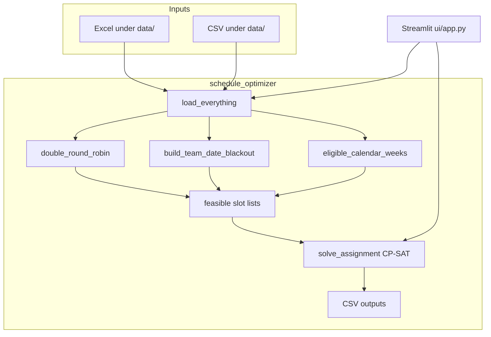

# Code documentation — every feature

This document describes **every package, module, UI surface, and runtime artifact** in the Egyptian Premier League Schedule Optimizer repository. It complements the product specification in [PRD.md](PRD.md).

---

## 1. Repository layout

| Path | Purpose |
|------|---------|
| [schedule_optimizer/](schedule_optimizer/) | Core optimization library (data load, DRR, CP-SAT, pipeline, CLI). |
| [ui/](ui/) | Streamlit web application (dashboard, model explanation tab, data browser, schedule view, embedded docs). |
| [Documentations/MODEL_EXPLANATION.md](Documentations/MODEL_EXPLANATION.md) | Plain-language description of model type, objectives, constraints, and pipeline (also shown in the **Model explanation** app tab). |
| [data/](data/) and [data/Sources/](data/Sources/) | Authoritative Excel/CSV inputs (see PRD). |
| [output/](output/) | Written artifacts: `optimized_schedule.csv`, `week_round_map.csv`, `data_load_log.txt`. |
| [Documentations/](Documentations/) | PRD, this file, presentation PDF, etc. |
| [scripts/](scripts/) | Legacy/auxiliary scripts (scrapers, distance helpers); not used by the Streamlit UI. |
| [past seasons data/](past seasons%20data/) | Historical schedules (optional preview in UI). |

---

## 2. Package `schedule_optimizer`

### 2.1 [`__init__.py`](schedule_optimizer/__init__.py)

- Declares package version string `__version__`.

### 2.2 [`__main__.py`](schedule_optimizer/__main__.py)

- Entry when running `python -m schedule_optimizer`.
- Invokes `run.main()` and exits with its return code.

### 2.3 [`paths.py`](schedule_optimizer/paths.py)

- **`REPO_ROOT`**: repository root (`Path(__file__).resolve().parents[1]`).
- **`DATA`**: `REPO_ROOT / "data"`.
- **`SOURCES`**: `DATA / "Sources"`.
- **`OUTPUT`**: `REPO_ROOT / "output"`.

### 2.4 [`normalize.py`](schedule_optimizer/normalize.py)

| Function | Behavior |
|----------|----------|
| `strip_team_id(raw)` | Strips whitespace, removes internal spaces, uppercases; returns `None` for empty/NaN-like values. |
| `normalize_stadium_id(raw)` | Uppercases, maps known aliases to distance-matrix IDs (e.g. `HARAS_HODOOD`→`HARAS`, `GHAZL_MAHALLA`→`MAHALLA`, `KHALED_BICHARA`→`EL_GOUNA`, `BORGARAB`→`BORG_ARAB`, `ISMALIA`→`ISMAILIA_ST`). |

### 2.5 [`load_data.py`](schedule_optimizer/load_data.py)

| Symbol | Description |
|--------|-------------|
| `LoadLog` | Accumulates string lines; `write(path)` persists the log. |
| `load_everything(log)` | Opens **every** PRD-listed workbook/CSV: `Data_Model.xlsx` (all sheets), `expanded_calendar.xlsx` (all sheets), `calendar.xlsx` MAINCALENDAR, `teams_data`, `stadiums`, `security matrix`, distance matrix + columns file, FIFA workbooks, CAF CL/CC workbooks, merged blockers, `expanded_calendar.csv`. Warns if xlsx/csv row counts differ. Compares `Data_Model` `team_data` row count to `teams_data`. |
| `slot_date_series(slots)` | Parses `Date` column to normalized pandas datetimes. |
| `build_team_date_blackout(..., caf_buffer_days=1)` | Per-team **date** set: merged `cont_blockers` anchors joined by `Day_ID` → calendar `Date`, plus/minus `caf_buffer_days`. Does **not** blanket-merge CAF workbook dates into blackout (see PRD — avoids infeasibility). |
| `eligible_calendar_weeks(slots, fifa_dates)` | Weeks where count of slots with `Is_FIFA!=1`, `Is_SuperCup!=1`, and date not in FIFA union ≥ 9; sorted chronologically by week’s minimum date. |
| `dist_lookup(dist, a, b)` | Symmetric km lookup in pre-built dict from matrix sheet. |
| `venue_for_fixture(home, away, teams, security)` | If security row has `forced_venue`, use it; else home’s `Home_Stadium`. |
| `slot_tier(day_name, dt)` | Returns 1/2/3 from weekend + hour rules (PRD §5.2). |

### 2.6 [`round_robin.py`](schedule_optimizer/round_robin.py)

| Symbol | Description |
|--------|-------------|
| `Fixture` | Dataclass: `round_idx`, `home`, `away`. |
| `double_round_robin(team_ids)` | Circle method for `n−1` rounds; second half repeats pairings with **swapped** home/away. Produces `n×(n−1)` fixtures for even `n`. |

### 2.7 [`cp_sat_model.py`](schedule_optimizer/cp_sat_model.py)

| Symbol | Description |
|--------|-------------|
| `Match` | `idx`, `round_idx`, `home`, `away`, `venue`, `travel_cost` (km sum for objective). |
| `solve_assignment(matches, slot_meta, feasible, time_limit_s)` | Builds OR-Tools CP-SAT model: Boolean `x[m,t]` for feasible pairs only. **Constraints:** (1) exactly one slot per match; (2) for each datetime slot and each team, ≤1 match; (3) for each datetime and venue, ≤1 match. **Objective:** minimize `Σ 10×travel_cost × x` (integer coefficients). Returns `(assign_dict, cp_status, status_name, objective_value \| None)`. |

### 2.8 [`pipeline.py`](schedule_optimizer/pipeline.py)

| Symbol | Description |
|--------|-------------|
| `OptimizationResult` | Dataclass carrying `success`, `exit_code`, `message`, optional `schedule_df` / `week_round_df`, `log_lines`, `solver_status`, `objective_scaled`, `wall_time_s`, `stats` dict. |
| `run_optimization(caf_buffer_days=None, time_limit_s=180, write_outputs=True)` | End-to-end: load → blackouts → eligible weeks → DRR → venues/costs → feasible slot lists → CP-SAT → optional CSV writes. `caf_buffer_days` defaults from `EPL_CAF_BUFFER_DAYS` env or `1`. **Stats** include total/mean travel, tier counts, feasible-slot min/max/mean, solver fields. |

### 2.9 [`run.py`](schedule_optimizer/run.py)

- CLI: reads `EPL_CAF_BUFFER_DAYS`, calls `run_optimization(write_outputs=True)`, prints message, returns exit code.

---

## 3. Package `ui` (Streamlit)

### 3.1 Running the UI

```bash
pip install -r requirements.txt
python -m streamlit run ui/app.py
```

The first line of `app.py` inserts `REPO_ROOT` on `sys.path` so `import schedule_optimizer` resolves when the script lives in `ui/`.

### 3.2 [`app.py`](ui/app.py) — screens and behaviors

| Feature | Description |
|---------|-------------|
| **Page config** | Wide layout, ⚽ icon, title “EPL Schedule Optimizer”. |
| **Custom CSS** | Dark gradient background, card-style metrics, sidebar styling. |
| **Sidebar · CAF buffer slider** | Integer 0–5 days each side of each `cont_blockers` anchor (passed to `run_optimization`). |
| **Sidebar · Solver time limit** | 30–600 seconds for CP-SAT `max_time_in_seconds`. |
| **Sidebar · Run optimization** | Invokes `run_optimization` with selected buffer and time limit; stores `OptimizationResult` in `st.session_state["last_result"]`. |
| **Tab · Dashboard** | Club picker (`_render_club_picker`): grid of `st.button` widgets; **selected** club uses `type="primary"` (green), others `type="secondary"`. **Club season** (`_club_season_table`). **Head-to-head**: two `st.selectbox` widgets filter `_head_to_head_table` to rows where the pair meets (either home/away order). Schedule from `_schedule_dataframe()`. Then simulation metrics. |
| **Tab · Model explanation** | Renders `Documentations/MODEL_EXPLANATION.md` via `st.markdown`. |
| **Tab · Data library** | Checkbox to add `past seasons data/` root. Lists all `.xlsx`/`.csv` under chosen roots. Select file → if CSV, `load_csv` preview; if Excel, sheet picker then `load_excel_sheet` preview (max 400 rows). |
| **Tab · Schedule** | Reads `output/optimized_schedule.csv` if present; multiselect filter on `Round`; dataframe + download button. |
| **Tab · Code documentation** | Renders this markdown file (`CODE_DOCUMENTATION.md`) via `st.markdown`. |
| **`_schedule_dataframe()`** | Returns the active schedule: in-memory `last_result.schedule_df` after a successful run, otherwise reads `output/optimized_schedule.csv`. |
| **`_team_list()`** | Builds `(Team_ID, Team_Name)` pairs from `teams_data` (skips blank IDs). |
| **`_club_button()`** | Wraps `st.button` with `type="primary"` if selected else `"secondary"` (falls back without `type` on older Streamlit). |
| **`_render_club_picker()`** | Six-column grid; caption (club name) above each button; updates `st.session_state["dashboard_club"]`. |
| **`_club_season_table(sched, club_id)`** | Filters to rows where the club is home or away; adds `H_A` and `Opponent`; sorts by `Date_time`. |
| **`_head_to_head_table(sched, team_a, team_b)`** | Rows where `(Home==a and Away==b)` or `(Home==b and Away==a)`; sorted by `Date_time`. |

### 3.3 [`data_browser.py`](ui/data_browser.py)

| Function | Description |
|----------|-------------|
| `repo_root()` | Parent of `ui/` (repository root). |
| `list_tabular_files(roots, extensions)` | Unique sorted paths from recursive `rglob` over given roots. |
| `load_excel_sheet(path, sheet, nrows)` | `pandas.read_excel` preview. |
| `load_csv(path, nrows)` | `pandas.read_csv` preview. |
| `excel_sheet_names(path)` | Sheet names via `pd.ExcelFile`. |
| `describe_path(path)` | Relative path, suffix, file size. |

---

## 4. Outputs (`output/`)

| File | Producer | Contents |
|------|----------|----------|
| `optimized_schedule.csv` | `pipeline.run_optimization` | One row per match: round, week, IDs, datetime, venue, `Travel_km`, `Slot_tier`, FIFA/CAF/SuperCup flags. |
| `week_round_map.csv` | same | Maps abstract round index to `Calendar_Week_Num`. |
| `data_load_log.txt` | `LoadLog` | File/sheet touches, warnings, final status line. |

---

## 5. Environment variables

| Variable | Used by | Meaning |
|----------|---------|---------|
| `EPL_CAF_BUFFER_DAYS` | `run.py`, optional override in UI | Default continental anchor buffer when CLI run; UI overrides by passing `caf_buffer_days` explicitly. |

---

## 6. Dependencies ([requirements.txt](requirements.txt))

- **pandas / openpyxl**: Excel + CSV I/O.
- **ortools**: CP-SAT solver.
- **streamlit**: Web UI.

---

## 7. Execution flow (high level)



---

## 8. Extension points (not implemented)

- Weighted objective using `Slot_tier` or external Parameters sheet.
- Soft constraints: rest days, away-break patterns, synchronized final rounds.
- Gurobi / IIS for infeasibility diagnostics.

---

## 9. Version

Documentation generated for codebase revision including Streamlit UI and `schedule_optimizer.pipeline` module.
