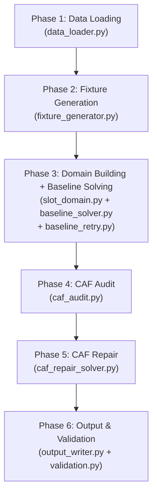
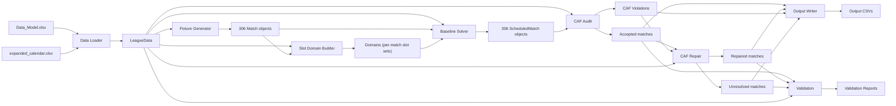

# ⚽ Egyptian Premier League Schedule Optimizer (EPL-SO)
## Comprehensive System & Model Documentation

> **Document Purpose:** This document consolidates the Product Requirements Document (PRD), Decision Theory & AHP-MODM Mathematical Formulation, CP-SAT Solver Design Notes, and Implementation Walkthrough into a single, unified reference manual.

## Table of Contents
1. [Part 1: Product Requirements Document (PRD)](#part-1-product-requirements-document-prd)
2. [Part 2: Multi-Objective Decision Theory & AHP Formulation](#part-2-multi-objective-decision-theory--ahp-formulation)
3. [Part 3: CP-SAT Solver Assignment Model & Architecture](#part-3-cp-sat-solver-assignment-model--architecture)
4. [Part 4: Code Implementation & Technical Walkthrough](#part-4-code-implementation--technical-walkthrough)

---
# Part 1: Product Requirements Document (PRD)

## Egyptian Premier League Schedule Optimizer

**Version:** 3.3
**Status:** Full product and model requirements for the current Streamlit application, validation dashboard, and CAF-aware scheduling pipeline.
**Last updated:** 2026-05-17
**Authoritative model inputs:** `data/Data_Model.xlsx` and `data/expanded_calendar.xlsx` only.

---

## 1. Purpose

The product builds and reviews a full Egyptian Premier League schedule from committed workbook data. It must generate a double round-robin fixture framework, assign fixtures to real calendar slots, audit CAF conflicts, repair affected matches where possible, and expose the result through an operational Streamlit UI.

The application must support both model execution and schedule inspection:

- run the full scheduling pipeline from the UI,
- tweak model variables before a run,
- inspect final, baseline, and repaired schedules,
- view matches by team, head-to-head pair, round, month, and day,
- visualize season travel distance by team,
- explain why a calendar day has no selected match,
- inspect validation, feasibility, fairness, CAF-repair, Monte Carlo, and historical benchmark dashboards,
- browse and download generated artifacts.

The product also supports optional offline analysis modes:

- batch Monte Carlo seed sweeps from the CLI,
- historical benchmark analysis over normalized past-season datasets,
- cached comparison of the current optimized schedule against historical seasons inside the UI.

The scheduling approach is a structured baseline-plus-repair flow:

1. Load and normalize the two authoritative Excel workbooks.
2. Generate a seeded double round-robin fixture framework with valid home/away patterns.
3. Build dynamic chronological round windows from playable non-FIFA calendar slots.
4. Solve a CAF-aware baseline CP-SAT model inside strict round windows.
5. Audit remaining CAF conflicts.
6. If CAF violations exist, remove CAF-conflicting matches into a postponement queue.
7. If CAF violations exist, repair queued matches into later free CAF-safe slots when possible.
8. If no CAF violations exist, skip repair and write a skipped repair status.
9. Write final schedule, diagnostics, and validation reports.
10. Present all outputs in the Streamlit UI.

---

## 2. Source of Truth and Data Policy

The model must use only:

| File | Required use |
|---|---|
| `data/Data_Model.xlsx` | Teams, stadiums, distance matrix, security rules, forced venues, team tiers, CAF participation flags. |
| `data/expanded_calendar.xlsx` | Slot universe, dates, kickoff times, week numbers, FIFA flags, CAF blockers, Ramadan/calendar fields. |

The pipeline must not use these as model inputs:

- previous `output/*` artifacts,
- `output/phases/*` artifacts,
- generated CSV mirrors,
- past-season datasets for optimization decisions,
- scraped files,
- web data,
- manually edited fixture outputs.

Generated outputs are inspection artifacts only. They may be displayed or downloaded by the UI, but they must never drive a new solver run.

Normalized past-season CSVs, historical FIFA/CAF context files, and `dist_matrix.json` may be used only by historical benchmark tooling and analysis scripts. They must never change the optimization model's feasible region or objective inputs.

---

## 3. Input Requirements

### 3.1 `data/Data_Model.xlsx`

Required sheets and columns:

| Sheet | Required columns |
|---|---|
| `team_data` | `Team_ID`, `Team_Name`, `Gov_ID`, `Gov_Name`, `Home_Stadium_ID`, `Alt_Stadium_ID`, `Tier`, `Cont_Flag` |
| `Stadiums` | `Stadium_ID`, `Stadium_Name`, `Gov_ID`, `City`, `Is_Floodlit` |
| `dist_Matrix` | `Origin` plus stadium ID columns |
| `Sec_Matrix` | `home_team_ID`, `away_team_ID`, `banned_venue1_ID`, `banned_venue2_ID`, `forced_venue_ID` |

Normalization rules:

- IDs are stripped and uppercased.
- `Cont_Flag` values `CL` and `CC` identify CAF-participating teams.
- Empty `Cont_Flag` values mean the team is not CAF-participating.
- `forced_venue_ID`, when present for a home/away pair, overrides the home stadium.
- Distances are looked up from the away team's home stadium to the assigned venue.

### 3.2 `data/expanded_calendar.xlsx`

Required sheets:

| Sheet | Required use |
|---|---|
| `expanded_calendar` | Primary slot universe. |
| `expanded _calendar_table` | Secondary calendar table; may be used for validation/fallback if normalized. |
| `FIFA_DAYS1` | Authoritative FIFA-date expansion. |
| `cont_blockers_updated1` | Authoritative team-specific CAF blockers. |
| `unique_CAF_dates` | CAF date list for calendar diagnostics and cross-checks. |

The main slot universe must include or be normalizable to:

- `Day_ID`
- `Date`
- `_date` derived from `Date`
- `Date time`
- `Week_Num`
- `Day_name`
- `Is_FIFA` when present
- `Is_CAF` when present
- CAF/FIFA label fields when present

### 3.3 FIFA Day Definition

FIFA dates are the union of:

- slot rows where `Is_FIFA == 1`,
- dates listed in a sheet containing `FIFA_DAYS` in its name (e.g., `FIFA_DAYS1`),
- dates with non-empty FIFA label fields such as `FIFA_DAY` or `FIFA_DAYS`.

No league match may be scheduled on a FIFA date in any phase.

### 3.4 CAF Blocker Definition

CAF blockers come from:

- `cont_blockers_updated1`,
- `unique_CAF_dates`,
- CAF labels or `Is_CAF` flags where useful for diagnostics.

Team-specific blockers are used by the solver and repair logic. Unique CAF dates are also shown in the calendar UI to explain CAF-blocked days.

---

## 4. Tunable Model Variables

The Streamlit sidebar must expose all current model variables that can be changed before a run. Changes apply to the current Streamlit session and are patched into imported solver modules before executing the pipeline.

### 4.1 League Shape

| Variable | Default | Meaning |
|---|---:|---|
| `NUM_TEAMS` | 18 | Number of league teams. Must match workbook team count. |
| `NUM_ROUNDS` | 34 | Double round-robin rounds. Expected value is `(NUM_TEAMS - 1) * 2`. |
| `MATCHES_PER_ROUND` | 9 | Matches per abstract round. Expected value is `NUM_TEAMS / 2`. |

### 4.2 Rest and Streak Rules

| Variable | Default | Meaning |
|---|---:|---|
| `MIN_REST_DAYS_LOCAL` | 3 | Full rest days between league matches. Dates must be at least 4 calendar days apart. |
| `MIN_REST_DAYS_CAF` | 3 | Full rest days between league and CAF matches. Dates must be at least 4 calendar days apart. |
| `PREFERRED_REST_DAYS_CAF` | 5 | Preferred CAF buffer where code paths consume it. |
| `MAX_CONSECUTIVE_HOME` | 2 | Max consecutive home matches in played/team sequence. |
| `MAX_CONSECUTIVE_AWAY` | 2 | Max consecutive away matches in played/team sequence. |
| `MIN_DAYS_BETWEEN_ROUNDS` | 1 | Gap between rounds. 1 forbids same-day overlap; 2 adds one idle day between rounds. |

### 4.3 Capacity Rules

| Variable | Default | Meaning |
|---|---:|---|
| `HARD_MIN_MATCHES_PER_WEEK` | 6 | Hard lower week target retained for model configuration. |
| `HARD_MAX_MATCHES_PER_WEEK` | 18 | Hard cap on league matches in a calendar week. |
| `SOFT_MIN_MATCHES_PER_WEEK` | 6 | Soft lower target for weekly load balance. |
| `SOFT_MAX_MATCHES_PER_WEEK` | 12 | Soft upper target for weekly load balance. |
| `MAX_MATCHES_PER_DAY` | 3 | Hard cap on league matches scheduled on one calendar date. |
| `MAX_MATCHES_PER_SLOT` | 2 | Hard cap on league matches assigned to the same kickoff slot. |
| `MIN_STADIUM_SERVICE_GAP_DAYS` | 0 | Service gap between non-forced uses of the same stadium. |

### 4.4 Objective Weights

| Variable | Default | Meaning |
|---|---:|---|
| `W_STADIUM_MAINTENANCE_OVERLAP` | 5,000,000 | Penalty for back-to-back stadium use within service gap. |
| `ALT_STADIUM_RELIEF_PENALTY` | 1,000,000 | Base penalty for using alternate stadium (multiplied by team tier). |
| `OTHER_STADIUM_RELIEF_PENALTY` | 3,000,000 | Base penalty for using a non-home, non-alt fallback stadium (multiplied by team tier). |
| `W_HOME_VENUE_DISPLACEMENT` | 1 | Per-kilometer penalty for moving a home team away from its primary stadium. |
| `W_ROUND_ORDER` | 100 | Penalty for deviation from nominal round/week placement. |
| `W_WEEK_UNDERLOAD` | 50 | Penalty below soft weekly load target. |
| `W_WEEK_OVERLOAD` | 50 | Penalty above soft weekly load target. |
| `W_TRAVEL` | 1 | Per-kilometer travel penalty. |
| `W_TIER_MISMATCH` | 20 | Penalty for mismatch between match tier and slot tier. |
| `W_CAF_PREFERRED` | 10 | Preferred CAF rest weight. |

### 4.5 Solver Limits

| Variable | Default | Meaning |
|---|---:|---|
| `BASELINE_SOLVER_TIME_LIMIT_S` | 600 | CP-SAT baseline solve time limit. |
| `REPAIR_SOLVER_TIME_LIMIT_S` | 60 | Repair phase time limit/configuration value. |

---

## 5. Fixture Generation

The fixture framework must be generated before slot assignment.

Requirements:

- 18-team double round-robin.
- 34 abstract rounds.
- 9 matches per round.
- Every ordered pair appears exactly once.
- Every unordered pair appears twice, home and away.
- Each team plays exactly once per abstract round before postponements.
- Home/away orientation is solved before slot scheduling.

Home/away pattern requirements:

- Each team has 17 home and 17 away matches.
- No team has more than two consecutive home or away matches in abstract round order.
- Rolling five-match windows should contain two or three home matches where feasible.
- Season edges should avoid two consecutive home or away matches where feasible.
- Second-leg matches reverse first-leg home/away.

Generated artifacts:

- `output/phases/04_fixture_framework.csv`
- `output/phases/04_home_away_patterns.csv`

---

## 6. Round Window Construction

The model must not map round number directly to calendar week number.

Round windows are built from playable slot dates:

- FIFA dates are removed first.
- Candidate windows are chronological date ranges from usable slots.
- Non-final rounds start from rolling 5-day base windows.
- Round 34 uses a tail domain: every playable slot from the start of its selected final-round window through the end of the season.
- A candidate window must contain enough slot rows for a round.
- CAF-heavy windows where CAF teams have no CAF-safe slot are skipped.
- Selected windows must be chronological and non-overlapping.
- Exactly `NUM_ROUNDS` baseline windows are required.
- The active non-final-round policy may widen a pressured round window after initial selection:
  - `compact`: expand day-by-day up to 28 days when the round has too few slot rows or one of its matches has too few feasible slots.
  - `epl_relaxed`: expand day-by-day up to 56 days and keep widening until the round reaches a 56-day spillover target or feasibility pressure is relieved.
  - `epl_full`: spill every non-final round from its selected start date through the end of the season.
- The round-window artifact must reflect the effective policy-adjusted start/end dates that were actually used to build domains.

Output:

- `output/phases/03_round_windows.csv`

---

## 7. Baseline Solver

The baseline solver assigns generated fixtures to concrete calendar slots using CP-SAT.

### 7.1 Baseline Hard Constraints

| ID | Constraint |
|---|---|
| H1 | Every generated fixture is assigned exactly once. |
| H2 | No league match is assigned to a FIFA date. FIFA dates are removed from usable slots before solving. |
| H3 | Baseline match domains are restricted to their selected round window. For Round 34, the selected window is the final-round tail domain. |
| H4 | A team cannot play more than one league match on the same calendar date. |
| H5 | A venue cannot host more than one match in the same slot. |
| H6 | A kickoff slot cannot exceed `MAX_MATCHES_PER_SLOT`, except on the chosen Round 34 shared slot where the special final-round slot cap applies. |
| H7 | A calendar date cannot exceed `MAX_MATCHES_PER_DAY` league matches, except on the chosen Round 34 date where the special final-round day cap applies. |
| H8 | A team must have at least `MIN_REST_DAYS_LOCAL` full rest days between league matches. |
| H9 | Non-postponed baseline rounds must respect the minimum gap: Round `R+1` must start at least `MIN_DAYS_BETWEEN_ROUNDS` calendar days after Round `R` ends. |
| H10 | Forced venue rules from `Sec_Matrix` must be respected in the strict baseline model. |
| H11 | CAF teams must avoid known CAF dates and the hard CAF buffer when feasible inside the round window. |
| H12 | All Round 34 matches must share exactly one calendar date and one kickoff slot. |

If CAF-safe slots do not exist inside a strict round window for a match, the domain builder may relax the CAF filter for that match so the baseline remains complete. Such matches must then be caught by CAF audit and moved to the postponement queue.

### 7.1.1 Final Round Publication Rule

The current product enforces a one-slot final round for `Round 34` only.

- The rule applies to the final published schedule, not just the pre-CAF baseline.
- The solver must not create synthetic dates or synthetic kickoff slots.
- Every Round 34 match must use one shared real slot from the Round 34 tail domain, so the whole round kicks off simultaneously.
- The only global constraints that may be relaxed for the final round are:
  - same-date match count,
  - same-kickoff match count on the chosen shared slot.
- Venue-slot exclusivity remains hard, so the same stadium still cannot host two matches in the same slot.
- If the strict full-season model cannot satisfy the Round 34 shared-slot rule together with the normal last-round venue, tier, rest, CAF, and round-gap rules, it must trigger the dedicated Round 34 rescue model before escalating to a looser non-final domain policy.

### 7.1.2 Final Round Rescue Model

When the strict baseline solve is infeasible and Round 34 exists, the baseline phase must retry within the same domain attempt using a dedicated last-round rescue model.

Rescue sequence:

1. Solve Rounds 1-33 under the current domain policy with normal strict baseline rules.
2. Freeze that partial schedule.
3. Solve Round 34 as one shared-slot batch over the real Round 34 tail window.

Round 34 rescue hard rules:

- banned venues from `Sec_Matrix` remain banned,
- one real shared slot must be chosen for all Round 34 matches,
- one team cannot play two league matches on the same calendar date,
- one venue cannot host two matches in the same shared slot,
- the special Round 34 day cap and Round 34 slot cap still apply.

Round 34 rescue soft relaxations:

- forced venue requirement,
- Tier 1 shared-slot requirement,
- local league rest gap,
- CAF date/buffer proximity,
- Round 33 to Round 34 gap,
- weekly hard cap,
- non-forced stadium service gap.

Optimization priority inside the rescue model:

1. Keep the round feasible without using banned venues or splitting the shared slot.
2. Minimize the number and severity of Round 34-only rule relaxations.
3. Protect higher-tier matches at better venues first.
4. Then minimize travel, tier mismatch, and round-drift cost.

### 7.1.3 Final Round Venue Fallback

The simultaneous Round 34 slot can create stadium contention when multiple home teams share the same `Home_Stadium_ID` and `Alt_Stadium_ID`.

For Round 34 rescue assignments, the solver must consider venue candidates in this preference order:

1. primary home stadium
2. alternate home stadium
3. nearest other free stadium from `Stadiums`

Rules:

- in the strict baseline model, forced venues still override every fallback rule,
- in the Round 34 rescue model only, forced venue becomes a top preference rather than a hard requirement,
- the fallback search is restricted to Round 34 only; it is not a global all-round venue-relaxation rule,
- "nearest" is measured from the home team's primary stadium using the stadium distance matrix,
- banned venues from `Sec_Matrix` remain disallowed,
- if multiple home teams contend for the same primary and alternate venues in Round 34, the objective must prefer keeping the higher-tier match at the primary venue, then the next-best match at the alternate venue, and only then displace the lower-tier match to the nearest other free stadium,
- if venue choices are otherwise indifferent, the solver must prefer the option with the better total optimization score.

### 7.1.4 Baseline Domain Fallback Strategy

The baseline pipeline must retry infeasible solves with progressively looser non-final round policies:

1. `compact`
2. `epl_relaxed`
3. `epl_full`

Rules:

- the first solve may reuse already-built compact domains,
- within each domain attempt, the strict baseline model runs first and the Round 34 rescue model runs second if strict Round 34 rules make the attempt infeasible,
- each later attempt must rebuild domains under the looser policy,
- the pipeline must stop retrying as soon as one policy returns a feasible baseline,
- if all three policies fail, the baseline phase must report infeasibility and stop before CAF audit/repair.

`output/phases/06_baseline_solver_status.json` must retain normal solver metadata and, when the retry wrapper is used, add:

- `domain_policy`
- `domain_attempt`
- `domain_attempt_count`
- `domain_fallback_used`
- `solver_mode`
- `final_round_rescue_attempted`
- `final_round_rescue_used`
- `strict_attempt`
- `final_round_rescue_candidate_slot_count`
- `final_round_rescue_relaxations`

### 7.2 Baseline Soft Objectives

The baseline objective minimizes the following (higher weights = higher priority):

| Objective | Logic | Weight (Penalty) |
|---|---|---|
| **ALT_STADIUM_DISPLACEMENT** | Penalty for moving a team to its `Alt_Stadium_ID`. Scales by team tier (Tier 1: 10M, Tier 2: 5M, Tier 3: 2M, Tier 4: 1M). | 1,000,000 * Tier_Weight |
| **OTHER_STADIUM_DISPLACEMENT** | Penalty for moving a team to a non-home, non-alt fallback stadium. Scales by team tier. | 3,000,000 * Tier_Weight |
| **HOME_VENUE_DISPLACEMENT** | Penalty per km between the primary home stadium and the assigned fallback venue. | 1 per km |
| **STADIUM_MAINTENANCE** | Avoid scheduling matches at the same venue within `MIN_STADIUM_SERVICE_GAP_DAYS`. | 5,000,000 per overlap |
| **ROUND_ORDER** | Penalty per match shifted from its nominal week. | 100 per week-diff |
| **WEEK_LOAD** | Penalty per match above/below soft week caps. | 50 per match |
| **TRAVEL** | Penalty per km traveled by the away team. | 1 per km |
| **TIER_MISMATCH** | Penalty for placing a Tier-X match in a Tier-Y slot. | 20 * |X-Y| |

#### 7.2.1 Tiered Venue Priority Resolution
To prevent lower-tier matches from indiscriminately displacing higher-tier teams from their primary stadiums, the venue-displacement penalties are tier-weighted.

**Conflict Scenarios:**
- **Tier 1 vs. Tier 3 Clash:** Displacing Tier 3 costs 2M. Accepting a maintenance overlap costs 5M. The solver will displace the Tier 3 team.
- **Tier 1 vs. Tier 1 Clash:** Displacing Tier 1 costs 10M. Accepting a maintenance overlap costs 5M. The solver will allow the back-to-back matches at the primary stadium (UEFA 48-hour style).
- **Round 34 Shared-Slot Clash (3 teams share one home and one alt venue):** The highest-tier match keeps the primary venue, the next-best match uses the alternate venue, and the lowest-tier match is displaced to the nearest other free stadium when feasible.

Hard feasibility always outranks soft preferences.

#### 7.2.2 Round 34 Rescue Penalty Layers

When the dedicated Round 34 rescue model is active, it keeps the normal travel, round-order, tier-mismatch, alternate-venue, other-stadium, and home-displacement penalties, then adds higher-priority rescue penalties for:

- breaking a strict forced-venue assignment,
- assigning a Tier 1 derby to a non-Tier-1 slot,
- shortening local rest around Round 34,
- shortening CAF buffer around Round 34,
- shrinking the Round 33 -> Round 34 gap,
- overflowing the weekly hard cap,
- reusing a non-forced venue inside the stadium service gap.

These rescue penalties are applied only to Round 34 and only after the strict model has failed under the same domain attempt.

Output:

- `output/optimized_schedule_pre_caf.csv`
- `output/phases/05_baseline_feasible_slot_counts.csv`
- `output/phases/06_baseline_solver_status.json`

---

## 8. CAF Audit

After baseline solving, the system audits CAF constraints. 

### 8.1 Proactive Pruning vs. Safety Net Architecture
The system uses a two-tier defense against CAF conflicts:
1. **Tier 1: Proactive Pruning (Phase 3a):** The domain builder automatically removes CAF-conflicting slots from each match's options. If a valid baseline solution is found, it is usually 100% CAF-safe by design.
2. **Tier 2: Safety Net (Phase 4 & 5):** If a match has *no* CAF-safe slots within its strict 5-day round window, the domain builder "relaxes" the filter to allow a baseline solution. The **CAF Audit** is the safety net that catches these intentionally allowed violations and moves them to the **CAF Repair** phase for rescheduling.

**Note:** If the Audit reports "0 violations," it means the Proactive Pruning was successful and no matches required postponement.

A baseline match is a CAF violation if:

- it is too close to a CAF date for either CAF-participating team,
- it conflicts with team-specific CAF blocker data,
- it violates the hard CAF buffer before or after a CAF fixture.

CAF buffer:

- Applies only to teams with `Cont_Flag` in `CL` or `CC`.
- Same-day CAF and league match is forbidden.
- A league match must be at least `MIN_REST_DAYS_CAF + 1` calendar days away from each relevant CAF match.
- Default hard gap is 4 calendar days apart.
- Preferred gap is 6 calendar days apart where supported.

Audit outputs:

- accepted baseline matches,
- CAF violations,
- `output/phases/07_caf_audit.csv`.

---

## 9. CAF Repair

The repair phase removes violating baseline matches from the accepted schedule and tries to reinsert queued matches into later valid slots. If any Round 34 match enters repair, the full final round must be treated as one shared-slot repair batch.

### 9.1 Free Slot Definition

For repair, a free slot means:

- the slot is in the usable non-FIFA slot universe,
- the slot date is on or after the original baseline match date,
- the slot still respects the applicable same-slot load cap,
- the venue is free in that slot,
- the slot has valid date, time, day ID, and week metadata.

Repair uses the same global day and slot caps as baseline, except that Round 34 may use the dedicated final-round caps on its chosen shared slot/date.

### 9.2 Repair Feasibility Rules

| Rule | Requirement |
|---|---|
| R1 | Slot is not a FIFA date. |
| R2 | Slot date is not before the original match date. |
| R3 | Date load is below the applicable daily cap. Default cap is `MAX_MATCHES_PER_DAY`; Round 34 may use the dedicated final-round day cap on its shared slot/date. |
| R4 | Neither team already has an accepted league match on the candidate date. |
| R5 | Both teams satisfy local league rest rules against all accepted matches. |
| R6 | Venue is free in the candidate slot, even when the slot still has capacity for other venues. |
| R7 | Inserting the match does not create a home/away streak violation. |
| R8 | CAF teams satisfy the hard CAF buffer in both directions. |
| R9 | Calendar week load is below `HARD_MAX_MATCHES_PER_WEEK`. |
| R10 | If `MIN_STADIUM_SERVICE_GAP_DAYS > 0`, non-forced repair candidates must respect the same stadium maintenance window. Repair may switch a non-forced match to the alternate stadium or, for Round 34, to the nearest other free stadium; forced venues remain exempt. |

### 9.3 Final Round Batch Repair

If any `Round 34` match is postponed into CAF repair:

- every Round 34 match is removed from the accepted published schedule and promoted into one repair batch,
- the repair search must choose one common replacement slot for the entire round,
- rest-day rules, CAF buffers, home/away streak rules, week caps, and venue-slot exclusivity remain hard,
- the shared replacement slot may use the final-round day cap and final-round same-kickoff cap,
- Round 34 venue reassignment follows the same priority order as baseline: primary home venue, alternate venue, then nearest other free stadium,
- if no common feasible slot exists, the repair phase must leave the full Round 34 batch unresolved,
- it must never repair only part of Round 34 onto another slot or date.

Repair strategy:

- Deduplicate CAF violations by match.
- Count feasible repair slots per queued match.
- Process most-constrained matches first.
- Rank candidate shared slots by displacement from the original date.
- Use a multi-pass greedy placement so later state changes are considered.
- Skip the repair phase entirely when the audit returns zero violations.

Repair outputs:

- `output/caf_postponement_queue.csv`
- `output/caf_rescheduled_matches.csv`
- `output/unresolved_caf_postponements.csv`
- `output/phases/08_repair_feasible_slot_counts.csv`
- `output/phases/09_repair_solver_status.json`

---

## 10. Final Schedule and Validation

The final schedule is:

`accepted baseline matches + successfully repaired matches`

Queued matches that cannot be repaired remain in `output/unresolved_caf_postponements.csv`.

Final validation must check:

- fixture completeness,
- ordered pair count,
- unresolved postponement warning,
- no FIFA-date matches,
- Round 34 appears on exactly one calendar date and one kickoff slot in the final published schedule,
- daily match cap (`MAX_MATCHES_PER_DAY`) except on the valid Round 34 shared date,
- same-kickoff slot cap (`MAX_MATCHES_PER_SLOT`) except on the valid Round 34 shared slot,
- venue-slot conflicts,
- non-forced stadium maintenance gaps when enabled,
- non-postponed global round order,
- CAF buffers,
- per-team rest gaps,
- per-team home/away streaks,
- rolling five-match balance warnings,
- team round inversions for non-postponed played sequence.

Validation outputs:

- `output/phases/10_final_validation_report.csv`
- `output/phases/10_team_sequence_validation.csv`

---

## 11. Output Files

### 11.1 Primary Outputs

| File | Purpose |
|---|---|
| `output/optimized_schedule_pre_caf.csv` | Full baseline schedule before CAF repair. |
| `output/caf_postponement_queue.csv` | CAF-violating matches removed from baseline and their repair status. |
| `output/caf_rescheduled_matches.csv` | Successfully repaired CAF-postponed matches. |
| `output/unresolved_caf_postponements.csv` | Queued matches that could not be placed. |
| `output/optimized_schedule.csv` | Final accepted schedule after repair. |
| `output/week_round_map.csv` | Round-to-calendar-week mapping. |
| `output/data_load_log.txt` | Data load and workbook summary. |

### 11.2 Final Schedule Columns

`output/optimized_schedule.csv` must include:

- `Round`
- `Calendar_Week_Num`
- `Day_ID`
- `Date`
- `Date_time`
- `Home_Team_ID`
- `Away_Team_ID`
- `Venue_Stadium_ID`
- `Travel_km`
- `Slot_tier`
- `Home_Tier`
- `Away_Tier`
- `Match_Tier`
- `Is_FIFA`
- `Is_CAF`
- `Postponed`
- `Postponement_Status`
- `Postponement_Reason`

### 11.3 Postponement Queue Columns

`output/caf_postponement_queue.csv` must include:

- `Round`
- `Home_Team_ID`
- `Away_Team_ID`
- `Date`
- `Date_time`
- `Day_ID`
- `Calendar_Week_Num`
- `Venue_Stadium_ID`
- `Violation_Reason`
- `Affected_Team_ID`
- `Conflicting_CAF_Match`
- `Conflicting_CAF_Date`
- `Conflict_Direction`
- `Repair_Feasible_Slot_Count`
- `Repair_Status`

### 11.4 Diagnostic Outputs

| File | Purpose |
|---|---|
| `output/phases/01_load_summary.json` | Workbook and row-count summary. |
| `output/phases/02_fifa_summary.csv` | FIFA dates detected from input data. |
| `output/phases/03_caf_blocker_summary.csv` | CAF blockers grouped by team/date. |
| `output/phases/03_round_windows.csv` | Selected baseline windows. |
| `output/phases/04_fixture_framework.csv` | Generated DRR fixture framework. |
| `output/phases/04_home_away_patterns.csv` | Per-team H/A sequence diagnostics. |
| `output/phases/05_baseline_feasible_slot_counts.csv` | Baseline feasible slot count per match. |
| `output/phases/06_baseline_solver_status.json` | CP-SAT solver result. |
| `output/phases/07_caf_audit.csv` | CAF audit details. |
| `output/phases/08_repair_feasible_slot_counts.csv` | Repair feasible slot counts. |
| `output/phases/09_repair_solver_status.json` | Repair status summary. |
| `output/phases/10_final_validation_report.csv` | Final validation findings. |
| `output/phases/10_team_sequence_validation.csv` | Team sequence validation details. |

Notes:

- `output/phases/03_round_windows.csv` must record the effective round-window start, end, week span, and slot count after the active non-final policy is applied.
- `output/phases/05_baseline_feasible_slot_counts.csv` must record round-window bounds, slot counts, feasible slot counts, and whether CAF filtering was relaxed for a match.
- `output/phases/06_baseline_solver_status.json` must record solver status, objective, wall time, stadium-gap configuration, fallback-attempt metadata when fallback retries were used, and final-round rescue metadata when the dedicated Round 34 rescue model was attempted.

### 11.5 Optional Batch and Analysis Outputs

| File | Purpose |
|---|---|
| `output/multi_run/monte_carlo_results.csv` | Aggregated metrics for batch seed sweeps run via `python main.py --runs N [--parallel M]`. |

---

## 12. Streamlit UI Requirements

The UI must be an operational schedule workspace using the Nile League dark theme:

- dark surface based on `#232126`,
- text color based on `#f8f9f7`,
- purple accent palette based on `#68239e`, `#75409f`, `#8f67ad`, `#ab97ba`, and `#d2cad9`,
- `Nile_League.png` as the page icon and visible brand mark when available,
- club icons from `icons/` normalized to 500x500 PNG assets and mapped deterministically to `Team_ID`,
- active tab indicator is a thin underline only,
- app opens on Explore first,
- Explore opens on Team chooser first.

### 12.1 Top-Level Tabs

Top-level tab order:

1. `Explore`
2. `Run & progress`
3. `Validate & Insights`
4. `Artifacts`
5. `Browse files`

### 12.2 Explore Tab

Explore controls:

- schedule source selector: final schedule, baseline pre-CAF, repaired matches,
- round filter selector: all rounds or Round 1 through Round 34,
- toggle to load authoritative inputs for explanations.

Explore sub-tabs:

1. `Team chooser`
2. `Team vs Team`
3. `Travel stats`
4. `Calendar`
5. `Round filter`

Team chooser:

- select a team,
- show the selected club icon,
- include/exclude home and away matches,
- sort by date or round,
- table of filtered matches,
- CSV download.

Team vs Team:

- select Team A and Team B,
- show both selected club icons,
- show both directions of head-to-head matches,
- CSV download.

Travel stats:

- aggregate `Travel_km` by `Away_Team_ID`,
- include a club icon column,
- show league total travel km,
- show average per team,
- show highest-travel team,
- show away trips counted,
- bar chart of total team km,
- detailed table with total, average, longest trip, and trip count,
- CSV download.

Calendar:

- real month grid with one square per day,
- previous/next month buttons,
- jump-to-month and year controls,
- selected-day inspector,
- each match day shows match labels such as `R1 AHL vs ZAM` with club icons,
- days without selected matches explain why: FIFA, CAF blocked, no playable slot, no selected-round match, or no match,
- month metrics: total matches, match days, FIFA days, CAF dates, slot-days with no matches,
- compact count table,
- busiest dates,
- matches by weekday chart,
- daily status table.

Round filter:

- when all rounds are selected, show match count per round,
- when one round is selected, show only that round's matches.

### 12.3 Run & Progress Tab

The UI must:

- show phase status for load, fixture generation, initial compact domain build, baseline solve with EPL fallback retries, CAF audit, CAF repair, and output writing,
- when strict Round 34 rules fail, show that the run is retrying with the dedicated Round 34 rescue model before moving to the next non-final domain policy,
- show CAF repair only when audit returns violations; otherwise show a skipped message,
- mirror stdout in a live text area,
- apply sidebar model variables before running,
- write all primary and validation outputs after a successful run,
- report infeasible baseline status clearly after fallback retries are exhausted,
- surface the winning fallback domain policy when the baseline solves under `epl_relaxed` or `epl_full`.

### 12.4 Validate & Insights

The UI must provide a read-only analysis workspace that loads artifacts on demand and does not mutate solver outputs.

Sub-tabs:

1. `Overview`
2. `Constraint Compliance`
3. `Feasibility & Solver Pressure`
4. `CAF & Repair`
5. `Fairness & Operational Insights`
6. `Monte Carlo Analysis`
7. `Historical Comparison`

Requirements:

- `Overview` summarizes final schedule health, validation issue counts, solver statuses, unresolved postponements, season span, and other run-level metrics.
- `Constraint Compliance` groups validation findings by family and severity using final validation and sequence artifacts.
- `Feasibility & Solver Pressure` reads round-window and feasible-slot diagnostics to expose tight rounds, window span, and solver pressure.
- `CAF & Repair` summarizes audit findings, queue size, repaired matches, unresolved matches, and repair status.
- `Fairness & Operational Insights` shows travel spread, rest-gap spread, venue load share, round span, monthly match volume, and clickable detail tables.
- `Monte Carlo Analysis` reads `output/multi_run/monte_carlo_results.csv` when present and shows best seed, best objective, minimum validation errors, objective distribution, travel distribution, and raw run rows.
- `Historical Comparison` uses cached historical benchmark logic plus normalized past-season data to compare the optimized schedule against recent Egyptian Premier League seasons on waste-gap and home/away-streak metrics.
- The historical view must include a methodology/assumptions expander explaining the benchmark assumptions.
- If a required artifact is missing, each dashboard tab must show an informative empty state instead of failing.

### 12.5 Artifacts and Browse Files

Artifacts:

- list primary output files,
- list phase diagnostics,
- preview key tables,
- provide download buttons.

Browse files:

- browse any file under `output/` and `output/phases/`,
- show CSVs as dataframes,
- show JSON as structured JSON,
- show text files in text areas.

---

## 13. Acceptance Criteria

1. The model uses only `data/Data_Model.xlsx` and `data/expanded_calendar.xlsx` as authoritative inputs.
2. Fixture generation produces a complete 18-team, 34-round double round-robin framework.
3. Each team has valid home/away pattern diagnostics before slot assignment.
4. Dynamic round windows are selected from non-FIFA playable slots and may expand under `compact`, `epl_relaxed`, or `epl_full` policy.
5. Baseline scheduling creates a complete pre-CAF schedule using either the strict model or the dedicated Round 34 rescue model, or clearly reports infeasibility after domain fallback retries are exhausted.
6. No scheduled league match appears on a FIFA date.
7. Baseline and repair enforce `MAX_MATCHES_PER_DAY` by default, but Round 34 may use the dedicated final-round day cap on its one valid shared slot/date.
8. Baseline and repair enforce `MAX_MATCHES_PER_SLOT` by default, but Round 34 may use the dedicated final-round slot cap on its one valid shared slot.
9. The published Round 34 schedule uses one real shared kickoff slot for all matches.
10. If Round 34 is repaired, the system repairs the full round as one batch on one common slot or leaves the batch unresolved.
11. When Round 34 venue contention occurs, the strict model uses forced venues when required, and the rescue model prefers primary home venue, then alternate venue, then the nearest other free stadium, with higher-tier matches protected first and banned venues always excluded.
12. Team same-day, rest-day, and venue-slot constraints are respected.
13. Known CAF conflicts are audited after baseline.
14. CAF-violating matches are written to the postponement queue.
15. Repair keeps original `Round` metadata and sets repaired matches as postponed in final output.
16. Unrepairable matches are written to unresolved output, not silently dropped.
17. Final validation reports FIFA, CAF, daily cap, venue, rest, streak, completeness, and round-order issues.
18. Final validation reports a hard error if the published Round 34 schedule spans more than one slot or date.
19. UI exposes all tunable variables, including max matches per day.
20. UI defaults to Explore -> Team chooser.
21. UI top-level tabs are `Explore`, `Run & progress`, `Validate & Insights`, `Artifacts`, and `Browse files`.
22. `Validate & Insights` contains overview, compliance, feasibility, CAF/repair, fairness, Monte Carlo, and historical benchmark views.
23. Baseline status output records the effective domain policy, whether fallback retries were used, and whether the dedicated Round 34 rescue model was attempted or used.
24. Monte Carlo analysis renders `output/multi_run/monte_carlo_results.csv` when present and otherwise instructs the user to run batch mode from the CLI.
25. Historical comparison uses normalized past-season benchmark files and cached analysis logic without feeding those datasets back into the optimizer.
26. UI uses the Nile League dark palette and icon.
27. Club icons are normalized to 500x500 and mapped to every current workbook team.
28. The calendar grid shows matches, club icons, and no-match reasons per day.
29. Travel stats visualize total season kilometers by team with club icons.

---

## 14. Non-Goals

- Generating CAF fixtures.
- Editing FIFA dates.
- Pulling live sports, travel, or venue data from the web.
- Treating previous outputs as model inputs.
- Manually inventing teams, stadiums, distances, slots, or security rules.
- Guaranteeing that every queued CAF match can be repaired.

---

## 15. Optional Analysis Modes

The repository includes analysis-only workflows that are outside the core optimization path but part of the current product surface:

- CLI Monte Carlo runs via `python main.py --runs N [--parallel M]`, which checkpoint aggregated results and restore final artifacts for the best-performing seed.
- Historical benchmark scripts `analyze_historical.py` and `analyze_historical_detailed.py`, which study travel and gap behavior in past Egyptian Premier League seasons.
- UI historical comparison backed by `src/historical_engine.py` and `dist_matrix.json`.

These workflows may read normalized historical files under `past seasons data/`, but they must not modify the core optimizer inputs or use historical data to relax or tighten scheduling constraints.

---

## 16. Dashboard Metrics Explained

| Metric | Meaning |
|---|---|
| `Validation issue count` | Count of non-pass rows in `10_final_validation_report.csv`, excluding the all-clear sentinel row. |
| `Away travel range` | Difference between the highest and lowest total away-travel distance across teams in the final schedule. |
| `Top 3 venue share` | Fraction of all scheduled matches hosted by the three busiest venues. |
| `Week span count` | Number of distinct calendar weeks touched by a round, derived from `output/week_round_map.csv`. |
| `Max rest gap` | Largest `Gap_Days_From_Previous` value observed in team-sequence validation output. |
| `Max Waste Gap` | Historical benchmark gap after subtracting FIFA dates and weighted CAF occupancy from idle time between matches. |
| `Best seed` | Monte Carlo winner selected by fewest validation errors, then fewest unresolved matches, then lowest baseline objective, then lowest travel. |

---

## 17. Recent Development Milestones (Last 5 Commits)

Newest to oldest:

- `2f646a2` - Added baseline fallback retries across `compact`, `epl_relaxed`, and `epl_full` policies; refactored round-window/domain construction; surfaced fallback status in runtime artifacts; expanded the Streamlit validation workspace with fairness, Monte Carlo, and improved historical benchmark views.
- `5bec1d0` - Enforced the one-day Round 34 publication rule across baseline solving, CAF repair, and final validation; introduced dedicated final-round caps and shared-date repair behavior.
- `b65ba3c` - Repository housekeeping in `.gitignore`; no product requirement change.
- `15176ad` - Normalized historical league CSVs to improve consistency of benchmark and audit tooling.
- `e7ac63a` - Added historical analysis scripts and `dist_matrix.json` to support reproducible travel/gap benchmarking against past seasons.


---


# Part 2: Multi-Objective Decision Theory & AHP Formulation

This document outlines the formal mathematical framework used in the Egyptian Premier League Schedule Optimizer, aligning the codebase with academic standards of Multi-Criteria Decision Making (MCDM).

---

## 1. Decision Theory Paradigms: MODM vs. MADM

In Operations Research, **Multi-Criteria Decision Making (MCDM)** is divided into two primary subfields:

1. **Multi-Objective Decision Making (MODM)**: Focuses on optimization problems over a continuous or combinatorially large feasible region defined by mathematical constraints. It features decision variables, constraints, and objective functions.
2. **Multi-Attribute Decision Making (MADM / MCDA)**: Focuses on ranking, sorting, or selecting from a finite, discrete set of pre-existing alternatives.

### The Hybrid AHP-MODM Framework
Our league schedule optimizer solves a **MODM** problem because it searches a combinatorial space of billions of possible fixture permutations to find an optimal schedule. 

However, assigning objective weights in a weighted-sum objective is traditionally subjective. To solve this, we employ a **Hybrid AHP-MODM framework**:
* **Phase 1 (MADM - AHP)**: We use Saaty's **Analytic Hierarchy Process (AHP)** to mathematically calculate objective weights from pairwise comparisons, ensuring mathematical consistency.
* **Phase 2 (MODM - Integer Programming)**: We feed the calculated weights into the **Additive Utility Function** objective of our CP-SAT integer programming solver to find the optimal schedule.

---

## 2. Multi-Objective Formulation (Additive Utility Theory)

The schedule optimization problem is mathematically defined as a Vector Optimization Problem (VOP):

$$\text{Minimize } [f_1(X), f_2(X), \dots, f_k(X)]$$
$$\text{subject to } X \in \mathbb{M}$$

Where:
* $X$ is the matrix of assignment decisions.
* $\mathbb{M}$ is the feasible domain defined by the hard constraints (stadium availability, team rest, streaks).
* $f_i(X)$ are the individual objective functions (travel, overlaps, scheduling deviations).

### Additive Utility Function (Weighted Sum)
Under Multi-Attribute Utility Theory (MAUT), if the objectives are additive, we transform the vector problem into a single scalar objective by maximizing a global utility function (or minimizing global disutility):

$$\text{Minimize } U(X) = \sum_{i=1}^{k} w_i \cdot d_i(f_i(X))$$

Where:
* $d_i(f_i(X)) = \frac{f_i(X)}{N_i}$ is the normalized **disutility function** mapping the raw objective to a dimensionless scale of $[0, 1]$.
* $N_i$ is the normalization denominator representing the worst-case reasonable value (nadir approximation) for objective $i$.
* $w_i$ is the weight of importance assigned to objective $i$, satisfying the conditions:
$$\sum_{i=1}^{k} w_i = 1, \quad w_i \ge 0$$

### Objective Normalization Denominators ($N_i$)
To maintain dimensional homogeneity (not adding kilometers to hours or occurrences), we normalize the raw metrics using the following physical scaling denominators ($N_i$):

| Objective ($f_i$) | Normalization Constant ($N_i$) | Physical Unit | Physical Basis for $N_i$ |
| :--- | :--- | :--- | :--- |
| **Stadium Maintenance Overlaps** | $N_{overlap} = 10$ | Occurrences | Max tolerable overlaps per season |
| **Alt Venue Relief** | $N_{alt} = 100$ | Occurrences | Expected alternative stadium usages |
| **Other Venue Relief** | $N_{other} = 50$ | Occurrences | Expected neutral stadium usages |
| **Round Order Deviation** | $N_{round} = 200$ | Weeks | Worst-case cumulative round delays |
| **Venue Displacement** | $N_{disp} = 5,000$ | Kilometers (km) | Upper bound on home displacement travel |
| **Weekly Underload** | $N_{under} = 50$ | Matches | Worst-case cumulative weekly match shortfalls |
| **Weekly Overload** | $N_{over} = 50$ | Matches | Worst-case cumulative weekly match excesses |
| **Away Travel Distance** | $N_{travel} = 50,000$ | Kilometers (km) | Upper bound on total away travel (306 matches) |
| **Tier Mismatch** | $N_{tier} = 300$ | Tier levels | Total mismatch index in an unaligned schedule |
| **Evening Kickoff Preference** | $N_{evening} = 200$ | Hours | Total early kickoff hour penalties |
| **Slot Spread Collisions** | $N_{spread} = 50$ | Occurrences | Max slot concurrency collisions |

### Detailed Derivations of Normalization Constants ($N_i$)

To mathematically justify the selected values of $N_i$, they are derived directly from the physical and structural parameters of the Egyptian Premier League (18 teams, 34 rounds, 306 matches per season):

1. **Away Travel Distance ($N_{travel} = 50,000$ km)**:
   * **Justification**: There are 306 matches in a season. Based on Egypt's geography, the average away travel distance is ~163 km (e.g. Cairo to Alexandria is ~200 km, local Cairo derbies are 0 km, trips to Suez/Ismailia are ~130 km, and trips to Aswan are ~900 km).
   * **Math**: $306 \text{ matches} \times 163.4 \text{ km/match} \approx 50,000 \text{ km}$. This forms the empirical upper limit of seasonal travel.

2. **Venue Displacement ($N_{disp} = 5,000$ km)**:
   * **Justification**: Cumulative distance traveled by home teams forced to play away from their primary stadiums.
   * **Math**: Assuming an average of 15 matches per season are displaced by an average of 333 km (e.g. playing in Alexandria instead of Cairo): $15 \text{ matches} \times 333 \text{ km} = 5,000 \text{ km}$.

3. **Round Order Deviation ($N_{round} = 200$ weeks)**:
   * **Justification**: Cumulative week deviations of matches from their ideal chronological round weeks.
   * **Math**: Assuming a highly postponed season where 100 matches are delayed by an average of 2 weeks due to international or CAF matches: $100 \text{ matches} \times 2 \text{ weeks} = 200 \text{ weeks}$.

4. **Evening Kickoff Hour Penalty ($N_{evening} = 200$ hours)**:
   * **Justification**: Penalizes kickoffs before 21:00 (e.g. 17:00 kickoffs receive a 4-hour penalty).
   * **Math**: Assuming 80 matches are scheduled early in hot months with an average penalty of 2.5 hours: $80 \text{ matches} \times 2.5 \text{ hours} = 200 \text{ hours}$.

5. **Weekly Underload ($N_{under} = 50$ matches) & Overload ($N_{over} = 50$ matches)**:
   * **Justification**: Match deviations below the soft weekly minimum (6) or above the soft weekly maximum (12).
   * **Math**: In a congested calendar, if 16 weeks experience average loads outside the soft range by ~3.1 matches: $16 \text{ weeks} \times 3.1 \text{ matches} \approx 50 \text{ matches}$.

6. **Alt Venue Relief ($N_{alt} = 100$ occurrences)**:
   * **Justification**: Playing at alternate home venues.
   * **Math**: If 6 teams play half of their home games (8.5 games) at alternate stadiums: $6 \text{ teams} \times 8.5 \text{ matches} \approx 50$ occurrences. Across the entire league, 100 is the typical worst-case upper bound.

7. **Other Venue Relief ($N_{other} = 50$ occurrences)**:
   * **Justification**: Highly undesirable usage of neutral venues. 50 occurrences is the absolute safety/security tolerance limit before the season's logistics are considered broken.

8. **Stadium Maintenance Overlaps ($N_{overlap} = 10$ occurrences)**:
   * **Justification**: Stadium hosting matches within the service gap (e.g., 3 days). A high-quality schedule must have 0 overlaps. 10 is established as the absolute worst-case limit of stadium tolerance.

9. **Tier Mismatch ($N_{tier} = 300$ levels)**:
   * **Justification**: Mismatches between match tiers and slot tiers.
   * **Math**: If 150 matches are scheduled in sub-optimal slots by an average of 2 tier levels: $150 \text{ matches} \times 2 \text{ levels} = 300 \text{ tier levels}$.

10. **Slot Spread Collisions ($N_{spread} = 50$ occurrences)**:
    * **Justification**: More than 1 match scheduled in the same kickoff slot on the same day.
    * **Math**: If 25 slots suffer from concurrency collisions, affecting 50 matches: $25 \text{ collisions} \times 2 = 50 \text{ occurrences}$.

11. **CAF Preferred Rest ($N_{caf\_pref} = 50$ occurrences)**:
    * **Justification**: Potential matches where CAF-participating teams can achieve an ideal 6-day rest window. This is limited by the total number of CAF domestic/international slot alignments.

---

## 3. Weight Determination: Analytic Hierarchy Process (AHP)

To mathematically derive the weight vector $w$, the Decision Maker (DM) performs pairwise comparisons on **5 high-level criteria** rather than comparing all 12 sub-metrics (which would require a tedious 66 comparisons).

### The 5 High-Level Criteria
1. **Venue Rest & Integrity (VR)**: Restricting back-to-back stadium use and minimizing home venue changes.
2. **Travel Efficiency (TE)**: Reducing total travel distance for away teams.
3. **Round Chronology (RC)**: Preserving chronological week orders and avoiding round-to-week spillovers.
4. **Weekly Balance (WB)**: Spreading matches evenly across calendar weeks.
5. **Broadcasting & Slot Quality (BQ)**: Optimizing evening kickoff slots, match quality tiers, and slot concurrency.

### Step 1: Pairwise Comparison Matrix ($A$)
The DM constructs a $5 \times 5$ matrix $A$, where $a_{ij}$ represents the relative importance of criterion $i$ over criterion $j$ on Saaty's 1–9 scale:

$$A = \begin{pmatrix}
1 & a_{12} & a_{13} & a_{14} & a_{15} \\
1/a_{12} & 1 & a_{23} & a_{24} & a_{25} \\
1/a_{13} & 1/a_{23} & 1 & a_{34} & a_{35} \\
1/a_{14} & 1/a_{24} & 1/a_{34} & 1 & a_{45} \\
1/a_{15} & 1/a_{25} & 1/a_{35} & 1/a_{45} & 1
\end{pmatrix}$$

### Step 2: Weight Vector Calculation (Principal Eigenvector)
The weights correspond to the normalized principal eigenvector of matrix $A$:

$$A w = \lambda_{max} w$$

We calculate this numerically using the **Power Iteration Method**:
1. Start with $w^{(0)} = [0.2, 0.2, 0.2, 0.2, 0.2]^T$.
2. Iteratively compute $v^{(t)} = A w^{(t-1)}$ and normalize: $w^{(t)} = \frac{v^{(t)}}{\|v^{(t)}\|_1}$.
3. Stop when $\|w^{(t)} - w^{(t-1)}\| < 10^{-6}$.
4. Estimate the maximum eigenvalue $\lambda_{max} = \frac{1}{n} \sum_{i=1}^{n} \frac{(A w)_i}{w_i}$.

### Step 3: Consistency Verification
To ensure the DM's judgments are mathematically consistent:
1. Compute the **Consistency Index (CI)**:
   $$CI = \frac{\lambda_{max} - 5}{4}$$
2. Compute the **Consistency Ratio (CR)**:
   $$CR = \frac{CI}{RI_5}$$
   Where Saaty's Random Index for $5 \times 5$ matrices is $RI_5 = 1.12$.
3. If $CR < 0.10$, the weights are mathematically consistent and accepted. If $CR \ge 0.10$, the DM's comparisons are inconsistent and must be revised.

### Step 4: Sub-metric Mapping
The calculated high-level weights ($w_{VR}, w_{TE}, w_{RC}, w_{WB}, w_{BQ}$) are distributed to the 12 sub-metric weights ($W_j$) proportionally based on their standard default ratios, ensuring $\sum_{j=1}^{12} W_j = 1.0$.

---

## 4. Empirical Evaluation: Decision Support & Metric Breakdown Dashboard

To bridge the gap between abstract mathematical formulas and decision-making utility, the system incorporates two real-time feedback loops:

### 1. Interactive AHP Consistency Advisor
Saaty's AHP allows for subjective inconsistency, but requires the Consistency Ratio ($CR$) to remain below $0.10$ to be mathematically valid. To guide the user toward a consistent comparisons matrix:
* **Ideal Consistent Target**: For any comparison $a_{ij}$ between criteria $i$ and $j$, the mathematically consistent target value is the ratio of their computed weights:
  $$a'_{ij} = \frac{w_i}{w_j}$$
* **Inconsistency Advisor**: The system calculates the error between the user's selected slider value $S_{ij}$ and the consistent target slider value $S'_{ij}$ (derived by mapping $a'_{ij}$ back to the $[-8, 8]$ scale) for all 10 pairwise comparisons. 
* **Correction Suggestion**: If $CR \ge 0.10$, the system highlights the comparison $(i, j)$ with the largest absolute error $|S_{ij} - S'_{ij}|$ and recommends moving it towards $S'_{ij}$, guaranteeing a rapid convergence to a valid, consistent matrix.

### 2. Multi-Objective Performance Breakdown
Once the CP-SAT solver generates a schedule $X$, the dashboard decomposes the global objective score into its constituent disutility functions. It computes and displays:
1. **Raw Metric Value $f_i(X)$**: The physical count (e.g., total kilometers, number of overlaps).
2. **Dimensionless Normalized Disutility $d_i(X) = f_i(X) / N_i$**: The scaled disutility for each objective.
3. **Normalized Weights $w'_i$**: The sub-metric weights normalized over the active solver objectives to ensure they sum to exactly 1.0:
   $$w'_i = \frac{w_i}{\sum_{k \in \text{active}} w_k}, \quad \sum w'_i = 1.0$$
4. **Weighted Contribution $C_i(X) = w'_i \cdot d_i(X)$**: The direct contribution of objective $i$ to the overall schedule disutility.

The total sum of these contributions matches the overall disutility score:
$$U(X) = \sum_{i=1}^{k} C_i(X)$$

This breakdown allows the Egyptian Football Association (EFA) to immediately identify which scheduling compromises (e.g., travel vs. kickoff slots) are driving the disutility score of the generated schedule.

---

## 5. Comparison: Normalized Weighted Sum vs. Weighted Sum

The optimizer supports two primary formulation modes. Here is the mathematical comparison:

### 1. Classical Weighted Sum Method
The classical weighted sum minimizes the raw weighted sum of the objectives:
* Objective = sum( W_i * f_i(X) )
Where f_i(X) is the raw value of objective i (e.g., 55,000 kilometers of travel, 10 stadium overlaps).

* **Limitation (Dimensional Inhomogeneity):** It directly adds values of different units (kilometers, weeks, match counts). Because travel distance is numerically massive (in the tens of thousands), it completely dominates the objective function. The solver will ignore small-scale objectives like stadium turnaround overlaps or slot collisions, rendering their weights ineffective unless they are manually scaled up by millions.

### 2. Normalized Weighted Sum Method (Additive Utility)
The normalized weighted sum scales all objectives using normalization constants N_i to make them dimensionless:
* Objective = sum( w_i * [ f_i(X) / N_i ] )
Where w_i represents the normalized relative weights (sum of w_i = 1.0) and N_i represents the normalization constant (e.g. 50,000 for travel, 10 for overlaps).

* **Advantage:** By dividing each raw value f_i(X) by its normalizer N_i, all objectives are transformed into a dimensionless disutility score between 0.0 and 1.5. This ensures that a 10% increase in travel distance has the same mathematical impact as a 10% increase in stadium overlaps when weights are equal. The weights w_i represent true decision-maker priorities.

---

## 6. System Modifications & Recent Enhancements Log

The following changes have been successfully implemented:

### 1. Decimal AHP Weights
* High-level criteria weights are displayed as decimals in the range [0.0, 1.0] (instead of percentages) under the AHP comparisons matrix setup, ensuring mathematical transparency and verification of sum(w_i) = 1.0.

### 2. Real-Time AHP Consistency Advisor
* The system computes target consistent slider values:
  Target_Slider_ij = w_i / w_j
* If the Consistency Ratio (CR) is 0.10 or higher, the Consistency Advisor identifies the slider with the largest absolute deviation from its consistent target and displays a suggestion guiding the user on how to adjust it to achieve mathematical consistency.

### 3. Multi-Objective Performance Breakdown Table
* Added a breakdown table to the Insights Overview tab showing for each objective:
  - Metric Name
  - Raw Value f_i(X)
  - Normalizer N_i
  - Normalized Score d_i(X) = f_i(X) / N_i
  - Relative Weight w_i
  - Weighted Contribution = w_i * d_i(X)
* The sum of the weighted contributions matches the overall disutility score U(X) = sum( w_i * d_i(X) ).

### 4. Normalized Solver Status and JSON Reporting
* The solver status output file "06_baseline_solver_status.json" now logs both the final objective score and the individual objective breakdown in their normalized, dimensionless forms:
  - objective = Raw solver objective / 100,000
  - breakdown_i = Raw breakdown_i / N_i
* All Streamlit displays (Run & Progress, Insights, Monte Carlo) have been updated to dynamically render these decimal normalized values.

---

## 7. Step-by-Step Optimization Workflow & Methodology

The complete execution pipeline of the hybrid AHP-MODM scheduling framework flows step-by-step from user preferences to the final normalized results:

### Step 1: Decision-Maker Preferences (AHP Setup)
* **Action:** The user configures relative preferences between the 5 high-level criteria (Venue Rest, Travel, Chronology, Weekly Balance, Slot Quality) on the AHP UI panel.
* **Math:** The system maps the sliders (-8 to 8) to Saaty's 1-9 scale and constructs a 5x5 pairwise comparison matrix.
* **Consistency Check:** If the Consistency Ratio (CR) is 0.10 or higher, the Consistency Advisor recommends which slider to adjust. Once CR is below 0.10, the principal eigenvector is calculated using Power Iteration to yield 5 high-level weights that sum to exactly 1.0.

### Step 2: Sub-Objective Weight Mapping
* **Action:** The system maps the 5 criteria weights to 12 sub-metric weights (W_i) representing the individual soft constraints in the solver.
* **Math:** Weights are distributed proportionally based on empirical importance coefficients (e.g., Venue Rest weight is split into 85% stadium overlaps, 7% alternate venue relief, 5% other venue relief, and 3% home venue displacement).
* **Output:** All 12 mapped sub-metric weights sum to exactly 1.0.

### Step 3: CP-SAT Integerization and Normalization
* **Action:** Because Google OR-Tools CP-SAT only supports integer math, weights and normalizers are combined and scaled to build integer objective coefficients.
* **Math:** The solver calculates an integer coefficient for each objective:
  Solver_Weight_i = round( (W_i / sum(W_k)) * (100,000 / N_i) )
* **Objective Function:** The solver's internal objective function is formulated as:
  Minimize: sum( Solver_Weight_i * f_i(X) )
  Where f_i(X) represents the raw variables (like kilometers traveled, overlaps counted).

### Step 4: Constrained Search & Optimization
* **Action:** The CP-SAT solver is initiated.
* **Execution:** The solver searches the combinatorial space of matches, slots, and rounds, strictly enforcing hard constraints (FIFA calendar windows, team rest days, stadium overlaps) while minimizing the integerized disutility objective function.

### Step 5: Post-Solve Evaluation & Normalization
* **Action:** Once the solver completes and returns a schedule X, the post-solver evaluator parses the schedule.
* **Evaluation:** 
  1. Computes the raw metrics f_i(X) (e.g. total travel distance = 55,380 km, slot collisions = 45).
  2. Divides each raw metric by its normalizer denominator N_i to obtain the dimensionless normalized disutility score:
     d_i(X) = f_i(X) / N_i
  3. Divides the raw CP-SAT objective score (e.g., 98,304) by the 100,000 scaling factor to yield the normalized objective (e.g., 0.9830).
  4. Calculates the overall additive disutility score:
     U(X) = sum( w_i * d_i(X) )

### Step 6: Output Visualization and Reporting
* **Action:** The normalized objective score (0.9830) and the normalized breakdown dictionary are logged to "06_baseline_solver_status.json".
* **Dashboard Display:** The Streamlit dashboard displays the normalized metrics on the Run & Progress tab, and renders the detailed breakdown table under Insights -> Overview, verifying that the relative weights sum to 1.0 and showing the exact disutility contribution of each soft constraint.

---

## 8. AHP Method Details & Slider Interface Interpretation

To make the multi-objective weights selection intuitive for the user, the dashboard wraps Saaty's Analytic Hierarchy Process (AHP) in a 10-slider interface.

### 1. The Meaning of Each Slider (-8 to 8)
Each slider compares two high-level criteria (Criterion A vs. Criterion B) on a scale from -8 to 8, which represents Saaty's relative importance index:
* **Slider Value = 0 (Equal Importance):** Both criteria have equal importance. The comparison matrix entry is set to 1.0.
* **Slider Value is Positive (e.g. +2, Left is more important):** Criterion A is more important than Criterion B. The value is mapped to (Slider + 1) on Saaty's scale (e.g., +2 maps to 3, representing "Slightly More Important").
* **Slider Value is Negative (e.g. -2, Right is more important):** Criterion B is more important than Criterion A. The value is mapped to 1 / (|Slider| + 1) on Saaty's scale (e.g., -2 maps to 1/3, representing "Slightly Less Important").

The system uses these values to fill the pairwise matrix entry `a_ij` and sets `a_ji` to its reciprocal `1 / a_ij`.

### 2. Why 5 High-Level Criteria instead of 8 or 12 Objectives?
Comparing all 12 solver objectives (or even 8 objectives) directly is mathematically and cognitively impractical:
* **Cognitive Limit (Miller's Law):** Human decision-makers cannot consistently compare more than 7 (+/- 2) items at a time without making contradictory judgments (e.g. A > B, B > C, but C > A).
* **Combinatorial Explosion of Comparisons:** The number of comparisons required for N items is calculated as:
  Comparisons = N * (N - 1) / 2
  - **For 5 Criteria:** 10 comparisons (10 sliders). This is highly manageable and takes a user under 2 minutes.
  - **For 8 Criteria:** 28 comparisons (28 sliders). This leads to high user fatigue and results in highly inconsistent weights.
  - **For 12 Criteria:** 66 comparisons (66 sliders). This is practically unusable for human decision-makers.

### 3. Hierarchical Decomposition
To solve this, AHP groups the 12 sub-objectives into 5 high-level logical categories:
1. **Venue Rest & Integrity (VR):** Turns overlaps, relief stadiums, and home venue changes.
2. **Travel Efficiency (TE):** Away team travel kilometers.
3. **Round Chronology (RC):** Scheduling round order and calendar delay.
4. **Weekly Balance (WB):** Match counts per week.
5. **Broadcasting & Slot Quality (BQ):** Kickoff slots, match tiers, and scheduling spreads.

By comparing only these 5 categories (10 sliders), the user determines their high-level preferences. The system then automatically distributes these weights to the 12 sub-objectives proportionally based on their baseline ratios, combining mathematical precision with a simple, consistent user experience.

---

## 9. Solver Integerization (The 100,000 Scaling Factor) & Objective Proportionality

Google OR-Tools CP-SAT is a pure Integer Programming solver. To execute the Normalized Weighted Sum within this environment, the model must scale and integerize its weights and divisions.

### 1. Why the 100,000 Multiplier?
In a pure normalized model, the objective coefficient for a variable represents:
* Coefficient_i = Weight_i / Denominator_i
Because weights are decimals (e.g. 0.20) and denominators can be very large (e.g. 50,000 for travel), the raw mathematical terms become extremely small decimals:
* Travel Coefficient Term = 0.20 / 50,000 = 0.000004
If we directly rounded these small decimals to integers, they would collapse to 0. The solver would completely neglect travel distance, treating it as if it has no weight at all.

To prevent this collapse, the entire objective function is multiplied by a large scaling factor of **100,000**:
* Solver_Weight_i = round( (User_Weight_i / Total_User_Weights) * (100,000 / Denominator_i) )

Multiplying by 100,000 scales up the decimal coefficients so that even the smallest weight-to-denominator ratio remains represented by a non-zero integer coefficient.

### 2. Safeguarding Against Neglected Objectives
To guarantee that absolutely no objective is ever ignored or neglected by the solver, the code applies a mathematical lower bound clamp of **1** to all solver weights:
* Solver_Weight_i = max( 1, round( (User_Weight_i / Total_User_Weights) * (100,000 / Denominator_i) ) )

If an objective has a very small weight that would round down to 0, the `max(1, ...)` operator forces its coefficient to be at least 1. This ensures that every single active soft constraint retains a mathematical presence inside the solver search.

### 3. Proportionality & Nearness of Contributions
By dividing each objective's raw count by its normalization denominator (N_i), the solver evaluates them on a mathematically comparable scale. Here is how it behaves during search:
* **For Travel Distance (Raw = 55,000 km, N_travel = 50,000):**
  Solver contribution = (User_Weight * 55,000 / 50,000) * 100,000 = User_Weight * 110,000
* **For Same-Day Reuse Overlaps (Raw = 1 overlap, N_reuse = 10):**
  Solver contribution = (User_Weight * 1 / 10) * 100,000 = User_Weight * 10,000

Because the contributions (110,000 vs. 10,000) are within the same order of magnitude, the solver can make intelligent tradeoffs. It will gladly accept a minor increase of 100 km of travel (which adds 200 units to the objective) to resolve a single same-day reuse overlap (which subtracts 10,000 units from the objective), ensuring all constraints are optimized proportionally according to the user's priorities.


---


# Part 3: CP-SAT Solver Assignment Model & Architecture

This document explains the required optimization model after the v2.2 PRD update. The core change from v2.1 is that CAF blockers are no longer part of the first scheduling feasibility model. The system first builds a full league schedule while ignoring CAF, then audits and repairs CAF conflicts afterward.

A second key clarification introduced in v2.2: a team is **not required to play in every calendar round**. If a match is postponed to the CAF queue, that team's slot for that round is simply empty. The governing scheduling constraint is the rest-day gap rule, not round-by-round attendance. Rest rules differ by context: three full rest days between local league matches; four full rest days (minimum) around CAF matches in either direction.

---

## 1. Data Scope

The model may use only:

- `data/Data_Model.xlsx`
- `data/expanded_calendar.xlsx`

No other data files are valid model inputs. Previous output files are diagnostics only and must not be read back into the model.

`Data_Model.xlsx` provides teams, tiers, CAF participation flags, stadiums, distances, and security/forced-venue rules.

`expanded_calendar.xlsx` provides the slot universe, FIFA days, CAF blockers, and calendar flags.

---

## 2. High-Level Model Flow

The required workflow has four logical phases:

1. **Load and validate the two workbooks.**
2. **Generate a double round-robin fixture framework.**
3. **Solve the baseline league timetable while ignoring CAF blockers.**
4. **Audit CAF conflicts, queue violating matches, and repair them into free CAF-safe slots.**

FIFA days are excluded in every phase. CAF dates are ignored only in phase 3.

---

## 3. Baseline Assignment Model

The baseline model assigns each league fixture to a calendar slot.

Decision variable:

`x[m,t] = 1` if league match `m` is assigned to slot row `t`.

The model is sparse: `x[m,t]` is created only when slot `t` is allowed for match `m` under baseline feasibility.

### 3.1 Baseline Feasible Domain

For baseline scheduling, slot `t` is feasible for match `m` only if:

- the slot date is not a FIFA day,
- the slot has valid date/time/week metadata,
- the slot belongs to an allowed scheduling week/domain for the match,
- venue, team, rest, and home/away rules can be satisfied.

The baseline domain deliberately does not check:

- `Is_CAF`,
- `cont_blockers_updated1`,
- `unique_CAF_dates`,
- team-specific CAF buffers.

This means a match may be placed on or near a CAF date during baseline construction. That is acceptable only temporarily; the CAF audit phase will remove it.

### 3.2 Baseline Hard Constraints

The baseline model enforces:

- every match is assigned exactly one slot,
- no scheduled match is on a FIFA day,
- a team cannot play more than one league match on the same date or slot,
- a venue cannot host more than one league match in the same slot,
- each team has at least three full calendar days of rest between any two consecutively played league matches (dates must be at least four calendar days apart),
- no team has more than two consecutive home matches,
- no team has more than two consecutive away matches,
- forced venues from `Sec_Matrix` are honored.

**Rest-day rule summary:**

| Context | Full rest days (minimum) | Calendar days apart (minimum) | Preferred gap |
|---|---|---|---|
| League match → League match | 3 | 4 | 4+ |
| League match ↔ CAF match (either direction) | 4 | 5 | 6 |

The CAF buffer rule (bidirectional, four rest days minimum) is not applied in the baseline phase but is enforced during CAF audit and repair.

A team is not required to play in every calendar round. The rest-day rule is measured between consecutive **played** match dates only; a skipped calendar round does not introduce or relax any rest obligation.

### 3.3 Baseline Objective

After hard feasibility, the baseline objective may minimize:

- home/away streak pressure,
- total travel,
- mismatch between match tier and slot tier,
- poor placement of top-tier matches,
- slot overload where overload is allowed,
- movement away from nominal round/week.

Hard constraints always dominate soft objectives.

---

## 4. Fixture Framework Model

The fixture framework is a double round-robin:

- each team is assigned to exactly one match per abstract round (nominal ordering),
- each ordered pair occurs exactly once,
- each pair appears once at each team's home venue.

**The DRR is generated by a random draw, not an optimizer.** In real-life Egyptian Premier League operations the fixture pairs and home/away assignments are determined by a random draw. The model replicates this: fixture pairing and home/away assignment are produced by a seeded random process. Any valid DRR arrangement that satisfies the completeness rules is acceptable. The system must not prefer or rank one DRR arrangement over another at the fixture-generation stage.

**Important:** the per-round assignment in the framework is a logical ordering aid, not a hard calendar attendance rule. A team does not have to have a match played in every calendar round. When a match is moved to the CAF postponement queue, the team's calendar slot for that round is vacated. The abstract round number is preserved as a metadata field (`Round`) on the postponed record.

The constraint that governs calendar proximity is the rest-day rule, not round presence. A team that skips a calendar round still must satisfy the rest gap between its previous played match and its next played match.

The framework can be generated by a seeded random permutation algorithm, a standard round-robin construction (e.g. circle method) applied to a randomly ordered team list, or any other method that produces a valid, complete DRR from a random seed.

---

## 5. FIFA Modeling

FIFA days are a hard global blackout.

The FIFA date set is the union of:

- `Is_FIFA == 1` in calendar rows,
- dates listed in `FIFA_DAYS1`,
- non-empty FIFA label columns such as `FIFA_DAY` or `FIFA_DAYS`.

No decision variable may allow a league match on a FIFA date. If a generated schedule contains a FIFA-day match, the schedule is invalid.

---

## 6. CAF Audit Model

CAF is handled after the baseline schedule exists.

For each scheduled baseline match, the audit checks both teams against CAF data from `expanded_calendar.xlsx`.

A match is CAF-violating if:

- it is on a team-specific CAF blocker date,
- it involves a `CL` or `CC` team and is fewer than five calendar days before that team's CAF match (i.e. the league match date and the CAF match date are less than five days apart going forward),
- it involves a `CL` or `CC` team and is fewer than five calendar days after that team's preceding CAF match (i.e. the league match date and the CAF match date are less than five days apart going backward),
- it breaks final hard constraints when CAF blockers are treated as protected team activity.

The buffer is **bidirectional**: a CAF match creates a protected zone of at least four full rest days on both sides. A league match falling in either the pre-CAF or post-CAF protected window is a violation.

Violating matches are removed from the accepted baseline table and written to `output/caf_postponement_queue.csv`. The remaining accepted matches become fixed commitments for the repair phase.

---

## 7. CAF Repair Model

The repair model places queued matches into genuinely free slots.

Decision variable:

`r[q,t] = 1` if queued match `q` is repaired into free slot `t`.

The repair domain for `r[q,t]` includes only slots where:

- no accepted league match already occupies slot `t`,
- the slot date is not a FIFA day,
- both teams have at least three full calendar days from all other accepted league matches (dates at least four apart),
- inserting the match preserves home/away streak limits,
- the venue is available,
- for CAF-participating teams: the inserted date is not a CAF blocker date, is at least five calendar days before any upcoming CAF match, and is at least five calendar days after any preceding CAF match (six calendar days preferred in either direction).

The repair objective should maximize repaired matches first. Secondary objectives may minimize week movement, preserve home/away quality, and prefer suitable slot tiers.

If no feasible `r[q,t]` exists for a queued match, that match remains unresolved and is written to `output/unresolved_caf_postponements.csv`.

---

## 8. Final Schedule Semantics

The final schedule is:

`baseline accepted matches - CAF-violating queued matches + CAF-repaired matches`

Final schedule requirements:

- every row is sourced from the two workbooks and generated fixture data,
- no league match is on a FIFA day,
- all accepted rows satisfy hard constraints,
- repaired rows have `Postponed = True`,
- unresolved queue rows are not silently included in the final accepted schedule.

If unresolved postponements exist, the run may still produce a partial final accepted schedule, but it must report unresolved matches explicitly.

---

## 9. Hard vs Soft Summary

Hard rules:

- use only the two authoritative workbooks,
- double round-robin fixture completeness (all fixtures must be scheduled or queued),
- a team is not required to play in every calendar round; round attendance is not enforced,
- no FIFA-day league matches,
- team/date/slot conflicts,
- venue/slot conflicts,
- forced venues,
- three full rest days between consecutive played league matches (four calendar days apart),
- home/away streak cap (no more than two consecutive in either direction),
- CAF same-day blackout and **bidirectional** four-full-rest-day buffer (five calendar days minimum, six preferred) around CAF matches during audit/repair.

Soft rules:

- travel minimization,
- better slots for better matches,
- top-tier prime-slot preference,
- lower week movement,
- lower home/away imbalance beyond the hard streak cap.

---

## 10. Relation to ILP/CP-SAT

The model can be implemented with CP-SAT or another integer optimization method. The mathematical structure is a Boolean assignment problem with linear constraints and a linear weighted objective.

The important modeling requirements are phase separation and rest-gap asymmetry:

- FIFA is always a hard blackout.
- CAF is not part of baseline feasibility.
- CAF is enforced through post-baseline audit and repair.
- Round attendance is not a constraint variable. Teams may have zero matches in a given calendar round.
- Rest gaps are asymmetric by context: three full rest days for league-to-league, four full rest days (minimum) in either direction around a CAF match. The repair model must encode the bidirectional CAF buffer as two separate gap constraints per queued match per CAF date.


---


# Part 4: Code Implementation & Technical Walkthrough

## 1. Project Overview

This project **automatically generates an optimized match schedule** for the Egyptian Premier League (EPL). It takes as input data about the 18 teams, their stadiums, distances, security constraints, and a calendar of available time slots — then produces a complete 306-match double round-robin schedule that respects FIFA blackout dates, CAF (African continental) competition buffers, rest-day rules, venue constraints, and broadcasting fairness.

### The Core Problem

Scheduling a football league is a **combinatorial optimization problem**. You have:
- **18 teams** → 306 matches (each pair plays home and away)
- **34 rounds** (17 first-leg + 17 second-leg)
- **Hundreds of calendar slots** across the season
- **Dozens of hard constraints** (rest days, venue conflicts, FIFA dates, CAF buffers, etc.)
- **Soft objectives** (minimize travel, put big matches in prime slots, balance weekly load)

The project uses **Google OR-Tools CP-SAT** (Constraint Programming with Boolean Satisfiability) to solve this as an integer optimization problem.

### Technology Stack

| Component | Technology |
|---|---|
| Language | Python 3 |
| Optimizer | Google OR-Tools (CP-SAT solver) |
| Data I/O | Pandas + openpyxl (Excel reading) |
| Frontend | Streamlit (interactive web dashboard) |
| Visualization | Altair (charts in Streamlit) |
| Data Format | Excel (.xlsx) input, CSV output |

---

## 2. Project File Structure

```
Egyptian-Premier-League-Schedule-Optimizer/
├── main.py                        # CLI entry point — runs the 6-phase pipeline
├── streamlit_app.py               # Interactive web UI (~4400 lines)
├── requirements.txt               # Dependencies: ortools, pandas, openpyxl, streamlit
├── Nile_League.png                # League logo used in the Streamlit UI header
├── CONTEXT.md                     # Quick-reference repository context & architecture
├── walkthrough.md                 # This file — comprehensive project walkthrough
├── formulation.tex                # LaTeX mathematical formulation of the model
├── dist_matrix.json               # Serialized distance matrix (reference)
│
├── data/                          # INPUT DATA (the two authoritative workbooks)
│   ├── Data_Model.xlsx            #   Teams, stadiums, distances, security rules
│   └── expanded_calendar.xlsx     #   Calendar slots, FIFA dates, CAF blockers
│
├── src/                           # CORE ENGINE (16 Python modules)
│   ├── __init__.py
│   ├── constants.py               #   All configurable parameters (95 lines)
│   ├── tiers.py                   #   Slot-tier and match-tier classification
│   ├── data_loader.py             #   Loads & validates both Excel workbooks
│   ├── fixture_generator.py       #   Generates the 306-match DRR fixture list
│   ├── slot_domain.py             #   Builds per-match feasible slot domains
│   ├── baseline_solver.py         #   CP-SAT model: assigns matches to slots (~1818 lines)
│   ├── baseline_retry.py          #   Domain fallback retry logic for baseline solver
│   ├── caf_audit.py               #   Detects CAF conflicts in the baseline schedule
│   ├── caf_repair_solver.py       #   Reschedules CAF-violating matches (~1066 lines)
│   ├── final_round.py             #   Final-round simultaneous-slot scheduling helpers
│   ├── venue_rules.py             #   Venue selection, ranking, and distance helpers
│   ├── output_writer.py           #   Writes all output CSV files
│   ├── validation.py              #   Final schedule validation engine (~532 lines)
│   ├── multi_run.py               #   Monte Carlo batch execution framework
│   └── historical_engine.py       #   Past-season analysis engine (reference)
│
├── Documentations/                # Academic and product documentation
│   ├── PRD.md                     #   Product requirements document
│   ├── MODEL_EXPLANATION.md       #   Solver design notes
│   ├── presentation.pdf           #   Presentation slides
│   └── Documentation Phase I.pdf  #   Phase I documentation
│
├── Diagrams/                      # Architecture and flow diagrams
├── icons/                         # Team logo PNGs (used by Streamlit UI)
├── past seasons data/             # Historical league CSV files (reference only)
├── Research papers/               # Academic references
├── 50 runs/                       # Results from 50-run Monte Carlo experiments
├── tests/                         # Test files
│
├── output/                        # GENERATED OUTPUT (not committed to git)
│   ├── optimized_schedule.csv     #   Final schedule (306 matches)
│   ├── optimized_schedule_pre_caf.csv   # Pre-CAF-repair schedule
│   ├── caf_postponement_queue.csv #   CAF violation details
│   ├── caf_rescheduled_matches.csv #  Successfully repaired matches
│   ├── unresolved_caf_postponements.csv # Matches that couldn't be repaired
│   ├── week_round_map.csv         #   Round-to-week mapping
│   ├── data_load_log.txt          #   Data loading diagnostics
│   ├── phases/                    #   Diagnostic phase artifacts
│   │   ├── 01_load_summary.json
│   │   ├── 03_round_windows.csv
│   │   ├── 04_fixture_framework.csv
│   │   ├── 04_home_away_patterns.csv
│   │   ├── 05_baseline_feasible_slot_counts.csv
│   │   ├── 06_baseline_solver_status.json
│   │   ├── 07_caf_audit.csv
│   │   ├── 08_repair_feasible_slot_counts.csv
│   │   ├── 09_repair_solver_status.json
│   │   ├── 10_final_validation_report.csv
│   │   └── 10_team_sequence_validation.csv
│   └── multi_run/
│       └── monte_carlo_results.csv
│
├── analyze_historical.py          # Script for historical data analysis
├── analyze_historical_detailed.py # Detailed historical analysis
└── generate_all_historical_fifa.py # FIFA date generator for past seasons
```

---

## 3. How To Run

### CLI Pipeline (Single Run)
```bash
python main.py                    # Uses default seed (88)
python main.py --seed 42          # Custom seed
```

### CLI Pipeline (Monte Carlo — Multiple Seeds)
```bash
python main.py --runs 50 --parallel 4   # Run 50 seeds in parallel
```

### Streamlit Web UI
```bash
streamlit run streamlit_app.py
```

### Dependencies
```
ortools
pandas
openpyxl
streamlit
```

---

## 4. Input Data

All model inputs come from exactly two Excel workbooks in the `data/` directory. **No previous CSV outputs are ever fed back into the solver.**

### `Data_Model.xlsx` — League Structure

| Sheet | Contents | Key Columns |
|---|---|---|
| `team_data` | 18 teams | `Team_ID`, `Team_Name`, `Gov_ID`, `Gov_Name`, `Home_Stadium_ID`, `Alt_Stadium_ID`, `Tier` (1–4), `Cont_Flag` (CL/CC/empty) |
| `Stadiums` | All available stadiums | `Stadium_ID`, `Stadium_Name`, `Gov_ID`, `City`, `Is_Floodlit` |
| `dist_Matrix` | Pairwise stadium distances (km) | Origin rows × Destination columns |
| `Sec_Matrix` | Security rules per matchup | `home_team_ID`, `away_team_ID`, `banned_venue1_ID`, `banned_venue2_ID`, `forced_venue_ID` |

- **Team Tiers**: Teams are ranked 1 (top) to 4 (lowest). This affects match-tier classification and venue-selection penalty weighting.
- **Continental Flag** (`Cont_Flag`): `CL` = CAF Champions League, `CC` = CAF Confederation Cup, empty = no continental commitment.
- **Security Rules**: For specific matchups (e.g., derbies), a forced venue may be mandated and/or certain stadiums banned.

### `expanded_calendar.xlsx` — Calendar & Constraints

| Sheet | Contents | Key Columns |
|---|---|---|
| `expanded _calendar_table` | All possible kickoff slots | `Date`, `Date time`, `Day_ID`, `Week_Num`, `Day_name`, `Is_FIFA`, `Is_CAF`, `Is_Ramadan`, `Is_SuperCup` |
| `FIFA_DAYS1` | FIFA international window dates | Date column |
| `cont_blockers` | CAF match dates per team | `team_id`, `caf_date`/`date_id`, `competition_name`, `round`, `location` |
| `unique_caf` | Deduplicated CAF dates | Date column |

- **FIFA dates** are absolute blackouts — no league match may be scheduled on any FIFA date. They are collected from three sources (the `Is_FIFA` flag column, the dedicated `FIFA_DAYS1` sheet, and any `FIFA_DAY`/`FIFA_DAYS` label columns) and unioned together.
- **CAF blockers** define per-team continental match dates. League matches for a CAF-participating team must maintain a buffer from their CAF dates.

---

## 5. The `LeagueData` Dataclass

All loaded data is packaged into a single immutable dataclass that is passed through the entire pipeline:

```python
@dataclass
class LeagueData:
    teams: pd.DataFrame           # 18 rows from team_data
    stadiums: pd.DataFrame        # All stadiums
    dist_matrix: Dict[str, Dict[str, float]]  # Pairwise distances (km)
    sec_rules: List[SecRule]      # Security rules (forced venues, bans)
    
    slots: pd.DataFrame           # ALL calendar slots (raw)
    usable_slots: pd.DataFrame    # FIFA-filtered slots only
    fifa_dates: Set[date]         # All FIFA blackout dates
    caf_blockers: pd.DataFrame   # CAF match records
    caf_dates_by_team: Dict[str, List[date]]  # Sorted CAF dates per team
    unique_caf_dates: Set[date]  # Deduplicated CAF dates
```

The `SecRule` dataclass represents one row from the security matrix:
```python
@dataclass
class SecRule:
    home_team_id: str
    away_team_id: str
    banned_venue1_id: str
    banned_venue2_id: str
    forced_venue_id: str
```

---

## 6. The Six-Phase Pipeline

The optimizer runs as a sequential six-phase pipeline. Each phase produces diagnostic artifacts in `output/phases/`.



---

### Phase 1: Data Loading (`src/data_loader.py`)

**Purpose**: Read, validate, and normalize both Excel workbooks into the `LeagueData` dataclass.

**Process**:
1. **Load `Data_Model.xlsx`**: Read `team_data` (validate 18 teams), `Stadiums` (cross-check all home stadiums exist), `dist_Matrix` (parse into nested dictionary), and `Sec_Matrix` (parse into `SecRule` objects).
2. **Load `expanded_calendar.xlsx`**: Read the main calendar sheet, the FIFA days sheet, the CAF blockers sheet, and the unique CAF dates sheet.
3. **Normalize all IDs**: All team/stadium IDs are stripped, uppercased, and standardized via `_norm_id()`.
4. **Parse dates**: All date columns are converted to Python `date` objects. The `Date time` column (kickoff times) is normalized — if raw values are `time` objects, they are combined with the date to produce `datetime` objects.
5. **Build FIFA date set**: Three sources are unioned (the `Is_FIFA` binary flag, the `FIFA_DAYS1` sheet, and any `FIFA_DAY`/`FIFA_DAYS` label columns).
6. **Build CAF data**: Per-team sorted lists of CAF dates, and a deduplicated global set.
7. **Create usable slots**: The full slot table filtered to exclude FIFA dates and null dates.

**Outputs**:
- `output/data_load_log.txt` — Human-readable loading summary
- `output/phases/01_load_summary.json` — Machine-readable counts

---

### Phase 2: Fixture Generation (`src/fixture_generator.py`)

**Purpose**: Generate the complete 306-match double round-robin fixture framework with valid home/away patterns.

**Algorithm — Circle Method + CP-SAT Orientation**:

1. **Shuffle teams**: Sort team IDs, then shuffle with the seeded RNG (`random.Random(seed)`). This makes different seeds produce different fixtures.

2. **Circle method pairing**: Fix one team (`team_ids[0]`) and rotate the remaining 17. For each of the 17 rotations:
   - Pair the fixed team with one rotating team
   - Pair remaining teams by mirroring (position `i` with position `n-1-i`)
   - This produces 17 rounds × 9 matches = 153 first-leg pairings

3. **Home/away orientation** (CP-SAT model): The raw pairings from the circle method don't specify who is home. A CP-SAT model decides orientation with these constraints:
   - Each team has exactly 17 home and 17 away matches across 34 rounds
   - **No 3+ consecutive home or away** (sliding window of 3 rounds: sum ≥ 1 and ≤ 2)
   - **Rolling-5 balance** (optional): In any 5 consecutive rounds, each team has 2 or 3 home matches
   - **Balanced edges** (optional): Rounds 1–2 and 33–34 have exactly one home and one away
   - The model tries three relaxation levels: full constraints → drop balanced edges → drop rolling-5

4. **Second leg mirroring**: For each first-leg pairing `(A, B)` in round `r`, create a second-leg match `(B, A)` in round `r + 17`.

5. **Venue assignment**: Each match's venue is resolved using security rules:
   - If there's a **forced venue** for this matchup → use it
   - Otherwise → use the home team's `Home_Stadium_ID`

6. **Match tier calculation**: Using `tiers.match_tier(home_tier, away_tier)`:
   - Both Tier 1 or Tier 1 vs Tier 2 → Match Tier 1
   - Both Tier 2, or Tier 1 vs Tier 3 → Match Tier 2
   - Otherwise → Match Tier 3

7. **Validation**: The generated fixtures are verified for completeness (306 matches, all 306 ordered pairs present, each team has 17 home + 17 away, each round has exactly 9 matches, no team appears twice in a round).

**Key Data Structure — `Match`**:
```python
@dataclass
class Match:
    match_idx: int      # Global 0-based index (0..305)
    round_num: int      # 1-based round (1..34)
    home_team: str      # e.g., "AHL"
    away_team: str      # e.g., "ZAM"
    venue: str          # e.g., "CAIRO_INTL"
    match_tier: int     # 1, 2, or 3
```

**Outputs**:
- `output/phases/04_fixture_framework.csv` — All 306 matches
- `output/phases/04_home_away_patterns.csv` — Per-team H/A pattern strings (e.g., "HAHHAAHA...")

---

### Phase 3: Domain Building & Baseline Solving

This phase has three sub-modules: **slot domain construction**, **baseline retry logic**, and the **baseline CP-SAT solver**.

#### Phase 3a: Slot Domain Construction (`src/slot_domain.py`)

**Purpose**: For each match, compute the set of usable-slot indices (the "domain") where it could legally be placed.

**Process**:

1. **Build round windows**: 34 chronological, non-overlapping date windows are constructed from the usable slots:
   - Start from the earliest available date and slide forward
   - Each window spans `NON_FINAL_ROUND_BASE_WINDOW_DAYS = 5` calendar days
   - A window must have at least `MATCHES_PER_ROUND = 9` slots and CAF-safe capacity
   - Windows are non-overlapping (each starts after the previous one ends)
   - The **final round** (Round 34) gets a special tail domain extending to the end of the season

2. **CAF-blocked slot identification**: For each CAF-participating team, compute the set of slot indices that fall within `MIN_REST_DAYS_CAF + 1 = 4` calendar days of any of their CAF dates. These slots are "blocked" for that team.

3. **Adaptive window expansion** (non-final policy): Three domain policies progressively widen windows for feasibility:
   - **`compact`**: Expand pressured windows up to `NON_FINAL_ROUND_MAX_WINDOW_DAYS = 28` days
   - **`epl_relaxed`**: Expand up to `NON_FINAL_ROUND_EPL_FALLBACK_WINDOW_DAYS = 56` days
   - **`epl_full`**: Spill all non-final round windows to the season end
   
   A round "needs more slack" when its window has fewer than `NON_FINAL_ROUND_MIN_SLOT_COUNT = 15` slots, or when any match in the round has fewer than `NON_FINAL_ROUND_MIN_FEASIBLE_SLOTS_PER_MATCH = 9` feasible slots.

4. **Per-match domain computation**: Each match's domain = its round's slot window minus any CAF-blocked slots for either participating team. If CAF filtering eliminates ALL slots, the full round window is used (with a "caf_relaxed" flag) and the match relies on the CAF repair phase to fix any resulting violations.

**Key Data Structure — `RoundWindow`**:
```python
@dataclass(frozen=True)
class RoundWindow:
    round_num: int
    start_date: date
    end_date: date
    week_nums: str          # Semicolon-separated week numbers
    slot_indices: List[int]  # Indices into usable_slots DataFrame
```

**Outputs**:
- `output/phases/03_round_windows.csv` — All 34 round windows with date ranges and slot counts
- `output/phases/05_baseline_feasible_slot_counts.csv` — Per-match feasible slot counts

#### Phase 3b: Baseline Retry (`src/baseline_retry.py`)

**Purpose**: Automatically retry the baseline solver with progressively looser domain policies if the initial attempt is infeasible.

**Process**: The system tries up to three domain policies in order:
1. `compact` — Compact round windows (default)
2. `epl_relaxed` — Extended EPL spillover windows
3. `epl_full` — Full EPL spillover tails (season-end)

If a policy produces a feasible solution, the solver stops. The final `06_baseline_solver_status.json` records which policy was used and how many attempts were needed.

#### Phase 3c: Baseline CP-SAT Solver (`src/baseline_solver.py`)

**Purpose**: Assign all 306 matches to calendar slots and venues while satisfying hard constraints and minimizing a weighted soft-objective function.

This is the **core optimization engine** (~1818 lines). It builds and solves a Constraint Programming model using Google OR-Tools.

##### Decision Variables

The primary decision variable is a **binary assignment matrix**:

```
x[match_idx][(slot_idx, venue)] ∈ {0, 1}
```

For each match `m`, for each feasible `(slot, venue)` pair in its domain, there is a Boolean variable. Exactly one must be 1 (the match is assigned to that slot at that venue).

Additional auxiliary variables:
- `match_day[match_idx]` — The day ID (integer) the match is assigned to
- `venue_date_vars[(venue, date)]` — List of all assignment vars that use that venue on that date
- `all_vars_by_slot[slot_idx]` — All assignment vars using that slot index

##### Venue Selection Logic (`src/venue_rules.py`)

For each match, candidate venues are ranked:

1. **Forced venue** (from security rules) — Overrides everything. Only one option.
2. **Primary home venue** — The home team's `Home_Stadium_ID`
3. **Alternate home venue** — The home team's `Alt_Stadium_ID` (if different from primary)
4. **Other stadiums** — All remaining stadiums, sorted by distance from the home team's primary venue

Each `VenueCandidate` carries metadata:
```python
@dataclass(frozen=True)
class VenueCandidate:
    venue: str
    is_forced: bool
    is_primary: bool
    is_alt: bool
    is_other: bool
    home_displacement_km: float  # Distance from primary home venue
```

##### Hard Constraints

| Constraint | Description | Implementation |
|---|---|---|
| **Assignment uniqueness** | Each match assigned to exactly one (slot, venue) pair | `sum(vars) == 1` per match |
| **Venue-slot exclusivity** | No two matches at the same venue in the same slot | `sum(venue_slot_vars) <= 1` |
| **Team rest days** | Each team must have at least `MIN_REST_DAYS_LOCAL = 3` full rest days between any two of its matches (i.e., dates at least 4 apart) | Sliding window constraint: for every team and every window of `gap + 1` days, at most 1 match |
| **Daily match cap** | At most `MAX_MATCHES_PER_DAY = 3` matches on any calendar date | `sum(date_vars) <= 3` |
| **Slot concurrency cap** | At most `MAX_MATCHES_PER_SLOT = 2` matches at the same kickoff time | `sum(slot_vars) <= 2` |
| **Weekly hard cap** | At most `HARD_MAX_MATCHES_PER_WEEK = 18` matches per calendar week | `load <= 18` |
| **Round ordering** | Consecutive non-final rounds must start on different calendar days (gap ≥ `MIN_DAYS_BETWEEN_ROUNDS = 1`) | Constraint on `match_day` variables across rounds |
| **Final round — single day** | All 9 Round 34 matches must be on the same calendar date (when `ENFORCE_FINAL_ROUND_SINGLE_DAY = True`) | `match_day` equality + relaxed daily cap = 9 |
| **Final round — single slot** | All 9 Round 34 matches must share the same kickoff slot (when `ENFORCE_FINAL_ROUND_SINGLE_SLOT = True`) | Slot index equality + relaxed slot cap = 9 |

##### Soft Objectives (Penalty Minimization)

The solver minimizes a weighted sum of penalty terms:

| Penalty | Weight | Logic |
|---|---|---|
| **Round chronological order** | `W_ROUND_ORDER = 100` per week-offset | Penalizes matches that play in a calendar week far from their round's nominal week |
| **Travel distance** | `W_TRAVEL = 1` per km | Away team's home stadium distance to match venue |
| **Tier mismatch** | `W_TIER_MISMATCH = 20` per tier gap | Match tier vs. slot tier difference (e.g., a tier-1 match in a tier-3 slot) |
| **Weekly underload** | `W_WEEK_UNDERLOAD = 50` per match below soft min | Penalizes weeks with fewer than `SOFT_MIN_MATCHES_PER_WEEK = 6` matches |
| **Weekly overload** | `W_WEEK_OVERLOAD = 50` per match above soft max | Penalizes weeks with more than `SOFT_MAX_MATCHES_PER_WEEK = 12` matches |
| **Evening preference** | `W_EVENING_PREFERENCE = 50` per hour before 21:00 | Encourages 8pm/10pm kickoffs. Penalty = max(0, 21 - kickoff_hour) |
| **Slot spread** | `W_SLOT_SPREAD = 500` per collision | Penalizes more than one match in the same kickoff slot on the same day |
| **Stadium maintenance overlap** | `W_STADIUM_MAINTENANCE_OVERLAP = 5,000,000` | Penalizes non-forced matches at the same venue within `MIN_STADIUM_SERVICE_GAP_DAYS = 2` days. This is a **soft constraint** — the solver can violate it at high cost |
| **Same-day venue reuse** | Fixed `50,000,000` | Additional massive penalty when a venue hosts >1 match on the same date |
| **Alternate stadium relief** | `ALT_STADIUM_RELIEF_PENALTY = 1,000,000` × tier_weight | Penalty for using the alternate home stadium instead of the primary |
| **Other stadium relief** | `OTHER_STADIUM_RELIEF_PENALTY = 3,000,000` × tier_weight | Penalty for using a non-home, non-alternate fallback venue |
| **Home venue displacement** | `W_HOME_VENUE_DISPLACEMENT = 1` per km | Per-km penalty for how far a venue is from the home team's primary stadium |

**Tier Weights**: Tier 1 teams have a weight of 10, Tier 2 = 5, Tier 3 = 2, Tier 4 = 1. This means displacing a Tier 1 team from its home venue is penalized 10× more than a Tier 4 team.

##### Solver Configuration

```python
solver.parameters.max_time_in_seconds = 600   # 10 minutes
solver.parameters.num_workers = 4              # Parallel search workers
solver.parameters.log_search_progress = True   # Console progress logging
```

##### Final-Round Rescue Model

If the strict baseline solver returns INFEASIBLE, the system automatically attempts a **Final-Round Rescue**. This is a two-phase approach:

1. **Solve the non-final schedule**: Build a model for rounds 1–33 only (with slightly relaxed constraints) and solve it.
2. **Rescue Round 34**: Given the fixed rounds 1–33 schedule, build a separate smaller CP-SAT model to place all 9 Round 34 matches. The rescue model:
   - Considers ALL usable slots (not just the round's original window)
   - Allows relaxation of certain constraints at extreme penalty costs:
     - `FINAL_ROUND_RESCUE_FORCED_VENUE_BREAK_PENALTY = 24,000,000` (breaking forced venue rules)
     - `FINAL_ROUND_RESCUE_TIER1_SLOT_PENALTY = 12,000,000` (using non-tier-1 slots)
     - `FINAL_ROUND_RESCUE_LOCAL_REST_SHORTFALL_PENALTY = 30,000,000` (shortening rest days)

**Key Data Structure — `ScheduledMatch`**:
```python
@dataclass
class ScheduledMatch:
    match_idx: int
    round_num: int
    home_team: str
    away_team: str
    venue: str
    match_tier: int
    slot_idx: int
    day_id: str
    date: date
    date_time: object
    week_num: int
    day_name: str
    slot_tier: int
    travel_km: float
    is_forced_venue: bool = False
```

**Outputs**:
- `output/phases/06_baseline_solver_status.json` — Solver status, wall time, objective value, domain policy used

---

### Phase 4: CAF Audit (`src/caf_audit.py`)

**Purpose**: Scan the baseline schedule to identify matches that violate CAF buffer rules for continental-participating teams.

**Process**:

1. **Identify CAF teams**: All teams with `Cont_Flag` of `CL` (Champions League) or `CC` (Confederation Cup).

2. **Scan each match**: For every match in the baseline, check both the home and away team. If either team is a CAF team, check:
   - **SAME_DAY**: The league match date is on the same day as a CAF match
   - **PRE**: The league match is too close BEFORE a CAF match (gap < `MIN_REST_DAYS_CAF + 1 = 4` days)
   - **POST**: The league match is too close AFTER a CAF match (gap < 4 days)

3. **Split results**: Matches are divided into `accepted` (no CAF issues) and `violations` (queued for repair).

**Key Data Structure — `CAFViolation`**:
```python
@dataclass
class CAFViolation:
    match: ScheduledMatch
    affected_team_id: str
    conflicting_caf_date: date
    conflicting_caf_competition: str
    conflicting_caf_round: str
    conflict_direction: str  # PRE, POST, SAME_DAY
    violation_reason: str
```

**Outputs**:
- `output/caf_postponement_queue.csv` — Detailed violation information
- `output/phases/07_caf_audit.csv` — Per-match audit results

---

### Phase 5: CAF Repair (`src/caf_repair_solver.py`)

**Purpose**: Reschedule CAF-violating matches into new slots that satisfy all constraints, including CAF buffers.

**Architecture**: The repair module provides two solver paths, automatically selected based on the `MIN_STADIUM_SERVICE_GAP_DAYS` setting:

- **Legacy repair** (`MIN_STADIUM_SERVICE_GAP_DAYS <= 0`): Venue-fixed greedy nearest-slot algorithm
- **Stadium-gap-aware repair** (`MIN_STADIUM_SERVICE_GAP_DAYS > 0`): Same greedy algorithm but also considers venue reassignment and stadium maintenance gaps

#### Repair Algorithm

1. **Build occupied state** (`_OccupiedState`): Track what's already scheduled — team dates, venue usage, week loads, slot usage, home/away sequences. This state is incrementally updated as matches are placed.

2. **Final-round batch handling**: If any Round 34 matches are CAF-violated, they are extracted as a batch. All Round 34 matches (from both `accepted` and `queued`) are collected and solved together using a mini CP-SAT model to ensure they all land on the same slot.

3. **Greedy nearest-slot placement**: The remaining violated matches are sorted by urgency (fewest valid slots first), then placed in up to 3 passes:
   - For each match, find all valid slots (satisfying rest days, CAF buffers, venue uniqueness, streak limits, daily/weekly caps)
   - Rank by proximity to original date, stadium maintenance violation count, and whether an alternate venue is needed
   - Assign to the best available slot
   - Update the occupied state
   - Repeat. Matches that could not be placed in pass N may become placeable in pass N+1 as the state evolves.

4. **Hard constraint checks per candidate slot**:
   - Both teams free on that date
   - Both teams have `MIN_REST_DAYS_LOCAL` rest from their nearest other match
   - No home/away streak violation (max 2 consecutive)
   - Both teams have `MIN_REST_DAYS_CAF + 1` gap from nearest CAF date
   - Slot not at max capacity (`MAX_MATCHES_PER_SLOT`)
   - Week not at max capacity (`HARD_MAX_MATCHES_PER_WEEK`)
   - Date not at max capacity (`MAX_MATCHES_PER_DAY`)
   - Venue not already used in that slot

**Outputs**:
- `output/phases/08_repair_feasible_slot_counts.csv` — How many valid slots each violated match has
- `output/phases/09_repair_solver_status.json` — Repair statistics (count repaired, unresolved, elapsed time)

---

### Phase 6: Output & Validation (`src/output_writer.py` + `src/validation.py`)

#### Output Writer

**Files produced**:

| File | Description | Row count |
|---|---|---|
| `optimized_schedule_pre_caf.csv` | Full baseline schedule before any CAF adjustments | 306 |
| `optimized_schedule.csv` | **Final schedule** — accepted + repaired matches | 306 (or fewer if unresolved) |
| `caf_postponement_queue.csv` | All CAF violations with final repair statuses | Varies |
| `caf_rescheduled_matches.csv` | Only the matches that were successfully repaired | Varies |
| `unresolved_caf_postponements.csv` | Matches that could not be repaired | Varies (ideally 0) |
| `week_round_map.csv` | Which calendar weeks each round spans | 34 |

#### Validation Engine

The validation module runs 9 comprehensive checks on the final (accepted + repaired) schedule:

| Check | Severity | What It Validates |
|---|---|---|
| `FIXTURE_COUNT` | ERROR | Total matches = 306, all 306 ordered pairs present |
| `FIFA_DATE` | ERROR | No match scheduled on a FIFA blackout date |
| `TEAM_REST` | ERROR | Every team has ≥ `MIN_REST_DAYS_LOCAL + 1` = 4 days between consecutive league matches |
| `TEAM_HOME_AWAY_STREAK` | ERROR | No team has 3+ consecutive home or 3+ consecutive away |
| `TEAM_ROUND_ORDER` | ERROR | Non-postponed rounds play in chronological order per team |
| `DAILY_MATCH_CAP` | ERROR | At most 3 matches per day (9 for final round day) |
| `SLOT_MATCH_CAP` | ERROR | At most 2 matches per slot (9 for final round slot) |
| `VENUE_SLOT_CONFLICT` | ERROR | No two matches at the same venue in the same slot |
| `GLOBAL_ROUND_ORDER` | ERROR | Consecutive rounds start on strictly later calendar days |
| `STADIUM_SERVICE_GAP` | WARN | Non-forced matches at same venue have ≥ 3 days apart |
| `CAF_BUFFER` | ERROR | CAF teams have ≥ 4 day gap between league and CAF matches |
| `ROLLING5_BALANCE` | WARN | Each team has 2 or 3 home matches in any 5-match window |
| `UNRESOLVED_POSTPONEMENTS` | WARN | Lists any CAF-postponed matches that couldn't be repaired |

The validation also builds a **team sequence report** (`10_team_sequence_validation.csv`) — a chronological play-by-play for each team showing gaps, streak lengths, H/A patterns, rolling-5 balance, and whether each match was postponed.

**Outputs**:
- `output/phases/10_final_validation_report.csv` — All validation findings
- `output/phases/10_team_sequence_validation.csv` — Per-team chronological sequence analysis

---

## 7. Configuration Constants (`src/constants.py`)

All tunable parameters are centralized in one file. Here is the complete table:

### League Structure
| Constant | Value | Description |
|---|---|---|
| `NUM_TEAMS` | 18 | Number of teams in the league |
| `NUM_ROUNDS` | 34 | Total rounds (17 × 2 for double round-robin) |
| `MATCHES_PER_ROUND` | 9 | Matches per round (18 / 2) |

### Rest-Day Rules
| Constant | Value | Description |
|---|---|---|
| `MIN_REST_DAYS_LOCAL` | 3 | Minimum full rest days between league matches (dates ≥ 4 apart) |
| `MIN_REST_DAYS_CAF` | 3 | Minimum rest days between league and CAF matches (dates ≥ 4 apart) |
| `PREFERRED_REST_DAYS_CAF` | 5 | Preferred CAF rest gap (dates ≥ 6 apart) — used for bonus penalties |

### Home/Away Streak Cap
| Constant | Value | Description |
|---|---|---|
| `MAX_CONSECUTIVE_HOME` | 2 | Maximum consecutive home matches per team |
| `MAX_CONSECUTIVE_AWAY` | 2 | Maximum consecutive away matches per team |

### Weekly Load Balancing
| Constant | Value | Description |
|---|---|---|
| `HARD_MIN_MATCHES_PER_WEEK` | 6 | Hard lower bound on weekly matches |
| `HARD_MAX_MATCHES_PER_WEEK` | 18 | Hard upper bound on weekly matches |
| `SOFT_MIN_MATCHES_PER_WEEK` | 6 | Below this → underload penalty |
| `SOFT_MAX_MATCHES_PER_WEEK` | 12 | Above this → overload penalty |

### Day and Slot Concurrency
| Constant | Value | Description |
|---|---|---|
| `MAX_MATCHES_PER_DAY` | 3 | Max league matches on one calendar date |
| `MAX_MATCHES_PER_SLOT` | 2 | Max matches at the same kickoff time |
| `MIN_DAYS_BETWEEN_ROUNDS` | 1 | Min calendar day gap between consecutive rounds |
| `MIN_STADIUM_SERVICE_GAP_DAYS` | 2 | Min days between non-forced matches at same venue |

### Round Window Policy
| Constant | Value | Description |
|---|---|---|
| `NON_FINAL_ROUND_BASE_WINDOW_DAYS` | 5 | Initial round window width (days) |
| `NON_FINAL_ROUND_MAX_WINDOW_DAYS` | 28 | Max window under compact policy |
| `NON_FINAL_ROUND_EPL_FALLBACK_WINDOW_DAYS` | 56 | Max window under EPL relaxed policy |
| `NON_FINAL_ROUND_MIN_SLOT_COUNT` | 15 | Min slots in a round window (base_window × max_matches_per_day) |
| `NON_FINAL_ROUND_MIN_FEASIBLE_SLOTS_PER_MATCH` | 9 | Min feasible slots per match before expansion triggers |

### Final-Round Publication Rule
| Constant | Value | Description |
|---|---|---|
| `FINAL_ROUND_NUM` | 34 | The final round number |
| `ENFORCE_FINAL_ROUND_SINGLE_DAY` | True | All Round 34 matches must be on the same day |
| `ENFORCE_FINAL_ROUND_SINGLE_SLOT` | True | All Round 34 matches must share one kickoff slot |
| `FINAL_ROUND_MAX_MATCHES_PER_DAY` | 9 | Relaxed daily cap for the final round day |
| `FINAL_ROUND_MAX_MATCHES_PER_SLOT` | 9 | Relaxed slot cap for the final round slot |

### Soft-Objective Weights
| Constant | Value | Description |
|---|---|---|
| `W_ROUND_ORDER` | 100 | Per-week-offset penalty for round order |
| `W_WEEK_UNDERLOAD` | 50 | Per-match-below-soft-min penalty |
| `W_WEEK_OVERLOAD` | 50 | Per-match-above-soft-max penalty |
| `W_TRAVEL` | 1 | Per-km travel penalty |
| `W_TIER_MISMATCH` | 20 | Per-tier-gap mismatch penalty |
| `W_CAF_PREFERRED` | 10 | Bonus for 6-day CAF gap |
| `W_EVENING_PREFERENCE` | 50 | Per-hour penalty for pre-21:00 kickoff |
| `W_SLOT_SPREAD` | 500 | Penalty for >1 match in same slot |
| `W_STADIUM_MAINTENANCE_OVERLAP` | 5,000,000 | Penalty for back-to-back venue use |
| `ALT_STADIUM_RELIEF_PENALTY` | 1,000,000 | Base penalty for alternate stadium |
| `OTHER_STADIUM_RELIEF_PENALTY` | 3,000,000 | Base penalty for non-home, non-alt venue |
| `W_HOME_VENUE_DISPLACEMENT` | 1 | Per-km penalty for home venue displacement |

### Solver Limits
| Constant | Value | Description |
|---|---|---|
| `BASELINE_SOLVER_TIME_LIMIT_S` | 600 | Baseline solver time limit (10 minutes) |
| `REPAIR_SOLVER_TIME_LIMIT_S` | 60 | Repair solver time limit (1 minute) |

### Other
| Constant | Value | Description |
|---|---|---|
| `DEFAULT_SEED` | 88 | Default random seed for fixture generation |
| `DATA_MODEL_PATH` | `data/Data_Model.xlsx` | Path to team/stadium data |
| `EXPANDED_CALENDAR_PATH` | `data/expanded_calendar.xlsx` | Path to calendar data |
| `OUTPUT_DIR` | `output` | Output directory |
| `PHASES_DIR` | `output/phases` | Phase artifact directory |

---

## 8. Supporting Modules

### Tier Classification (`src/tiers.py`)

**Slot Tier** — Classifies calendar slots by attractiveness:
- **Tier 1**: Weekend (FRI/SAT) evening (kickoff ≥ 19:00)
- **Tier 2**: Weekend afternoon OR weekday evening
- **Tier 3**: Weekday afternoon/early

**Match Tier** — Classifies matches by team quality:
- **Tier 1**: Both teams ≤ Tier 2 and at least one is Tier 1
- **Tier 2**: Both teams ≤ Tier 2 (but not Tier 1), or Tier 1 vs Tier 3
- **Tier 3**: Everything else

The solver tries to assign Tier 1 matches to Tier 1 slots, penalizing mismatches.

### Final Round Helpers (`src/final_round.py`)

This module provides shared utilities for the final-round simultaneous-kickoff rule:

- `is_final_round(round_num)` — Checks if a round is Round 34 with enforcement enabled
- `collect_final_round_matches(matches)` — Filters matches to Round 34
- `get_valid_final_round_shared_date(matches)` — Returns the shared date if all 9 matches are on one day
- `get_valid_final_round_shared_slot(matches)` — Returns the shared slot if all 9 matches share one slot
- `allowed_matches_on_date(date, valid_date)` — Returns 9 for the final round day, 3 otherwise
- `allowed_matches_in_slot(slot, valid_slot)` — Returns 9 for the final round slot, 2 otherwise

### Venue Rules (`src/venue_rules.py`)

Centralized venue-selection logic used by both the baseline solver and CAF repair:

- `build_team_lookup(data)` — Builds a `Dict[str, dict]` mapping team IDs to their home/alt/tier info
- `find_sec_rule(home, away, rules)` — Looks up the security rule for a specific matchup
- `get_venue_options(home, away, teams_dict, rules)` — Returns a `VenueOptions` with primary, alternate, forced, banned, and allowed venues
- `get_ranked_venue_candidates(...)` — Returns an ordered list of `VenueCandidate` objects (forced → primary → alt → others sorted by distance)
- `stadium_distance(dist_matrix, origin, dest)` — Looks up the distance between two stadiums (bidirectional lookup, returns 1,000,000 km if unknown)

---

## 9. Monte Carlo / Multi-Run Framework (`src/multi_run.py`)

The system supports running the pipeline with multiple random seeds to find the best schedule across many fixture drawings.

### Architecture

- **Parallel execution**: Uses `ProcessPoolExecutor` with configurable `max_workers`
- **Checkpointing**: Results are saved to `output/multi_run/monte_carlo_results.csv` after every successful run with atomic file writes (temp file → fsync → rename)
- **Resume support**: On restart, previously completed seeds are loaded and skipped
- **Best-seed restoration**: After all runs complete, the best seed is re-run to produce its full output artifacts

### Metrics per Run (`RunMetrics`)

```python
@dataclass
class RunMetrics:
    seed: int
    baseline_objective: Optional[float]
    caf_violations: int
    repaired_count: int
    unresolved_count: int
    total_travel_km: float
    max_rest_gap: int
    top_3_venue_share: float
    validation_errors: int
    validation_warnings: int
    wall_time_s: float
```

### Best-Run Selection Priority

1. **Fewest validation errors** (hard constraint violations)
2. **Fewest unresolved CAF matches** (all 306 matches playable)
3. **Lowest baseline objective** (optimal soft-constraint performance)
4. **Lowest total travel** (tie-breaking)

---

## 10. Historical Analysis Engine (`src/historical_engine.py`)

A reference module for analyzing past Egyptian Premier League seasons. It reads CSV files from the `past seasons data/` directory and computes metrics like:

- Match counts, FIFA days, max raw gap between matches, max "waste" gap (adjusting for FIFA/CAF blocked days), and longest home/away streaks.
- Team name mapping from full names (e.g., "Ahly SC") to standardized IDs (e.g., "AHL").
- Team-to-stadium mapping for historical seasons.

This module is **not part of the optimization pipeline** — it serves as a benchmark and validation reference.

---

## 11. Streamlit Web UI (`streamlit_app.py`)

A comprehensive 4,400-line Streamlit application providing an interactive frontend for the optimizer. It includes:

### Features

1. **Pipeline Runner**: Execute the full 6-phase pipeline with real-time progress bars, phase-by-phase status indicators, and console log streaming.

2. **Configuration Panel**: Override any constant from `constants.py` at runtime via sidebar widgets (sliders, number inputs, toggles). Changes apply for the current session without modifying source files.

3. **Data Explorer**: Browse loaded data (teams, stadiums, distance matrix, security rules, calendar slots, FIFA dates, CAF blockers).

4. **Schedule Viewer**: Interactive table of the final 306-match schedule with filtering by round, team, venue, and date range.

5. **Calendar Heatmap**: Visual calendar showing daily match density across the season.

6. **Team Analytics**: Per-team dashboards showing match sequences, rest-day distributions, home/away patterns, and travel statistics.

7. **Validation Dashboard**: Summary of all validation checks with severity-colored results and drill-down details.

8. **CAF Impact Analysis**: Visualization of CAF violations, repairs, and any unresolved postponements.

9. **Monte Carlo Results Browser**: If multi-run results exist, display comparative metrics across seeds.

### UI Design

- Purple-themed palette with custom CSS styling
- Team logos from the `icons/` directory
- Altair charts for interactive visualizations

---

## 12. Mathematical Formulation Summary

The optimization problem can be expressed as:

**Minimize**: `Σ (penalty terms)`

Subject to:
1. **Each match assigned exactly once**: `Σ_{(s,v)} x[m,s,v] = 1 ∀ m`
2. **Venue-slot uniqueness**: `Σ_m x[m,s,v] ≤ 1 ∀ (s,v)`
3. **Team rest**: For each team and each window of `MIN_REST_DAYS_LOCAL + 1` days, at most 1 match
4. **Daily load**: `Σ_m (assigned to date d) ≤ MAX_MATCHES_PER_DAY`
5. **Slot load**: `Σ_m (assigned to slot s) ≤ MAX_MATCHES_PER_SLOT`
6. **Weekly load**: `Σ_m (assigned to week w) ≤ HARD_MAX_MATCHES_PER_WEEK`
7. **Round ordering**: Round r+1 starts strictly after round r ends
8. **Final round**: All 9 matches share one date and one slot
9. **Stadium service gap** (soft): Non-forced venue reuse within `MIN_STADIUM_SERVICE_GAP_DAYS` penalized

**Penalty function**: `W_ROUND_ORDER × week_diff + W_TRAVEL × travel_km + W_TIER_MISMATCH × tier_diff + W_EVENING_PREFERENCE × hour_gap + W_SLOT_SPREAD × slot_collision + W_STADIUM_MAINTENANCE × venue_overlap + ALT_PENALTY × is_alt × tier_weight + OTHER_PENALTY × is_other × tier_weight + W_DISPLACEMENT × displacement_km + W_UNDERLOAD × under + W_OVERLOAD × over`

---

## 13. Key Design Decisions

### Why Two-Phase CAF Handling?

The baseline solver intentionally ignores some CAF buffer constraints during its primary optimization. This is because:
1. CAF dates create tight per-team windows that can easily make the full 306-match problem infeasible
2. The audit-then-repair approach lets the baseline find a strong global schedule first, then locally adjusts only the few matches that violate CAF buffers
3. Typically only 5–15 matches need repair, keeping the repair problem small and fast

### Why the Circle Method?

The circle method guarantees a complete, balanced round-robin with exactly N-1 rounds for N teams. Combined with CP-SAT orientation solving, it produces home/away patterns that are provably valid (no 3+ streaks, balanced edges, rolling-5 balance) before slot assignment even begins.

### Why Venue Flexibility in the Baseline?

Instead of hardcoding each match to its home team's stadium, the solver considers primary, alternate, and (optionally) other stadiums. This prevents infeasibility when:
- A team's home stadium is on a tight maintenance schedule
- Multiple teams share a stadium (e.g., Cairo International Stadium hosts multiple teams)
- Security rules force certain matches to specific venues

The massive penalty weights (`1M` for alternate, `3M` for other) ensure venue reassignment only happens when absolutely necessary.

### Why Soft Stadium Maintenance?

The `MIN_STADIUM_SERVICE_GAP_DAYS` constraint is intentionally soft (penalized, not forbidden) because making it hard would often cause infeasibility — particularly for popular shared stadiums like Cairo International Stadium that may need to host multiple matches per week.

---

## 14. End-to-End Data Flow



---

## 15. Phase Artifact Index

Every run produces diagnostic artifacts in `output/phases/` that trace the full pipeline execution:

| Phase | File | Purpose |
|---|---|---|
| 1 | `01_load_summary.json` | Data loading counts and paths |
| 3 | `03_round_windows.csv` | 34 round windows with date ranges |
| 2 | `04_fixture_framework.csv` | Complete 306-match fixture list |
| 2 | `04_home_away_patterns.csv` | Per-team H/A patterns with streak/balance stats |
| 3 | `05_baseline_feasible_slot_counts.csv` | Per-match feasible domain sizes |
| 3 | `06_baseline_solver_status.json` | Solver outcome, time, objective, domain policy |
| 4 | `07_caf_audit.csv` | Per-match CAF violation flags |
| 5 | `08_repair_feasible_slot_counts.csv` | Feasible repair slots per violated match |
| 5 | `09_repair_solver_status.json` | Repair outcome counts and timing |
| 6 | `10_final_validation_report.csv` | All validation findings (ERROR/WARN/PASS) |
| 6 | `10_team_sequence_validation.csv` | Per-team chronological sequence analysis |

---

## 16. Running the Full Pipeline — Example Flow

```
$ python main.py --seed 88

============================================================
Phase 1: Loading data...
============================================================
  Teams: 18
  Stadiums: 12
  Total slots: 450
  FIFA dates: 28
  Usable slots: 380
  CAF blockers: 24
  CAF teams: ['AHL', 'ZAM', 'PYR']

============================================================
Phase 2: Generating DRR fixtures (seed=88)...
============================================================
  [fixture] 306 matches generated.
  [fixture] H/A orientation solved (rolling-5 + balanced edges).

============================================================
Phase 3: Building slot domains and solving baseline...
============================================================
  [baseline] Domain policy 1/3: compact round windows.
  [baseline] Model built in 2.3s. Solving...
  [baseline] Solver status: OPTIMAL (45.2s)
  [baseline] 306 matches scheduled.

============================================================
Phase 4: CAF audit...
============================================================
  [caf_audit] 8 violations found across 6 matches.
  [caf_audit] 300 accepted, 6 queued for repair.

============================================================
Phase 5: CAF repair...
============================================================
  [caf_repair] Starting repair phase with stadium service gap (2 days)...
  [caf_repair] 6 unique matches to repair.
  [repair pass 1] REPAIRED: match 42 (AHL vs CER) moved from 2026-10-15 to 2026-10-22
  ...
  [caf_repair] Done in 1.2s: 6 repaired, 0 unresolved.

============================================================
Phase 6: Writing final outputs...
============================================================
  [output] Wrote output/optimized_schedule.csv (306 rows)
  [output] Wrote output/caf_postponement_queue.csv (6 rows)
  [validation] 0 errors, 2 warnings.

============================================================
Process complete in 52.8s
============================================================
```

---

## 17. Key Metrics for Evaluation

When presenting or evaluating the optimizer's output, these are the key metrics to check:

1. **Validation Errors**: Must be 0 for a valid schedule
2. **Validation Warnings**: Should be minimal (stadium service gaps, rolling-5 imbalance)
3. **CAF Violations Found / Repaired / Unresolved**: Ideally all violations repaired, 0 unresolved
4. **Total Travel (km)**: Lower is better — measures away team travel efficiency
5. **Tier Mismatch Rate**: How many top matches landed in prime slots
6. **Baseline Objective Value**: The CP-SAT objective function value — lower is better
7. **Solver Wall Time**: How long the optimization took
8. **Final Round**: Verify all 9 Round 34 matches are on the same day and same kickoff time