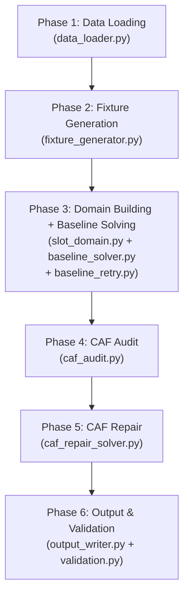
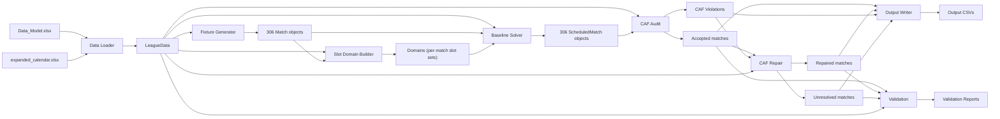

# Egyptian Premier League Schedule Optimizer — Full Detailed Walkthrough

## 1. Project Overview

This project **automatically generates an optimized match schedule** for the Egyptian Premier League (EPL). It takes as input data about the 18 teams, their stadiums, distances, security constraints, and a calendar of available time slots — then produces a complete 306-match double round-robin schedule that respects FIFA blackout dates, CAF (African continental) competition buffers, rest-day rules, venue constraints, and broadcasting fairness.

### The Core Problem

Scheduling a football league is a **combinatorial optimization problem**. You have:
- **18 teams** → 306 matches (each pair plays home and away)
- **34 rounds** (17 first-leg + 17 second-leg)
- **Hundreds of calendar slots** across the season
- **Dozens of hard constraints** (rest days, venue conflicts, FIFA dates, CAF buffers, etc.)
- **Soft objectives** (minimize travel, put big matches in prime slots, balance weekly load)

The project uses **Google OR-Tools CP-SAT** (Constraint Programming with Boolean Satisfiability) to solve this as an integer optimization problem.

### Technology Stack

| Component | Technology |
|---|---|
| Language | Python 3 |
| Optimizer | Google OR-Tools (CP-SAT solver) |
| Data I/O | Pandas + openpyxl (Excel reading) |
| Frontend | Streamlit (interactive web dashboard) |
| Visualization | Altair (charts in Streamlit) |
| Data Format | Excel (.xlsx) input, CSV output |

---

## 2. Project File Structure

```
Egyptian-Premier-League-Schedule-Optimizer/
├── main.py                        # CLI entry point — runs the 6-phase pipeline
├── streamlit_app.py               # Interactive web UI (~4400 lines)
├── requirements.txt               # Dependencies: ortools, pandas, openpyxl, streamlit
├── Nile_League.png                # League logo used in the Streamlit UI header
├── CONTEXT.md                     # Quick-reference repository context & architecture
├── walkthrough.md                 # This file — comprehensive project walkthrough
├── formulation.tex                # LaTeX mathematical formulation of the model
├── dist_matrix.json               # Serialized distance matrix (reference)
│
├── data/                          # INPUT DATA (the two authoritative workbooks)
│   ├── Data_Model.xlsx            #   Teams, stadiums, distances, security rules
│   └── expanded_calendar.xlsx     #   Calendar slots, FIFA dates, CAF blockers
│
├── src/                           # CORE ENGINE (16 Python modules)
│   ├── __init__.py
│   ├── constants.py               #   All configurable parameters (95 lines)
│   ├── tiers.py                   #   Slot-tier and match-tier classification
│   ├── data_loader.py             #   Loads & validates both Excel workbooks
│   ├── fixture_generator.py       #   Generates the 306-match DRR fixture list
│   ├── slot_domain.py             #   Builds per-match feasible slot domains
│   ├── baseline_solver.py         #   CP-SAT model: assigns matches to slots (~1818 lines)
│   ├── baseline_retry.py          #   Domain fallback retry logic for baseline solver
│   ├── caf_audit.py               #   Detects CAF conflicts in the baseline schedule
│   ├── caf_repair_solver.py       #   Reschedules CAF-violating matches (~1066 lines)
│   ├── final_round.py             #   Final-round simultaneous-slot scheduling helpers
│   ├── venue_rules.py             #   Venue selection, ranking, and distance helpers
│   ├── output_writer.py           #   Writes all output CSV files
│   ├── validation.py              #   Final schedule validation engine (~532 lines)
│   ├── multi_run.py               #   Monte Carlo batch execution framework
│   └── historical_engine.py       #   Past-season analysis engine (reference)
│
├── Documentations/                # Academic and product documentation
│   ├── PRD.md                     #   Product requirements document
│   ├── MODEL_EXPLANATION.md       #   Solver design notes
│   ├── presentation.pdf           #   Presentation slides
│   └── Documentation Phase I.pdf  #   Phase I documentation
│
├── Diagrams/                      # Architecture and flow diagrams
├── icons/                         # Team logo PNGs (used by Streamlit UI)
├── past seasons data/             # Historical league CSV files (reference only)
├── Research papers/               # Academic references
├── 50 runs/                       # Results from 50-run Monte Carlo experiments
├── tests/                         # Test files
│
├── output/                        # GENERATED OUTPUT (not committed to git)
│   ├── optimized_schedule.csv     #   Final schedule (306 matches)
│   ├── optimized_schedule_pre_caf.csv   # Pre-CAF-repair schedule
│   ├── caf_postponement_queue.csv #   CAF violation details
│   ├── caf_rescheduled_matches.csv #  Successfully repaired matches
│   ├── unresolved_caf_postponements.csv # Matches that couldn't be repaired
│   ├── week_round_map.csv         #   Round-to-week mapping
│   ├── data_load_log.txt          #   Data loading diagnostics
│   ├── phases/                    #   Diagnostic phase artifacts
│   │   ├── 01_load_summary.json
│   │   ├── 03_round_windows.csv
│   │   ├── 04_fixture_framework.csv
│   │   ├── 04_home_away_patterns.csv
│   │   ├── 05_baseline_feasible_slot_counts.csv
│   │   ├── 06_baseline_solver_status.json
│   │   ├── 07_caf_audit.csv
│   │   ├── 08_repair_feasible_slot_counts.csv
│   │   ├── 09_repair_solver_status.json
│   │   ├── 10_final_validation_report.csv
│   │   └── 10_team_sequence_validation.csv
│   └── multi_run/
│       └── monte_carlo_results.csv
│
├── analyze_historical.py          # Script for historical data analysis
├── analyze_historical_detailed.py # Detailed historical analysis
└── generate_all_historical_fifa.py # FIFA date generator for past seasons
```

---

## 3. How To Run

### CLI Pipeline (Single Run)
```bash
python main.py                    # Uses default seed (88)
python main.py --seed 42          # Custom seed
```

### CLI Pipeline (Monte Carlo — Multiple Seeds)
```bash
python main.py --runs 50 --parallel 4   # Run 50 seeds in parallel
```

### Streamlit Web UI
```bash
streamlit run streamlit_app.py
```

### Dependencies
```
ortools
pandas
openpyxl
streamlit
```

---

## 4. Input Data

All model inputs come from exactly two Excel workbooks in the `data/` directory. **No previous CSV outputs are ever fed back into the solver.**

### `Data_Model.xlsx` — League Structure

| Sheet | Contents | Key Columns |
|---|---|---|
| `team_data` | 18 teams | `Team_ID`, `Team_Name`, `Gov_ID`, `Gov_Name`, `Home_Stadium_ID`, `Alt_Stadium_ID`, `Tier` (1–4), `Cont_Flag` (CL/CC/empty) |
| `Stadiums` | All available stadiums | `Stadium_ID`, `Stadium_Name`, `Gov_ID`, `City`, `Is_Floodlit` |
| `dist_Matrix` | Pairwise stadium distances (km) | Origin rows × Destination columns |
| `Sec_Matrix` | Security rules per matchup | `home_team_ID`, `away_team_ID`, `banned_venue1_ID`, `banned_venue2_ID`, `forced_venue_ID` |

- **Team Tiers**: Teams are ranked 1 (top) to 4 (lowest). This affects match-tier classification and venue-selection penalty weighting.
- **Continental Flag** (`Cont_Flag`): `CL` = CAF Champions League, `CC` = CAF Confederation Cup, empty = no continental commitment.
- **Security Rules**: For specific matchups (e.g., derbies), a forced venue may be mandated and/or certain stadiums banned.

### `expanded_calendar.xlsx` — Calendar & Constraints

| Sheet | Contents | Key Columns |
|---|---|---|
| `expanded _calendar_table` | All possible kickoff slots | `Date`, `Date time`, `Day_ID`, `Week_Num`, `Day_name`, `Is_FIFA`, `Is_CAF`, `Is_Ramadan`, `Is_SuperCup` |
| `FIFA_DAYS1` | FIFA international window dates | Date column |
| `cont_blockers` | CAF match dates per team | `team_id`, `caf_date`/`date_id`, `competition_name`, `round`, `location` |
| `unique_caf` | Deduplicated CAF dates | Date column |

- **FIFA dates** are absolute blackouts — no league match may be scheduled on any FIFA date. They are collected from three sources (the `Is_FIFA` flag column, the dedicated `FIFA_DAYS1` sheet, and any `FIFA_DAY`/`FIFA_DAYS` label columns) and unioned together.
- **CAF blockers** define per-team continental match dates. League matches for a CAF-participating team must maintain a buffer from their CAF dates.

---

## 5. The `LeagueData` Dataclass

All loaded data is packaged into a single immutable dataclass that is passed through the entire pipeline:

```python
@dataclass
class LeagueData:
    teams: pd.DataFrame           # 18 rows from team_data
    stadiums: pd.DataFrame        # All stadiums
    dist_matrix: Dict[str, Dict[str, float]]  # Pairwise distances (km)
    sec_rules: List[SecRule]      # Security rules (forced venues, bans)
    
    slots: pd.DataFrame           # ALL calendar slots (raw)
    usable_slots: pd.DataFrame    # FIFA-filtered slots only
    fifa_dates: Set[date]         # All FIFA blackout dates
    caf_blockers: pd.DataFrame   # CAF match records
    caf_dates_by_team: Dict[str, List[date]]  # Sorted CAF dates per team
    unique_caf_dates: Set[date]  # Deduplicated CAF dates
```

The `SecRule` dataclass represents one row from the security matrix:
```python
@dataclass
class SecRule:
    home_team_id: str
    away_team_id: str
    banned_venue1_id: str
    banned_venue2_id: str
    forced_venue_id: str
```

---

## 6. The Six-Phase Pipeline

The optimizer runs as a sequential six-phase pipeline. Each phase produces diagnostic artifacts in `output/phases/`.



---

### Phase 1: Data Loading (`src/data_loader.py`)

**Purpose**: Read, validate, and normalize both Excel workbooks into the `LeagueData` dataclass.

**Process**:
1. **Load `Data_Model.xlsx`**: Read `team_data` (validate 18 teams), `Stadiums` (cross-check all home stadiums exist), `dist_Matrix` (parse into nested dictionary), and `Sec_Matrix` (parse into `SecRule` objects).
2. **Load `expanded_calendar.xlsx`**: Read the main calendar sheet, the FIFA days sheet, the CAF blockers sheet, and the unique CAF dates sheet.
3. **Normalize all IDs**: All team/stadium IDs are stripped, uppercased, and standardized via `_norm_id()`.
4. **Parse dates**: All date columns are converted to Python `date` objects. The `Date time` column (kickoff times) is normalized — if raw values are `time` objects, they are combined with the date to produce `datetime` objects.
5. **Build FIFA date set**: Three sources are unioned (the `Is_FIFA` binary flag, the `FIFA_DAYS1` sheet, and any `FIFA_DAY`/`FIFA_DAYS` label columns).
6. **Build CAF data**: Per-team sorted lists of CAF dates, and a deduplicated global set.
7. **Create usable slots**: The full slot table filtered to exclude FIFA dates and null dates.

**Outputs**:
- `output/data_load_log.txt` — Human-readable loading summary
- `output/phases/01_load_summary.json` — Machine-readable counts

---

### Phase 2: Fixture Generation (`src/fixture_generator.py`)

**Purpose**: Generate the complete 306-match double round-robin fixture framework with valid home/away patterns.

**Algorithm — Circle Method + CP-SAT Orientation**:

1. **Shuffle teams**: Sort team IDs, then shuffle with the seeded RNG (`random.Random(seed)`). This makes different seeds produce different fixtures.

2. **Circle method pairing**: Fix one team (`team_ids[0]`) and rotate the remaining 17. For each of the 17 rotations:
   - Pair the fixed team with one rotating team
   - Pair remaining teams by mirroring (position `i` with position `n-1-i`)
   - This produces 17 rounds × 9 matches = 153 first-leg pairings

3. **Home/away orientation** (CP-SAT model): The raw pairings from the circle method don't specify who is home. A CP-SAT model decides orientation with these constraints:
   - Each team has exactly 17 home and 17 away matches across 34 rounds
   - **No 3+ consecutive home or away** (sliding window of 3 rounds: sum ≥ 1 and ≤ 2)
   - **Rolling-5 balance** (optional): In any 5 consecutive rounds, each team has 2 or 3 home matches
   - **Balanced edges** (optional): Rounds 1–2 and 33–34 have exactly one home and one away
   - The model tries three relaxation levels: full constraints → drop balanced edges → drop rolling-5

4. **Second leg mirroring**: For each first-leg pairing `(A, B)` in round `r`, create a second-leg match `(B, A)` in round `r + 17`.

5. **Venue assignment**: Each match's venue is resolved using security rules:
   - If there's a **forced venue** for this matchup → use it
   - Otherwise → use the home team's `Home_Stadium_ID`

6. **Match tier calculation**: Using `tiers.match_tier(home_tier, away_tier)`:
   - Both Tier 1 or Tier 1 vs Tier 2 → Match Tier 1
   - Both Tier 2, or Tier 1 vs Tier 3 → Match Tier 2
   - Otherwise → Match Tier 3

7. **Validation**: The generated fixtures are verified for completeness (306 matches, all 306 ordered pairs present, each team has 17 home + 17 away, each round has exactly 9 matches, no team appears twice in a round).

**Key Data Structure — `Match`**:
```python
@dataclass
class Match:
    match_idx: int      # Global 0-based index (0..305)
    round_num: int      # 1-based round (1..34)
    home_team: str      # e.g., "AHL"
    away_team: str      # e.g., "ZAM"
    venue: str          # e.g., "CAIRO_INTL"
    match_tier: int     # 1, 2, or 3
```

**Outputs**:
- `output/phases/04_fixture_framework.csv` — All 306 matches
- `output/phases/04_home_away_patterns.csv` — Per-team H/A pattern strings (e.g., "HAHHAAHA...")

---

### Phase 3: Domain Building & Baseline Solving

This phase has three sub-modules: **slot domain construction**, **baseline retry logic**, and the **baseline CP-SAT solver**.

#### Phase 3a: Slot Domain Construction (`src/slot_domain.py`)

**Purpose**: For each match, compute the set of usable-slot indices (the "domain") where it could legally be placed.

**Process**:

1. **Build round windows**: 34 chronological, non-overlapping date windows are constructed from the usable slots:
   - Start from the earliest available date and slide forward
   - Each window spans `NON_FINAL_ROUND_BASE_WINDOW_DAYS = 5` calendar days
   - A window must have at least `MATCHES_PER_ROUND = 9` slots and CAF-safe capacity
   - Windows are non-overlapping (each starts after the previous one ends)
   - The **final round** (Round 34) gets a special tail domain extending to the end of the season

2. **CAF-blocked slot identification**: For each CAF-participating team, compute the set of slot indices that fall within `MIN_REST_DAYS_CAF + 1 = 4` calendar days of any of their CAF dates. These slots are "blocked" for that team.

3. **Adaptive window expansion** (non-final policy): Three domain policies progressively widen windows for feasibility:
   - **`compact`**: Expand pressured windows up to `NON_FINAL_ROUND_MAX_WINDOW_DAYS = 28` days
   - **`epl_relaxed`**: Expand up to `NON_FINAL_ROUND_EPL_FALLBACK_WINDOW_DAYS = 56` days
   - **`epl_full`**: Spill all non-final round windows to the season end
   
   A round "needs more slack" when its window has fewer than `NON_FINAL_ROUND_MIN_SLOT_COUNT = 15` slots, or when any match in the round has fewer than `NON_FINAL_ROUND_MIN_FEASIBLE_SLOTS_PER_MATCH = 9` feasible slots.

4. **Per-match domain computation**: Each match's domain = its round's slot window minus any CAF-blocked slots for either participating team. If CAF filtering eliminates ALL slots, the full round window is used (with a "caf_relaxed" flag) and the match relies on the CAF repair phase to fix any resulting violations.

**Key Data Structure — `RoundWindow`**:
```python
@dataclass(frozen=True)
class RoundWindow:
    round_num: int
    start_date: date
    end_date: date
    week_nums: str          # Semicolon-separated week numbers
    slot_indices: List[int]  # Indices into usable_slots DataFrame
```

**Outputs**:
- `output/phases/03_round_windows.csv` — All 34 round windows with date ranges and slot counts
- `output/phases/05_baseline_feasible_slot_counts.csv` — Per-match feasible slot counts

#### Phase 3b: Baseline Retry (`src/baseline_retry.py`)

**Purpose**: Automatically retry the baseline solver with progressively looser domain policies if the initial attempt is infeasible.

**Process**: The system tries up to three domain policies in order:
1. `compact` — Compact round windows (default)
2. `epl_relaxed` — Extended EPL spillover windows
3. `epl_full` — Full EPL spillover tails (season-end)

If a policy produces a feasible solution, the solver stops. The final `06_baseline_solver_status.json` records which policy was used and how many attempts were needed.

#### Phase 3c: Baseline CP-SAT Solver (`src/baseline_solver.py`)

**Purpose**: Assign all 306 matches to calendar slots and venues while satisfying hard constraints and minimizing a weighted soft-objective function.

This is the **core optimization engine** (~1818 lines). It builds and solves a Constraint Programming model using Google OR-Tools.

##### Decision Variables

The primary decision variable is a **binary assignment matrix**:

```
x[match_idx][(slot_idx, venue)] ∈ {0, 1}
```

For each match `m`, for each feasible `(slot, venue)` pair in its domain, there is a Boolean variable. Exactly one must be 1 (the match is assigned to that slot at that venue).

Additional auxiliary variables:
- `match_day[match_idx]` — The day ID (integer) the match is assigned to
- `venue_date_vars[(venue, date)]` — List of all assignment vars that use that venue on that date
- `all_vars_by_slot[slot_idx]` — All assignment vars using that slot index

##### Venue Selection Logic (`src/venue_rules.py`)

For each match, candidate venues are ranked:

1. **Forced venue** (from security rules) — Overrides everything. Only one option.
2. **Primary home venue** — The home team's `Home_Stadium_ID`
3. **Alternate home venue** — The home team's `Alt_Stadium_ID` (if different from primary)
4. **Other stadiums** — All remaining stadiums, sorted by distance from the home team's primary venue

Each `VenueCandidate` carries metadata:
```python
@dataclass(frozen=True)
class VenueCandidate:
    venue: str
    is_forced: bool
    is_primary: bool
    is_alt: bool
    is_other: bool
    home_displacement_km: float  # Distance from primary home venue
```

##### Hard Constraints

| Constraint | Description | Implementation |
|---|---|---|
| **Assignment uniqueness** | Each match assigned to exactly one (slot, venue) pair | `sum(vars) == 1` per match |
| **Venue-slot exclusivity** | No two matches at the same venue in the same slot | `sum(venue_slot_vars) <= 1` |
| **Team rest days** | Each team must have at least `MIN_REST_DAYS_LOCAL = 3` full rest days between any two of its matches (i.e., dates at least 4 apart) | Sliding window constraint: for every team and every window of `gap + 1` days, at most 1 match |
| **Daily match cap** | At most `MAX_MATCHES_PER_DAY = 3` matches on any calendar date | `sum(date_vars) <= 3` |
| **Slot concurrency cap** | At most `MAX_MATCHES_PER_SLOT = 2` matches at the same kickoff time | `sum(slot_vars) <= 2` |
| **Weekly hard cap** | At most `HARD_MAX_MATCHES_PER_WEEK = 18` matches per calendar week | `load <= 18` |
| **Round ordering** | Consecutive non-final rounds must start on different calendar days (gap ≥ `MIN_DAYS_BETWEEN_ROUNDS = 1`) | Constraint on `match_day` variables across rounds |
| **Final round — single day** | All 9 Round 34 matches must be on the same calendar date (when `ENFORCE_FINAL_ROUND_SINGLE_DAY = True`) | `match_day` equality + relaxed daily cap = 9 |
| **Final round — single slot** | All 9 Round 34 matches must share the same kickoff slot (when `ENFORCE_FINAL_ROUND_SINGLE_SLOT = True`) | Slot index equality + relaxed slot cap = 9 |

##### Soft Objectives (Penalty Minimization)

The solver minimizes a weighted sum of penalty terms:

| Penalty | Weight | Logic |
|---|---|---|
| **Round chronological order** | `W_ROUND_ORDER = 100` per week-offset | Penalizes matches that play in a calendar week far from their round's nominal week |
| **Travel distance** | `W_TRAVEL = 1` per km | Away team's home stadium distance to match venue |
| **Tier mismatch** | `W_TIER_MISMATCH = 20` per tier gap | Match tier vs. slot tier difference (e.g., a tier-1 match in a tier-3 slot) |
| **Weekly underload** | `W_WEEK_UNDERLOAD = 50` per match below soft min | Penalizes weeks with fewer than `SOFT_MIN_MATCHES_PER_WEEK = 6` matches |
| **Weekly overload** | `W_WEEK_OVERLOAD = 50` per match above soft max | Penalizes weeks with more than `SOFT_MAX_MATCHES_PER_WEEK = 12` matches |
| **Evening preference** | `W_EVENING_PREFERENCE = 50` per hour before 21:00 | Encourages 8pm/10pm kickoffs. Penalty = max(0, 21 - kickoff_hour) |
| **Slot spread** | `W_SLOT_SPREAD = 500` per collision | Penalizes more than one match in the same kickoff slot on the same day |
| **Stadium maintenance overlap** | `W_STADIUM_MAINTENANCE_OVERLAP = 5,000,000` | Penalizes non-forced matches at the same venue within `MIN_STADIUM_SERVICE_GAP_DAYS = 2` days. This is a **soft constraint** — the solver can violate it at high cost |
| **Same-day venue reuse** | Fixed `50,000,000` | Additional massive penalty when a venue hosts >1 match on the same date |
| **Alternate stadium relief** | `ALT_STADIUM_RELIEF_PENALTY = 1,000,000` × tier_weight | Penalty for using the alternate home stadium instead of the primary |
| **Other stadium relief** | `OTHER_STADIUM_RELIEF_PENALTY = 3,000,000` × tier_weight | Penalty for using a non-home, non-alternate fallback venue |
| **Home venue displacement** | `W_HOME_VENUE_DISPLACEMENT = 1` per km | Per-km penalty for how far a venue is from the home team's primary stadium |

**Tier Weights**: Tier 1 teams have a weight of 10, Tier 2 = 5, Tier 3 = 2, Tier 4 = 1. This means displacing a Tier 1 team from its home venue is penalized 10× more than a Tier 4 team.

##### Solver Configuration

```python
solver.parameters.max_time_in_seconds = 600   # 10 minutes
solver.parameters.num_workers = 4              # Parallel search workers
solver.parameters.log_search_progress = True   # Console progress logging
```

##### Final-Round Rescue Model

If the strict baseline solver returns INFEASIBLE, the system automatically attempts a **Final-Round Rescue**. This is a two-phase approach:

1. **Solve the non-final schedule**: Build a model for rounds 1–33 only (with slightly relaxed constraints) and solve it.
2. **Rescue Round 34**: Given the fixed rounds 1–33 schedule, build a separate smaller CP-SAT model to place all 9 Round 34 matches. The rescue model:
   - Considers ALL usable slots (not just the round's original window)
   - Allows relaxation of certain constraints at extreme penalty costs:
     - `FINAL_ROUND_RESCUE_FORCED_VENUE_BREAK_PENALTY = 24,000,000` (breaking forced venue rules)
     - `FINAL_ROUND_RESCUE_TIER1_SLOT_PENALTY = 12,000,000` (using non-tier-1 slots)
     - `FINAL_ROUND_RESCUE_LOCAL_REST_SHORTFALL_PENALTY = 30,000,000` (shortening rest days)

**Key Data Structure — `ScheduledMatch`**:
```python
@dataclass
class ScheduledMatch:
    match_idx: int
    round_num: int
    home_team: str
    away_team: str
    venue: str
    match_tier: int
    slot_idx: int
    day_id: str
    date: date
    date_time: object
    week_num: int
    day_name: str
    slot_tier: int
    travel_km: float
    is_forced_venue: bool = False
```

**Outputs**:
- `output/phases/06_baseline_solver_status.json` — Solver status, wall time, objective value, domain policy used

---

### Phase 4: CAF Audit (`src/caf_audit.py`)

**Purpose**: Scan the baseline schedule to identify matches that violate CAF buffer rules for continental-participating teams.

**Process**:

1. **Identify CAF teams**: All teams with `Cont_Flag` of `CL` (Champions League) or `CC` (Confederation Cup).

2. **Scan each match**: For every match in the baseline, check both the home and away team. If either team is a CAF team, check:
   - **SAME_DAY**: The league match date is on the same day as a CAF match
   - **PRE**: The league match is too close BEFORE a CAF match (gap < `MIN_REST_DAYS_CAF + 1 = 4` days)
   - **POST**: The league match is too close AFTER a CAF match (gap < 4 days)

3. **Split results**: Matches are divided into `accepted` (no CAF issues) and `violations` (queued for repair).

**Key Data Structure — `CAFViolation`**:
```python
@dataclass
class CAFViolation:
    match: ScheduledMatch
    affected_team_id: str
    conflicting_caf_date: date
    conflicting_caf_competition: str
    conflicting_caf_round: str
    conflict_direction: str  # PRE, POST, SAME_DAY
    violation_reason: str
```

**Outputs**:
- `output/caf_postponement_queue.csv` — Detailed violation information
- `output/phases/07_caf_audit.csv` — Per-match audit results

---

### Phase 5: CAF Repair (`src/caf_repair_solver.py`)

**Purpose**: Reschedule CAF-violating matches into new slots that satisfy all constraints, including CAF buffers.

**Architecture**: The repair module provides two solver paths, automatically selected based on the `MIN_STADIUM_SERVICE_GAP_DAYS` setting:

- **Legacy repair** (`MIN_STADIUM_SERVICE_GAP_DAYS <= 0`): Venue-fixed greedy nearest-slot algorithm
- **Stadium-gap-aware repair** (`MIN_STADIUM_SERVICE_GAP_DAYS > 0`): Same greedy algorithm but also considers venue reassignment and stadium maintenance gaps

#### Repair Algorithm

1. **Build occupied state** (`_OccupiedState`): Track what's already scheduled — team dates, venue usage, week loads, slot usage, home/away sequences. This state is incrementally updated as matches are placed.

2. **Final-round batch handling**: If any Round 34 matches are CAF-violated, they are extracted as a batch. All Round 34 matches (from both `accepted` and `queued`) are collected and solved together using a mini CP-SAT model to ensure they all land on the same slot.

3. **Greedy nearest-slot placement**: The remaining violated matches are sorted by urgency (fewest valid slots first), then placed in up to 3 passes:
   - For each match, find all valid slots (satisfying rest days, CAF buffers, venue uniqueness, streak limits, daily/weekly caps)
   - Rank by proximity to original date, stadium maintenance violation count, and whether an alternate venue is needed
   - Assign to the best available slot
   - Update the occupied state
   - Repeat. Matches that could not be placed in pass N may become placeable in pass N+1 as the state evolves.

4. **Hard constraint checks per candidate slot**:
   - Both teams free on that date
   - Both teams have `MIN_REST_DAYS_LOCAL` rest from their nearest other match
   - No home/away streak violation (max 2 consecutive)
   - Both teams have `MIN_REST_DAYS_CAF + 1` gap from nearest CAF date
   - Slot not at max capacity (`MAX_MATCHES_PER_SLOT`)
   - Week not at max capacity (`HARD_MAX_MATCHES_PER_WEEK`)
   - Date not at max capacity (`MAX_MATCHES_PER_DAY`)
   - Venue not already used in that slot

**Outputs**:
- `output/phases/08_repair_feasible_slot_counts.csv` — How many valid slots each violated match has
- `output/phases/09_repair_solver_status.json` — Repair statistics (count repaired, unresolved, elapsed time)

---

### Phase 6: Output & Validation (`src/output_writer.py` + `src/validation.py`)

#### Output Writer

**Files produced**:

| File | Description | Row count |
|---|---|---|
| `optimized_schedule_pre_caf.csv` | Full baseline schedule before any CAF adjustments | 306 |
| `optimized_schedule.csv` | **Final schedule** — accepted + repaired matches | 306 (or fewer if unresolved) |
| `caf_postponement_queue.csv` | All CAF violations with final repair statuses | Varies |
| `caf_rescheduled_matches.csv` | Only the matches that were successfully repaired | Varies |
| `unresolved_caf_postponements.csv` | Matches that could not be repaired | Varies (ideally 0) |
| `week_round_map.csv` | Which calendar weeks each round spans | 34 |

#### Validation Engine

The validation module runs 9 comprehensive checks on the final (accepted + repaired) schedule:

| Check | Severity | What It Validates |
|---|---|---|
| `FIXTURE_COUNT` | ERROR | Total matches = 306, all 306 ordered pairs present |
| `FIFA_DATE` | ERROR | No match scheduled on a FIFA blackout date |
| `TEAM_REST` | ERROR | Every team has ≥ `MIN_REST_DAYS_LOCAL + 1` = 4 days between consecutive league matches |
| `TEAM_HOME_AWAY_STREAK` | ERROR | No team has 3+ consecutive home or 3+ consecutive away |
| `TEAM_ROUND_ORDER` | ERROR | Non-postponed rounds play in chronological order per team |
| `DAILY_MATCH_CAP` | ERROR | At most 3 matches per day (9 for final round day) |
| `SLOT_MATCH_CAP` | ERROR | At most 2 matches per slot (9 for final round slot) |
| `VENUE_SLOT_CONFLICT` | ERROR | No two matches at the same venue in the same slot |
| `GLOBAL_ROUND_ORDER` | ERROR | Consecutive rounds start on strictly later calendar days |
| `STADIUM_SERVICE_GAP` | WARN | Non-forced matches at same venue have ≥ 3 days apart |
| `CAF_BUFFER` | ERROR | CAF teams have ≥ 4 day gap between league and CAF matches |
| `ROLLING5_BALANCE` | WARN | Each team has 2 or 3 home matches in any 5-match window |
| `UNRESOLVED_POSTPONEMENTS` | WARN | Lists any CAF-postponed matches that couldn't be repaired |

The validation also builds a **team sequence report** (`10_team_sequence_validation.csv`) — a chronological play-by-play for each team showing gaps, streak lengths, H/A patterns, rolling-5 balance, and whether each match was postponed.

**Outputs**:
- `output/phases/10_final_validation_report.csv` — All validation findings
- `output/phases/10_team_sequence_validation.csv` — Per-team chronological sequence analysis

---

## 7. Configuration Constants (`src/constants.py`)

All tunable parameters are centralized in one file. Here is the complete table:

### League Structure
| Constant | Value | Description |
|---|---|---|
| `NUM_TEAMS` | 18 | Number of teams in the league |
| `NUM_ROUNDS` | 34 | Total rounds (17 × 2 for double round-robin) |
| `MATCHES_PER_ROUND` | 9 | Matches per round (18 / 2) |

### Rest-Day Rules
| Constant | Value | Description |
|---|---|---|
| `MIN_REST_DAYS_LOCAL` | 3 | Minimum full rest days between league matches (dates ≥ 4 apart) |
| `MIN_REST_DAYS_CAF` | 3 | Minimum rest days between league and CAF matches (dates ≥ 4 apart) |
| `PREFERRED_REST_DAYS_CAF` | 5 | Preferred CAF rest gap (dates ≥ 6 apart) — used for bonus penalties |

### Home/Away Streak Cap
| Constant | Value | Description |
|---|---|---|
| `MAX_CONSECUTIVE_HOME` | 2 | Maximum consecutive home matches per team |
| `MAX_CONSECUTIVE_AWAY` | 2 | Maximum consecutive away matches per team |

### Weekly Load Balancing
| Constant | Value | Description |
|---|---|---|
| `HARD_MIN_MATCHES_PER_WEEK` | 6 | Hard lower bound on weekly matches |
| `HARD_MAX_MATCHES_PER_WEEK` | 18 | Hard upper bound on weekly matches |
| `SOFT_MIN_MATCHES_PER_WEEK` | 6 | Below this → underload penalty |
| `SOFT_MAX_MATCHES_PER_WEEK` | 12 | Above this → overload penalty |

### Day and Slot Concurrency
| Constant | Value | Description |
|---|---|---|
| `MAX_MATCHES_PER_DAY` | 3 | Max league matches on one calendar date |
| `MAX_MATCHES_PER_SLOT` | 2 | Max matches at the same kickoff time |
| `MIN_DAYS_BETWEEN_ROUNDS` | 1 | Min calendar day gap between consecutive rounds |
| `MIN_STADIUM_SERVICE_GAP_DAYS` | 2 | Min days between non-forced matches at same venue |

### Round Window Policy
| Constant | Value | Description |
|---|---|---|
| `NON_FINAL_ROUND_BASE_WINDOW_DAYS` | 5 | Initial round window width (days) |
| `NON_FINAL_ROUND_MAX_WINDOW_DAYS` | 28 | Max window under compact policy |
| `NON_FINAL_ROUND_EPL_FALLBACK_WINDOW_DAYS` | 56 | Max window under EPL relaxed policy |
| `NON_FINAL_ROUND_MIN_SLOT_COUNT` | 15 | Min slots in a round window (base_window × max_matches_per_day) |
| `NON_FINAL_ROUND_MIN_FEASIBLE_SLOTS_PER_MATCH` | 9 | Min feasible slots per match before expansion triggers |

### Final-Round Publication Rule
| Constant | Value | Description |
|---|---|---|
| `FINAL_ROUND_NUM` | 34 | The final round number |
| `ENFORCE_FINAL_ROUND_SINGLE_DAY` | True | All Round 34 matches must be on the same day |
| `ENFORCE_FINAL_ROUND_SINGLE_SLOT` | True | All Round 34 matches must share one kickoff slot |
| `FINAL_ROUND_MAX_MATCHES_PER_DAY` | 9 | Relaxed daily cap for the final round day |
| `FINAL_ROUND_MAX_MATCHES_PER_SLOT` | 9 | Relaxed slot cap for the final round slot |

### Soft-Objective Weights
| Constant | Value | Description |
|---|---|---|
| `W_ROUND_ORDER` | 100 | Per-week-offset penalty for round order |
| `W_WEEK_UNDERLOAD` | 50 | Per-match-below-soft-min penalty |
| `W_WEEK_OVERLOAD` | 50 | Per-match-above-soft-max penalty |
| `W_TRAVEL` | 1 | Per-km travel penalty |
| `W_TIER_MISMATCH` | 20 | Per-tier-gap mismatch penalty |
| `W_CAF_PREFERRED` | 10 | Bonus for 6-day CAF gap |
| `W_EVENING_PREFERENCE` | 50 | Per-hour penalty for pre-21:00 kickoff |
| `W_SLOT_SPREAD` | 500 | Penalty for >1 match in same slot |
| `W_STADIUM_MAINTENANCE_OVERLAP` | 5,000,000 | Penalty for back-to-back venue use |
| `ALT_STADIUM_RELIEF_PENALTY` | 1,000,000 | Base penalty for alternate stadium |
| `OTHER_STADIUM_RELIEF_PENALTY` | 3,000,000 | Base penalty for non-home, non-alt venue |
| `W_HOME_VENUE_DISPLACEMENT` | 1 | Per-km penalty for home venue displacement |

### Solver Limits
| Constant | Value | Description |
|---|---|---|
| `BASELINE_SOLVER_TIME_LIMIT_S` | 600 | Baseline solver time limit (10 minutes) |
| `REPAIR_SOLVER_TIME_LIMIT_S` | 60 | Repair solver time limit (1 minute) |

### Other
| Constant | Value | Description |
|---|---|---|
| `DEFAULT_SEED` | 88 | Default random seed for fixture generation |
| `DATA_MODEL_PATH` | `data/Data_Model.xlsx` | Path to team/stadium data |
| `EXPANDED_CALENDAR_PATH` | `data/expanded_calendar.xlsx` | Path to calendar data |
| `OUTPUT_DIR` | `output` | Output directory |
| `PHASES_DIR` | `output/phases` | Phase artifact directory |

---

## 8. Supporting Modules

### Tier Classification (`src/tiers.py`)

**Slot Tier** — Classifies calendar slots by attractiveness:
- **Tier 1**: Weekend (FRI/SAT) evening (kickoff ≥ 19:00)
- **Tier 2**: Weekend afternoon OR weekday evening
- **Tier 3**: Weekday afternoon/early

**Match Tier** — Classifies matches by team quality:
- **Tier 1**: Both teams ≤ Tier 2 and at least one is Tier 1
- **Tier 2**: Both teams ≤ Tier 2 (but not Tier 1), or Tier 1 vs Tier 3
- **Tier 3**: Everything else

The solver tries to assign Tier 1 matches to Tier 1 slots, penalizing mismatches.

### Final Round Helpers (`src/final_round.py`)

This module provides shared utilities for the final-round simultaneous-kickoff rule:

- `is_final_round(round_num)` — Checks if a round is Round 34 with enforcement enabled
- `collect_final_round_matches(matches)` — Filters matches to Round 34
- `get_valid_final_round_shared_date(matches)` — Returns the shared date if all 9 matches are on one day
- `get_valid_final_round_shared_slot(matches)` — Returns the shared slot if all 9 matches share one slot
- `allowed_matches_on_date(date, valid_date)` — Returns 9 for the final round day, 3 otherwise
- `allowed_matches_in_slot(slot, valid_slot)` — Returns 9 for the final round slot, 2 otherwise

### Venue Rules (`src/venue_rules.py`)

Centralized venue-selection logic used by both the baseline solver and CAF repair:

- `build_team_lookup(data)` — Builds a `Dict[str, dict]` mapping team IDs to their home/alt/tier info
- `find_sec_rule(home, away, rules)` — Looks up the security rule for a specific matchup
- `get_venue_options(home, away, teams_dict, rules)` — Returns a `VenueOptions` with primary, alternate, forced, banned, and allowed venues
- `get_ranked_venue_candidates(...)` — Returns an ordered list of `VenueCandidate` objects (forced → primary → alt → others sorted by distance)
- `stadium_distance(dist_matrix, origin, dest)` — Looks up the distance between two stadiums (bidirectional lookup, returns 1,000,000 km if unknown)

---

## 9. Monte Carlo / Multi-Run Framework (`src/multi_run.py`)

The system supports running the pipeline with multiple random seeds to find the best schedule across many fixture drawings.

### Architecture

- **Parallel execution**: Uses `ProcessPoolExecutor` with configurable `max_workers`
- **Checkpointing**: Results are saved to `output/multi_run/monte_carlo_results.csv` after every successful run with atomic file writes (temp file → fsync → rename)
- **Resume support**: On restart, previously completed seeds are loaded and skipped
- **Best-seed restoration**: After all runs complete, the best seed is re-run to produce its full output artifacts

### Metrics per Run (`RunMetrics`)

```python
@dataclass
class RunMetrics:
    seed: int
    baseline_objective: Optional[float]
    caf_violations: int
    repaired_count: int
    unresolved_count: int
    total_travel_km: float
    max_rest_gap: int
    top_3_venue_share: float
    validation_errors: int
    validation_warnings: int
    wall_time_s: float
```

### Best-Run Selection Priority

1. **Fewest validation errors** (hard constraint violations)
2. **Fewest unresolved CAF matches** (all 306 matches playable)
3. **Lowest baseline objective** (optimal soft-constraint performance)
4. **Lowest total travel** (tie-breaking)

---

## 10. Historical Analysis Engine (`src/historical_engine.py`)

A reference module for analyzing past Egyptian Premier League seasons. It reads CSV files from the `past seasons data/` directory and computes metrics like:

- Match counts, FIFA days, max raw gap between matches, max "waste" gap (adjusting for FIFA/CAF blocked days), and longest home/away streaks.
- Team name mapping from full names (e.g., "Ahly SC") to standardized IDs (e.g., "AHL").
- Team-to-stadium mapping for historical seasons.

This module is **not part of the optimization pipeline** — it serves as a benchmark and validation reference.

---

## 11. Streamlit Web UI (`streamlit_app.py`)

A comprehensive 4,400-line Streamlit application providing an interactive frontend for the optimizer. It includes:

### Features

1. **Pipeline Runner**: Execute the full 6-phase pipeline with real-time progress bars, phase-by-phase status indicators, and console log streaming.

2. **Configuration Panel**: Override any constant from `constants.py` at runtime via sidebar widgets (sliders, number inputs, toggles). Changes apply for the current session without modifying source files.

3. **Data Explorer**: Browse loaded data (teams, stadiums, distance matrix, security rules, calendar slots, FIFA dates, CAF blockers).

4. **Schedule Viewer**: Interactive table of the final 306-match schedule with filtering by round, team, venue, and date range.

5. **Calendar Heatmap**: Visual calendar showing daily match density across the season.

6. **Team Analytics**: Per-team dashboards showing match sequences, rest-day distributions, home/away patterns, and travel statistics.

7. **Validation Dashboard**: Summary of all validation checks with severity-colored results and drill-down details.

8. **CAF Impact Analysis**: Visualization of CAF violations, repairs, and any unresolved postponements.

9. **Monte Carlo Results Browser**: If multi-run results exist, display comparative metrics across seeds.

### UI Design

- Purple-themed palette with custom CSS styling
- Team logos from the `icons/` directory
- Altair charts for interactive visualizations

---

## 12. Mathematical Formulation Summary

The optimization problem can be expressed as:

**Minimize**: `Σ (penalty terms)`

Subject to:
1. **Each match assigned exactly once**: `Σ_{(s,v)} x[m,s,v] = 1 ∀ m`
2. **Venue-slot uniqueness**: `Σ_m x[m,s,v] ≤ 1 ∀ (s,v)`
3. **Team rest**: For each team and each window of `MIN_REST_DAYS_LOCAL + 1` days, at most 1 match
4. **Daily load**: `Σ_m (assigned to date d) ≤ MAX_MATCHES_PER_DAY`
5. **Slot load**: `Σ_m (assigned to slot s) ≤ MAX_MATCHES_PER_SLOT`
6. **Weekly load**: `Σ_m (assigned to week w) ≤ HARD_MAX_MATCHES_PER_WEEK`
7. **Round ordering**: Round r+1 starts strictly after round r ends
8. **Final round**: All 9 matches share one date and one slot
9. **Stadium service gap** (soft): Non-forced venue reuse within `MIN_STADIUM_SERVICE_GAP_DAYS` penalized

**Penalty function**: `W_ROUND_ORDER × week_diff + W_TRAVEL × travel_km + W_TIER_MISMATCH × tier_diff + W_EVENING_PREFERENCE × hour_gap + W_SLOT_SPREAD × slot_collision + W_STADIUM_MAINTENANCE × venue_overlap + ALT_PENALTY × is_alt × tier_weight + OTHER_PENALTY × is_other × tier_weight + W_DISPLACEMENT × displacement_km + W_UNDERLOAD × under + W_OVERLOAD × over`

---

## 13. Key Design Decisions

### Why Two-Phase CAF Handling?

The baseline solver intentionally ignores some CAF buffer constraints during its primary optimization. This is because:
1. CAF dates create tight per-team windows that can easily make the full 306-match problem infeasible
2. The audit-then-repair approach lets the baseline find a strong global schedule first, then locally adjusts only the few matches that violate CAF buffers
3. Typically only 5–15 matches need repair, keeping the repair problem small and fast

### Why the Circle Method?

The circle method guarantees a complete, balanced round-robin with exactly N-1 rounds for N teams. Combined with CP-SAT orientation solving, it produces home/away patterns that are provably valid (no 3+ streaks, balanced edges, rolling-5 balance) before slot assignment even begins.

### Why Venue Flexibility in the Baseline?

Instead of hardcoding each match to its home team's stadium, the solver considers primary, alternate, and (optionally) other stadiums. This prevents infeasibility when:
- A team's home stadium is on a tight maintenance schedule
- Multiple teams share a stadium (e.g., Cairo International Stadium hosts multiple teams)
- Security rules force certain matches to specific venues

The massive penalty weights (`1M` for alternate, `3M` for other) ensure venue reassignment only happens when absolutely necessary.

### Why Soft Stadium Maintenance?

The `MIN_STADIUM_SERVICE_GAP_DAYS` constraint is intentionally soft (penalized, not forbidden) because making it hard would often cause infeasibility — particularly for popular shared stadiums like Cairo International Stadium that may need to host multiple matches per week.

---

## 14. End-to-End Data Flow



---

## 15. Phase Artifact Index

Every run produces diagnostic artifacts in `output/phases/` that trace the full pipeline execution:

| Phase | File | Purpose |
|---|---|---|
| 1 | `01_load_summary.json` | Data loading counts and paths |
| 3 | `03_round_windows.csv` | 34 round windows with date ranges |
| 2 | `04_fixture_framework.csv` | Complete 306-match fixture list |
| 2 | `04_home_away_patterns.csv` | Per-team H/A patterns with streak/balance stats |
| 3 | `05_baseline_feasible_slot_counts.csv` | Per-match feasible domain sizes |
| 3 | `06_baseline_solver_status.json` | Solver outcome, time, objective, domain policy |
| 4 | `07_caf_audit.csv` | Per-match CAF violation flags |
| 5 | `08_repair_feasible_slot_counts.csv` | Feasible repair slots per violated match |
| 5 | `09_repair_solver_status.json` | Repair outcome counts and timing |
| 6 | `10_final_validation_report.csv` | All validation findings (ERROR/WARN/PASS) |
| 6 | `10_team_sequence_validation.csv` | Per-team chronological sequence analysis |

---

## 16. Running the Full Pipeline — Example Flow

```
$ python main.py --seed 88

============================================================
Phase 1: Loading data...
============================================================
  Teams: 18
  Stadiums: 12
  Total slots: 450
  FIFA dates: 28
  Usable slots: 380
  CAF blockers: 24
  CAF teams: ['AHL', 'ZAM', 'PYR']

============================================================
Phase 2: Generating DRR fixtures (seed=88)...
============================================================
  [fixture] 306 matches generated.
  [fixture] H/A orientation solved (rolling-5 + balanced edges).

============================================================
Phase 3: Building slot domains and solving baseline...
============================================================
  [baseline] Domain policy 1/3: compact round windows.
  [baseline] Model built in 2.3s. Solving...
  [baseline] Solver status: OPTIMAL (45.2s)
  [baseline] 306 matches scheduled.

============================================================
Phase 4: CAF audit...
============================================================
  [caf_audit] 8 violations found across 6 matches.
  [caf_audit] 300 accepted, 6 queued for repair.

============================================================
Phase 5: CAF repair...
============================================================
  [caf_repair] Starting repair phase with stadium service gap (2 days)...
  [caf_repair] 6 unique matches to repair.
  [repair pass 1] REPAIRED: match 42 (AHL vs CER) moved from 2026-10-15 to 2026-10-22
  ...
  [caf_repair] Done in 1.2s: 6 repaired, 0 unresolved.

============================================================
Phase 6: Writing final outputs...
============================================================
  [output] Wrote output/optimized_schedule.csv (306 rows)
  [output] Wrote output/caf_postponement_queue.csv (6 rows)
  [validation] 0 errors, 2 warnings.

============================================================
Process complete in 52.8s
============================================================
```

---

## 17. Key Metrics for Evaluation

When presenting or evaluating the optimizer's output, these are the key metrics to check:

1. **Validation Errors**: Must be 0 for a valid schedule
2. **Validation Warnings**: Should be minimal (stadium service gaps, rolling-5 imbalance)
3. **CAF Violations Found / Repaired / Unresolved**: Ideally all violations repaired, 0 unresolved
4. **Total Travel (km)**: Lower is better — measures away team travel efficiency
5. **Tier Mismatch Rate**: How many top matches landed in prime slots
6. **Baseline Objective Value**: The CP-SAT objective function value — lower is better
7. **Solver Wall Time**: How long the optimization took
8. **Final Round**: Verify all 9 Round 34 matches are on the same day and same kickoff time
