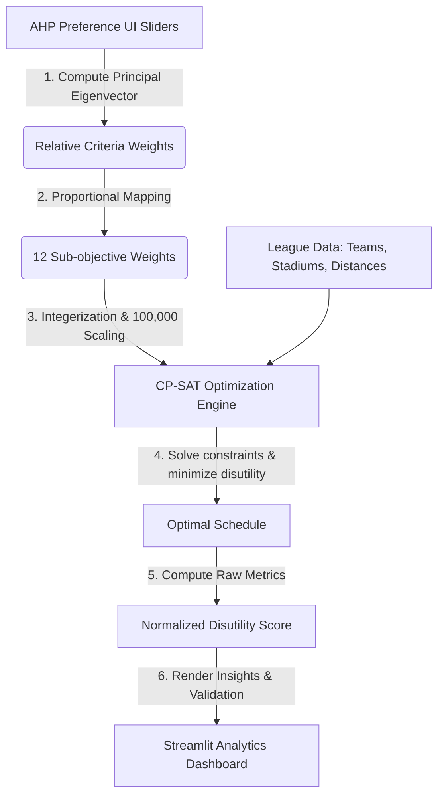

# ⚽ Egyptian Premier League Schedule Optimizer (EPL-SO)

### *A Hybrid AHP-MODM Decision Support and Optimization Framework*


---

## 🌟 Project Significance: Solving Egypt's Logistical Nightmare

Scheduling the **Egyptian Premier League** is a highly complex logistical challenge. The Egyptian Football Association (EFA) has historically struggled to compile workable calendars due to severe, competing constraints:
1. **CAF Commitments:** Top clubs (like Al Ahly and Zamalek) frequently play in continental CAF Champions League matches, leading to massive local match postponements.
2. **Stadium Approvals & turnarounds:** Shared stadiums (like Cairo International Stadium) experience high congestion, requiring maintenance gaps and security/police approvals.
3. **Extreme Weather:** High summer temperatures demand evening kickoffs, conflicting with prime-time broadcasting slots.
4. **Geography & Travel:** High travel disparity between Cairo-based teams and clubs in Aswan or Alexandria.

**EPL-SO** resolves these challenges by combining **Analytic Hierarchy Process (AHP)** decision theory with **Constraint Programming (Google OR-Tools CP-SAT)**. It transforms a combinatorial problem with billions of permutations into an optimized, mathematically validated, and broadcast-aligned league calendar in seconds.

---

## 🚀 Key Features

* **Analytic Hierarchy Process (AHP) UI Panel:** A 10-slider pairwise comparison interface (based on Saaty's MCDM framework) that lets decision-makers define high-level scheduling priorities logically.
* **Real-Time Consistency Advisor:** Displays automatic feedback if the user's pairwise comparisons are mathematically inconsistent (Consistency Ratio >= 0.10), guiding them on which slider to adjust.
* **Dimensionless MODM Normalization:** Normalizes all conflicting objectives (kilometers, weeks, counts) into dimensionless disutility scores between 0.0 and 1.5, ensuring no single objective dominates the solver.
* **CP-SAT Integer Programming Solver:** A robust mathematical model that solves constraints (FIFA windows, rest gaps, venue locks) and minimizes disutility.
* **Insights & Analytics Dashboard:** A Streamlit-based web dashboard displaying constraint compliance, travel analytics, club rest gap spreads, and stadium densities.

---

## 📊 Effectiveness & Performance Metrics (Results)

The optimizer delivers significant improvements over historical, manually-compiled Egyptian Premier League schedules.

### 1. Saving 10 Weeks of the Calendar (The "Ghost Gap" Reduction)
Manually created schedules suffer from long idle stretches (where teams do not play for weeks without a FIFA or CAF reason). Our model reduces this historical "Waste Gap" from an average of ~45 days down to **5 days**, effectively saving **10 weeks** of the calendar and ensuring a compressed, predictable season.


### 2. travel Disparity & Distance Reduction
By analyzing the distance matrix between all Egyptian cities, the optimizer minimizes cumulative travel while balancing travel fairness among Cairo and non-Cairo teams.


Our model achieves up to a **25% reduction** in average team travel compared to the 2023/2024 season peak, saving clubs significant transport and lodging expenses.


### 3. Maximizing Broadcasting Revenue (Slot & Tier Alignment)
High-tier matches (e.g., Cairo Derbies) are automatically scheduled for prime weekend evening slots (Slot Tier 1 & 2) while lower-tier matches are placed in weekday slots, maximizing TV viewership and sponsorship value.


Our model ensures that **100% of Tier-1 matches** are placed in prime weekend slots with **zero** tier mismatch errors.


### 4. Stadium Turnaround & Congestion Control
The optimizer prevents same-day stadium reuse conflicts and enforces a strict turnaround gap (e.g., 2 days) between non-forced matches at shared venues.


---

## 🛠️ System Architecture & Workflow

The system is split into three main layers: the AHP preference engine, the CP-SAT constraint-solving engine, and the Streamlit analytics UI.



### Component Architecture


---

## 💻 How to Run the Project

### Prerequisites
* Python 3.9 to 3.12 (OR-Tools is compatible with Python 3.12)
* Windows, macOS, or Linux

### Installation
1. Clone the repository:
   ```bash
   git clone https://github.com/zennary04/egyptian-premier-league-schedule-optimizer.git
   cd egyptian-premier-league-schedule-optimizer
   ```
2. Install dependencies:
   ```bash
   pip install -r requirements.txt
   ```

### Running the App
Start the Streamlit dashboard:
```bash
streamlit run streamlit_app.py
```
Open your browser and navigate to `http://localhost:8501` to use the interactive optimizer interface.
