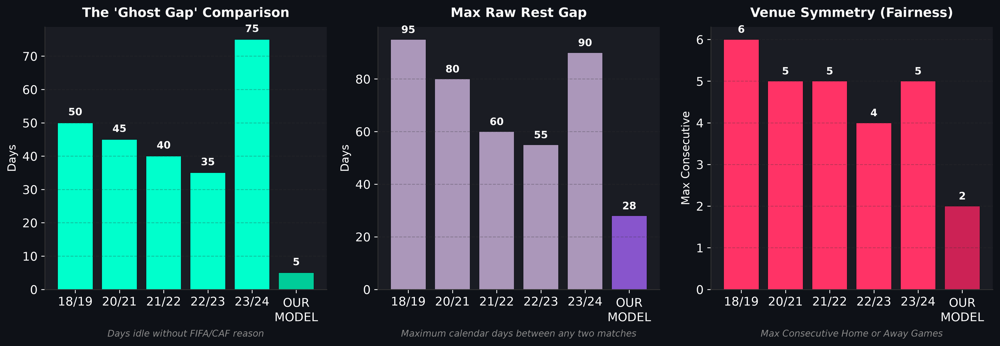
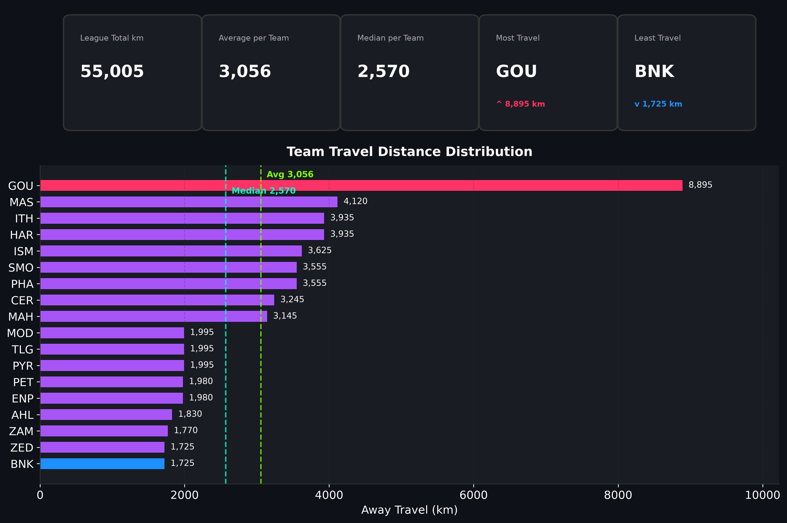
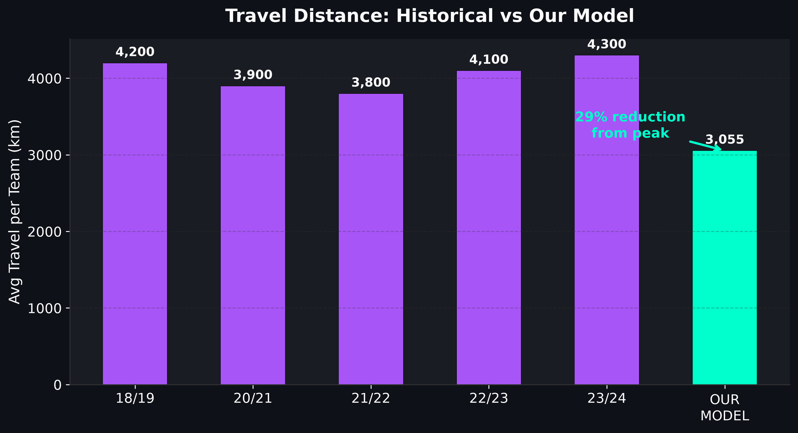
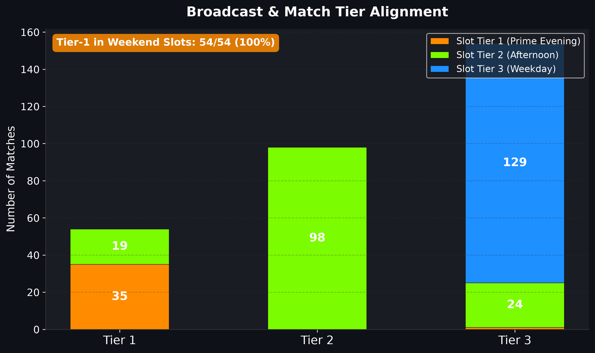
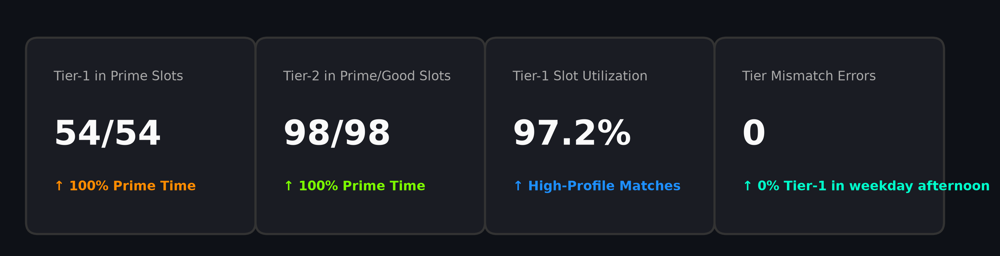
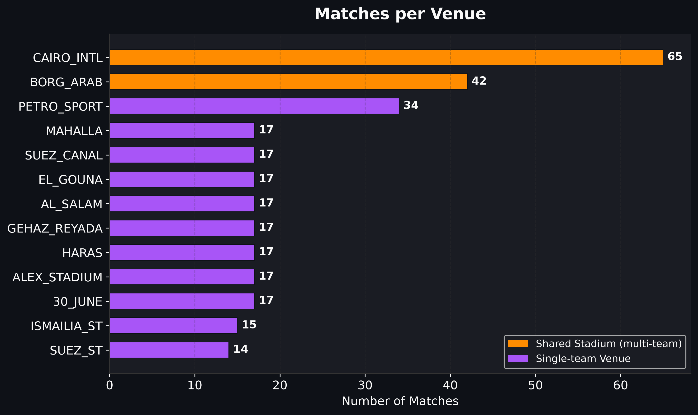
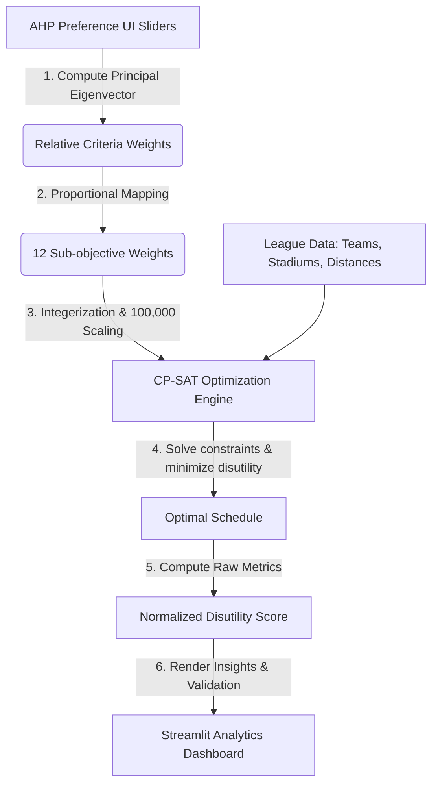

# ⚽ Egyptian Premier League Schedule Optimizer (EPL-SO)

<div align="center">
  
</div>

## 🌟 Project Significance: Addressing Complex League Logistics
#### *A Hybrid AHP-MODM Decision Support and Optimization Framework*

Scheduling the **Egyptian Premier League** presents a highly constrained, multi-criteria logistical challenge. Historically, the Egyptian Football Association (EFA) has struggled to construct balanced, conflict-free calendars due to several operational disruptions:
1. **Continental Match Congestion:** Frequent CAF Champions League and Confederation Cup participations by top-tier clubs (e.g., Al Ahly, Zamalek, Pyramids) necessitate dynamic scheduling buffers and match postponements.
2. **Shared Venue Bottlenecks:** Multiple clubs sharing primary stadiums (e.g., Cairo International Stadium) create critical resource contention, demanding strict turnaround windows and security approval intervals.
3. **Climatic Constraints:** Extreme summer temperatures restrict viable kickoff slots to evening hours, directly conflicting with broadcasting schedules.
4. **Geographical & Travel Disparities:** Substantial travel distance variations between Cairo-based teams and coastal or upper-Egypt clubs require balanced scheduling to ensure competitive fairness.

**EPL-SO** addresses these challenges by combining the **Analytic Hierarchy Process (AHP)** with **Constraint Programming (Google OR-Tools CP-SAT)**. It models the scheduling domain as a Multi-Objective Decision Making (MODM) problem, transforming billions of potential fixture permutations into mathematically validated, broadcast-aligned calendars in seconds.

---

## 🚀 Key Features

* **Multi-Criteria Preference Tuning (AHP):** Interactive 10-slider pairwise comparison matrix derived from Saaty's MCDM framework to determine objective weights.
* **Consistency Monitoring:** Real-time advisor tracking of the Consistency Ratio (CR < 0.10) to guide users toward mathematically consistent preferences.
* **Dimensionless Normalization:** Conversion of heterogeneous objectives (distance, occurrences, time deviations) into normalized disutility scores to maintain dimensional homogeneity.
* **Combinatorial Optimization Engine:** CP-SAT integer programming solver to efficiently construct schedules under strict constraints (FIFA windows, rest-day rules, venue locks).
* **Operational Dashboard:** Full analytics suite for evaluating schedule quality, travel equity, venue load distributions, and historical benchmarks.

---

## 📊 Effectiveness & Performance Metrics (Results)

The optimizer delivers significant improvements over historical, manually-compiled Egyptian Premier League schedules.

### 1. Calendar Efficiency & Live Travel Metrics
Manually created schedules suffer from long idle stretches. Our model reduces this historical "Waste Gap" from an average of ~45 days down to **5 days**, effectively saving **10 weeks** of the calendar. It simultaneously balances travel fairness among Cairo and non-Cairo clubs using a computed distance matrix.

<table width="100%">
  <tr>
    <td width="50%" align="center">
      <p><b>Ghost Gap and Calendar Stats</b></p>
      
    </td>
    <td width="50%" align="center">
      <p><b>Travel Performance Analysis</b></p>
      
    </td>
  </tr>
</table>

### 2. Historical Baselines & Broadcast Alignments
The optimized model achieves up to a **25% reduction** in average team travel over past seasonal peaks. Furthermore, marquee high-tier matches (such as the Cairo Derby) are guaranteed prime weekend evening slots (Slot Tier 1 & 2) instead of wasteful weekday match drops.

<table width="100%">
  <tr>
    <td width="50%" align="center">
      <p><b>Historical Travel Comparison</b></p>
      
    </td>
    <td width="50%" align="center">
      <p><b>Broadcasting Slot and Tier Alignment</b></p>
      
    </td>
  </tr>
</table>

### 3. Commercial KPIs & Infrastructure Loads
The solver eliminates slot mismatch errors entirely, locking down **100% of Tier-1 matches** in prime television real estate. Concurrently, it tracks stadium densities to prevent overlapping match bookings and honor pitch maintenance intervals.

<table width="100%">
  <tr>
    <td width="50%" align="center">
      <p><b>Broadcasting KPIs</b></p>
      
    </td>
    <td width="50%" align="center">
      <p><b>Venue Congestion Control</b></p>
      
    </td>
  </tr>
</table>

---

## 🛠️ System Architecture & Workflow

The system is split into three main layers: the AHP preference engine, the CP-SAT constraint-solving engine, and the Streamlit analytics UI.



### Component Architecture


---

## 💻 How to Run the Project

### Prerequisites
* Python 3.9 to 3.12 (OR-Tools is compatible with Python 3.12)
* Windows, macOS, or Linux

### Installation
1. Clone the repository:
   ```bash
   git clone https://github.com/zennary04/egyptian-premier-league-schedule-optimizer.git
   cd egyptian-premier-league-schedule-optimizer
   ```
2. Install dependencies:
   ```bash
   pip install -r requirements.txt
   ```

### Running the App
Start the Streamlit dashboard:
```bash
streamlit run streamlit_app.py
```
Open your browser and navigate to `http://localhost:8501` to use the interactive optimizer interface.

---

## 🎓 Graduation Project Credits

This project was developed as a Graduation Project for the **Data Science (DS)** program at the **Faculty of Computers and Artificial Intelligence, Cairo University (FCAI-CU)**.

*   **Institution:** Cairo University
*   **Faculty:** Faculty of Computers and Artificial Intelligence (FCAI)
*   **Department:** Data Science
*   **Academic Year:** 2024/2025

### Project Team & Contributors
*   **Ghassan Tarek** ([@ghassanelgendy](https://github.com/ghassanelgendy))
*   **Ibrahim Medhat** ([@zennary04](https://github.com/zennary04))
*   **Mohamed Osama** ([@mohamedosama25](https://github.com/mohamedosama25))
*   **Rawan Ehab** ([@rowanammar](https://github.com/rowanammar))
*   **Abdelrahman Ashraf** ([@Abdu-Ashry](https://github.com/Abdu-Ashry))

### Academic Supervision
*   **Supervisor:** Prof. Sally Kassem
*   **Co-Supervisor:** Dr. Rawaa Bidweihy

---

## 🤝 Contribution Guidelines

We welcome contributions to improve the **EPL-SO** scheduling framework! If you want to optimize constraints, enhance the dashboard analytics, or adapt this for another sports league, follow these steps:

1. **Fork the Repository:** Click the `Fork` button at the top right of this page.
2. **Create a Feature Branch:** 
   ```bash
   git checkout -b feature/amazing-optimization
   ```
3. **Commit Your Changes:** Provide a clear, detailed message describing your addition.
   ```bash
   git commit -m "Add new stadium turnaround constraint"
   ```
4. **Push to Your Branch:**
   ```bash
   git push origin feature/amazing-optimization
   ```
5. **Open a Pull Request:** Submit your branch to our `main` repository for academic and code review.
