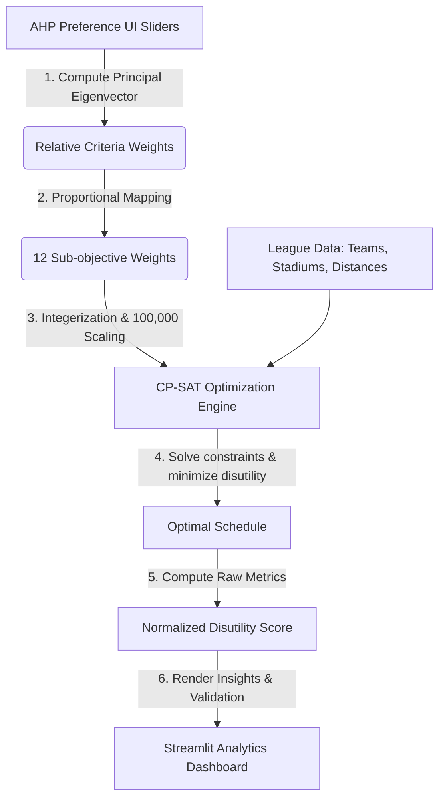

# ⚽ Egyptian Premier League Schedule Optimizer (EPL-SO)

<div align="center">
  
</div>

## 🌟 Project Significance: Solving Egypt's Logistical Nightmare
#### *A Hybrid AHP-MODM Decision Support and Optimization Framework*

Scheduling the **Egyptian Premier League** is a highly complex logistical challenge. The Egyptian Football Association (EFA) has historically struggled to compile workable calendars due to severe, competing constraints:
1. **CAF Commitments:** Top clubs (like Al Ahly and Zamalek) frequently play in continental CAF Champions League matches, leading to massive local match postponements.
2. **Stadium Approvals & turnarounds:** Shared stadiums (like Cairo International Stadium) experience high congestion, requiring maintenance gaps and security/police approvals.
3. **Extreme Weather:** High summer temperatures demand evening kickoffs, conflicting with prime-time broadcasting slots.
4. **Geography & Travel:** High travel disparity between Cairo-based teams and clubs in Aswan or Alexandria.

**EPL-SO** resolves these challenges by combining **Analytic Hierarchy Process (AHP)** decision theory with **Constraint Programming (Google OR-Tools CP-SAT)**. It transforms a combinatorial problem with billions of permutations into an optimized, mathematically validated, and broadcast-aligned league calendar in seconds.

---

## 🚀 Key Features

* **Analytic Hierarchy Process (AHP) UI Panel:** A 10-slider pairwise comparison interface (based on Saaty's MCDM framework) that lets decision-makers define high-level scheduling priorities logically.
* **Real-Time Consistency Advisor:** Displays automatic feedback if the user's pairwise comparisons are mathematically inconsistent (Consistency Ratio >= 0.10), guiding them on which slider to adjust.
* **Dimensionless MODM Normalization:** Normalizes all conflicting objectives (kilometers, weeks, counts) into dimensionless disutility scores between 0.0 and 1.5, ensuring no single objective dominates the solver.
* **CP-SAT Integer Programming Solver:** A robust mathematical model that solves constraints (FIFA windows, rest gaps, venue locks) and minimizes disutility.
* **Insights & Analytics Dashboard:** A Streamlit-based web dashboard displaying constraint compliance, travel analytics, club rest gap spreads, and stadium densities.

---

## 📊 Effectiveness & Performance Metrics (Results)

The optimizer delivers significant improvements over historical, manually-compiled Egyptian Premier League schedules.

### 1. Calendar Efficiency & Live Travel Metrics
Manually created schedules suffer from long idle stretches. Our model reduces this historical "Waste Gap" from an average of ~45 days down to **5 days**, effectively saving **10 weeks** of the calendar. It simultaneously balances travel fairness among Cairo and non-Cairo clubs using a computed distance matrix.

<table width="100%">
  <tr>
    <td width="50%" align="center">
      <p><b>Ghost Gap and Calendar Stats</b></p>
      
    </td>
    <td width="50%" align="center">
      <p><b>Travel Performance Analysis</b></p>
      
    </td>
  </tr>
</table>

### 2. Historical Baselines & Broadcast Alignments
The optimized model achieves up to a **25% reduction** in average team travel over past seasonal peaks. Furthermore, marquee high-tier matches (such as the Cairo Derby) are guaranteed prime weekend evening slots (Slot Tier 1 & 2) instead of wasteful weekday match drops.

<table width="100%">
  <tr>
    <td width="50%" align="center">
      <p><b>Historical Travel Comparison</b></p>
      
    </td>
    <td width="50%" align="center">
      <p><b>Broadcasting Slot and Tier Alignment</b></p>
      
    </td>
  </tr>
</table>

### 3. Commercial KPIs & Infrastructure Loads
The solver eliminates slot mismatch errors entirely, locking down **100% of Tier-1 matches** in prime television real estate. Concurrently, it tracks stadium densities to prevent overlapping match bookings and honor pitch maintenance intervals.

<table width="100%">
  <tr>
    <td width="50%" align="center">
      <p><b>Broadcasting KPIs</b></p>
      
    </td>
    <td width="50%" align="center">
      <p><b>Venue Congestion Control</b></p>
      
    </td>
  </tr>
</table>

---

## 🛠️ System Architecture & Workflow

The system is split into three main layers: the AHP preference engine, the CP-SAT constraint-solving engine, and the Streamlit analytics UI.



### Component Architecture


---

## 💻 How to Run the Project

### Prerequisites
* Python 3.9 to 3.12 (OR-Tools is compatible with Python 3.12)
* Windows, macOS, or Linux

### Installation
1. Clone the repository:
   ```bash
   git clone https://github.com/zennary04/egyptian-premier-league-schedule-optimizer.git
   cd egyptian-premier-league-schedule-optimizer
   ```
2. Install dependencies:
   ```bash
   pip install -r requirements.txt
   ```

### Running the App
Start the Streamlit dashboard:
```bash
streamlit run streamlit_app.py
```
Open your browser and navigate to `http://localhost:8501` to use the interactive optimizer interface.

---

## 🎓 Graduation Project Credits

This project was developed as a Graduation Project for the **Data Science (DS)** program at the **Faculty of Computers and Artificial Intelligence, Cairo University (FCAI-CU)**.

*   **Institution:** Cairo University
*   **Faculty:** Faculty of Computers and Artificial Intelligence (FCAI)
*   **Department:** Data Science
*   **Academic Year:** 2024/2025

### Project Team & Contributors
*   **Ghassan Tarek** ([@ghassanelgendy](https://github.com/ghassanelgendy))
*   **Ibrahim Medhat** ([@zennary04](https://github.com/zennary04))
*   **Mohamed Osama** ([@mohamedosama25](https://github.com/mohamedosama25))
*   **Rawan Ehab** ([@rowanammar](https://github.com/rowanammar))
*   **Abdelrahman Ashraf** ([@Abdu-Ashry](https://github.com/Abdu-Ashry))

### Academic Supervision
*   **Supervisor:** Prof. Sally Kassem
*   **Co-Supervisor:** Dr. Rawaa Bidweihy

---

## 🤝 Contribution Guidelines

We welcome contributions to improve the **EPL-SO** scheduling framework! If you want to optimize constraints, enhance the dashboard analytics, or adapt this for another sports league, follow these steps:

1. **Fork the Repository:** Click the `Fork` button at the top right of this page.
2. **Create a Feature Branch:** 
   ```bash
   git checkout -b feature/amazing-optimization
   ```
3. **Commit Your Changes:** Provide a clear, detailed message describing your addition.
   ```bash
   git commit -m "Add new stadium turnaround constraint"
   ```
4. **Push to Your Branch:**
   ```bash
   git push origin feature/amazing-optimization
   ```
5. **Open a Pull Request:** Submit your branch to our `main` repository for academic and code review.
