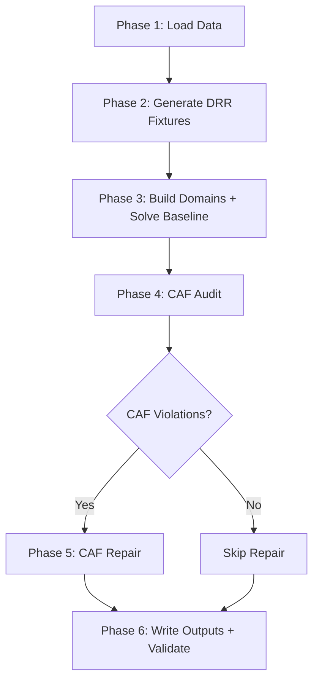

# Egyptian Premier League Schedule Optimizer — Full Detailed Walkthrough

## 1. Project Overview

This project **automatically generates an optimized match schedule** for the Egyptian Premier League (EPL). It takes as input data about the 18 teams, their stadiums, distances, security constraints, and a calendar of available time slots — then produces a complete 306-match double round-robin schedule that respects FIFA blackout dates, CAF (African continental) competition buffers, rest-day rules, venue constraints, and broadcasting fairness.

### The Core Problem

Scheduling a football league is a **combinatorial optimization problem**. You have:
- **18 teams** → 306 matches (each pair plays home and away)
- **34 rounds** (17 first-leg + 17 second-leg)
- **Hundreds of calendar slots** across the season
- **Dozens of hard constraints** (rest days, venue conflicts, FIFA dates, CAF buffers, etc.)
- **Soft objectives** (minimize travel, put big matches in prime slots, balance weekly load)

The project uses **Google OR-Tools CP-SAT** (Constraint Programming with Boolean Satisfiability) to solve this as an integer optimization problem.

### Technology Stack

| Component | Technology |
|---|---|
| Language | Python 3 |
| Optimizer | Google OR-Tools (CP-SAT solver) |
| Data I/O | Pandas + openpyxl (Excel reading) |
| Frontend | Streamlit (interactive web dashboard) |
| Data Format | Excel (.xlsx) input, CSV output |

---

## 2. Project File Structure

```
Egyptian-Premier-League-Schedule-Optimizer/
├── main.py                    # CLI entry point — runs the 6-phase pipeline
├── streamlit_app.py           # Interactive web UI (1900 lines)
├── requirements.txt           # Dependencies: ortools, pandas, openpyxl, streamlit
├── Nile_League.png            # League logo
│
├── data/                      # INPUT DATA (the two authoritative workbooks)
│   ├── Data_Model.xlsx        #   Teams, stadiums, distances, security rules
│   └── expanded_calendar.xlsx #   Calendar slots, FIFA dates, CAF blockers
│
├── src/                       # CORE ENGINE (11 Python modules)
│   ├── __init__.py
│   ├── constants.py           #   All configurable parameters
│   ├── tiers.py               #   Slot-tier and match-tier classification
│   ├── data_loader.py         #   Loads & validates both Excel workbooks
│   ├── fixture_generator.py   #   Generates the 306-match DRR fixture list
│   ├── slot_domain.py         #   Builds per-match feasible slot domains
│   ├── baseline_solver.py     #   CP-SAT model: assigns matches to slots
│   ├── caf_audit.py           #   Post-baseline CAF violation scanner
│   ├── caf_repair_solver.py   #   Reschedules CAF-violating matches
│   ├── output_writer.py       #   Writes all final CSV outputs
│   └── validation.py          #   Validates the final schedule
│
├── output/                    # OUTPUT (generated by the pipeline)
│   ├── optimized_schedule.csv
│   ├── optimized_schedule_pre_caf.csv
│   ├── caf_postponement_queue.csv
│   ├── caf_rescheduled_matches.csv
│   ├── unresolved_caf_postponements.csv
│   ├── week_round_map.csv
│   ├── data_load_log.txt
│   └── phases/                #   Intermediate diagnostic artifacts
│       ├── 01_load_summary.json
│       ├── 03_round_windows.csv
│       ├── 04_fixture_framework.csv
│       ├── 04_home_away_patterns.csv
│       ├── 05_baseline_feasible_slot_counts.csv
│       ├── 06_baseline_solver_status.json
│       ├── 07_caf_audit.csv
│       ├── 08_repair_feasible_slot_counts.csv
│       ├── 09_repair_solver_status.json
│       ├── 10_final_validation_report.csv
│       └── 10_team_sequence_validation.csv
│
├── icons/                     # Team logo PNGs (21 clubs)
├── past seasons data/         # Historical data (CSVs + CAF Excel files)
├── Research papers/           # Academic references on sports scheduling
└── Documentations/            # PRD, model explanation, presentation
```

---

## 3. The 6-Phase Pipeline

The pipeline is orchestrated by [main.py](file:///c:/Users/ibram/OneDrive/Documents/GitHub/Egyptian-Premier-League-Schedule-Optimizer/main.py). Each phase feeds into the next:



---

## 4. Phase 1 — Data Loading (`data_loader.py`)

### What it does
Reads **two Excel workbooks** and produces a validated `LeagueData` object containing everything the optimizer needs.

### Input: `Data_Model.xlsx` (4 sheets)

| Sheet | Contents | Key Columns |
|---|---|---|
| `team_data` | 18 teams | `Team_ID`, `Team_Name`, `Gov_ID`, `Home_Stadium_ID`, `Alt_Stadium_ID`, `Tier` (1-3), `Cont_Flag` (CL/CC/empty) |
| `Stadiums` | Stadium metadata | `Stadium_ID`, `Stadium_Name`, `Gov_ID`, `City`, `Is_Floodlit` |
| `dist_Matrix` | Distance matrix | Origin stadium → destination stadium distances in km |
| `Sec_Matrix` | Security rules | `home_team_ID`, `away_team_ID`, `banned_venue1_ID`, `banned_venue2_ID`, `forced_venue_ID` |

**Security rules** handle sensitive matches (e.g., Al Ahly vs Zamalek derby) where the match must be played at a specific neutral venue, not the home team's stadium.

### Input: `expanded_calendar.xlsx` (multiple sheets)

| Sheet | Contents |
|---|---|
| `expanded_calendar` | Every possible time slot: `Date`, `Date time`, `Day_ID`, `Week_Num`, `Day_name`, `Is_FIFA` |
| `FIFA_DAYS1` | FIFA international window dates |
| `cont_blockers_updated1` | CAF blocker dates per team (`team_id`, `caf_date`, `competition_name`, `round`) |
| `unique_CAF_dates` | Deduplicated list of all CAF match dates |

### Processing Steps

1. **Validate** all required sheets and columns exist
2. **Normalize** all IDs to uppercase strings (e.g., `"ahl"` → `"AHL"`)
3. **Parse FIFA dates** from three sources (union of `Is_FIFA == 1`, `FIFA_DAYS1` sheet, and label columns)
4. **Parse CAF blockers** — builds a dict mapping each CAF-participating team to their sorted list of CAF match dates
5. **Filter usable slots** — removes all FIFA-date slots from the calendar, producing `usable_slots`
6. **Cross-validate** — ensures every team's `Home_Stadium_ID` exists in the Stadiums sheet

### Output: `LeagueData` dataclass

```python
@dataclass
class LeagueData:
    teams: pd.DataFrame           # 18 rows
    stadiums: pd.DataFrame        # Stadium metadata
    dist_matrix: Dict[str, Dict[str, float]]  # Stadium-to-stadium distances
    sec_rules: List[SecRule]       # Forced venue / banned venue rules
    slots: pd.DataFrame           # All calendar slots
    usable_slots: pd.DataFrame    # Slots minus FIFA dates
    fifa_dates: Set[date]         # FIFA blackout dates
    caf_blockers: pd.DataFrame    # Raw CAF blocker data
    caf_dates_by_team: Dict[str, List[date]]  # Per-team sorted CAF dates
    unique_caf_dates: Set[date]   # All unique CAF dates
```

---

## 5. Phase 2 — Fixture Generation (`fixture_generator.py`)

### What it does
Generates all **306 matches** of a double round-robin (DRR) tournament, with valid home/away patterns.

### Step 1: Circle Method Pairing

Uses the classic **circle method** for round-robin scheduling:

1. **Shuffle** the 18 team IDs using the seeded RNG (default seed = 42)
2. **Fix** the first team, **rotate** the remaining 17
3. For each of 17 rotations, pair team `i` with team `n-1-i` → produces 9 pairings per round
4. This gives **17 rounds × 9 matches = 153 first-leg matches**

### Step 2: Home/Away Orientation via CP-SAT

The raw pairings don't specify who's home vs away. A **separate CP-SAT model** solves the orientation:

**Decision variable:** `x[(round, match_index)]` = 1 if pair[0] is home in first leg

**Hard constraints:**
- Each team plays exactly 17 home and 17 away across 34 rounds
- **No 3+ consecutive home or away** in any window of 3 rounds: `1 ≤ sum(window) ≤ 2`
- (Optional) **Rolling-5 balance**: in any 5 consecutive rounds, 2 or 3 must be home
- (Optional) **Balanced edges**: first two and last two rounds have exactly 1H + 1A

The solver tries three progressively relaxed constraint sets until one is feasible.

### Step 3: Mirror for Second Leg

The second leg (rounds 18–34) simply **swaps home and away** from the first leg. If Round 1 has AHL vs ZAM (AHL home), then Round 18 has ZAM vs AHL (ZAM home).

### Step 4: Venue Resolution

For each match, the venue is determined by:
1. Check `Sec_Matrix` for a **forced venue** for this (home, away) pair
2. If no forced venue, use the **home team's `Home_Stadium_ID`**

### Step 5: Match Tier Computation

Each match gets a **tier** (1 = top, 2 = mid, 3 = low) based on both teams' league tiers:

| Home Tier | Away Tier | Match Tier |
|---|---|---|
| 1 | 1 | **1** (derby/top match) |
| 1 | 2 | **1** |
| 1 | 3 | **2** |
| 2 | 2 | **2** |
| 2 | 3 | **3** |
| 3 | 3 | **3** |

### Output

306 `Match` objects, each containing: `match_idx`, `round_num`, `home_team`, `away_team`, `venue`, `match_tier`.

---

## 6. Phase 3 — Slot Domains & Baseline Solver

### 6a. Slot Domain Construction (`slot_domain.py`)

For each of the 306 matches, this module determines **which calendar slots it can be assigned to**.

**Step 1: Build round windows** — 34 non-overlapping 5-day date ranges are selected from the calendar, skipping FIFA dates and ensuring each window has enough slots for a full round.

**Step 2: CAF buffer pruning** — For matches involving a CAF-participating team (flagged `CL` or `CC`), any slot within 4 calendar days of that team's CAF date is **removed** from the domain.

**Step 3: Fallback** — If CAF pruning would leave zero slots for a match, the domain is relaxed back to all usable slots (the CAF audit will catch and repair it later).

### 6b. Baseline Solver (`baseline_solver.py`)

This is the **heart of the project** — a CP-SAT integer optimization model that assigns 306 matches to calendar slots.

#### Decision Variables

```
x[match_idx][slot_idx] ∈ {0, 1}
```
Binary variable: 1 if match `m` is assigned to slot `s`. Only created for feasible (match, slot) pairs from the domain.

Additionally, `match_time[match_idx]` = a chronological integer encoding of the assigned slot's position in time.

#### Hard Constraints (must be satisfied)

| Code | Constraint | Description |
|---|---|---|
| **H1** | `sum(x[m]) == 1` | Every match assigned exactly once |
| **H_TIER1_DERBY** | Force tier-1 slot | Tier-1 vs tier-1 matches **must** use a tier-1 slot (weekend evening) |
| **H4** | Team date uniqueness | A team plays at most 1 match per calendar date |
| **H5** | Venue slot uniqueness | A venue hosts at most 1 match per time slot |
| **H_DAILY** | `≤ 3 matches/day` | At most 3 league matches on one calendar date |
| **H_CONCURRENCY** | `≤ 2 matches/slot` | At most 2 matches at the same kickoff time |
| **H7** | Rest days (sliding window) | Each team has at most 1 match in any 4-day window (= 3 full rest days) |
| **H10** | Strict round order | Every match in Round R finishes before Round R+1 starts |

**How H7 works:** For each team and each starting date D, a window [D, D+3] is defined. All slots in that window are collected. The constraint says the team can have at most 1 match across all those slots. This enforces a minimum 3 full rest days between consecutive league matches.

**How H10 works:** For each round, `round_min` and `round_max` variables track the earliest and latest chronological time index. The constraint `round_max[R] + 1 ≤ round_min[R+1]` ensures strict temporal ordering.

#### Soft Objectives (minimized)

The solver minimizes a weighted sum of penalties:

| Weight | Objective | Description |
|---|---|---|
| `W_ROUND_ORDER = 100` | Round placement | Penalizes `|slot_week - nominal_week(round)|` — keeps rounds near their expected calendar position |
| `W_WEEK_UNDERLOAD = 50` | Week underload | Penalizes weeks with fewer than 6 matches |
| `W_WEEK_OVERLOAD = 50` | Week overload | Penalizes weeks with more than 12 matches |
| `W_TRAVEL = 1` | Travel distance | Per-km penalty for away team travel (stadium-to-stadium distance) |
| `W_TIER_MISMATCH = 20` | Tier mismatch | Penalizes `|match_tier - slot_tier|` — big matches should get prime slots |

**Week load** also has a hard upper bound of 18 matches/week.

#### Slot Tier System (`tiers.py`)

Each calendar slot gets a tier based on when it is:

| Slot Tier | When |
|---|---|
| **Tier 1** (best) | Weekend evening (Fri/Sat, kickoff ≥ 19:00) |
| **Tier 2** | Weekend afternoon OR weekday evening (≥ 19:00) |
| **Tier 3** | Weekday afternoon/early |

The soft objective tries to match high-tier matches with high-tier slots.

#### Solver Configuration

- **Time limit:** 600 seconds (10 minutes)
- **Workers:** 8 parallel threads
- **Output:** List of `ScheduledMatch` objects (match + its assigned slot details)

---

## 7. Phase 4 — CAF Audit (`caf_audit.py`)

### Why CAF is handled separately

The baseline solver **deliberately ignores CAF dates**. This is a design decision documented in the PRD: first build the best possible league schedule, then handle CAF conflicts as post-processing. This avoids making the baseline model overly constrained.

### What it checks

For every scheduled match, for each team involved, it checks:

1. **SAME_DAY**: Is the match on the same date as a CAF match for that team?
2. **PRE**: Is the match fewer than 5 calendar days **before** a CAF match? (need ≥ 4 full rest days)
3. **POST**: Is the match fewer than 5 calendar days **after** a CAF match?

### Output

- **Accepted matches**: Baseline matches that pass the CAF audit
- **Violations**: List of `CAFViolation` objects with details (affected team, conflicting CAF date, competition name, round, direction)
- The violated matches are **removed** from the accepted set and queued for repair

---

## 8. Phase 5 — CAF Repair (`caf_repair_solver.py`)

### Strategy: Multi-Pass Greedy Nearest-First

Unlike the baseline (which uses CP-SAT), the repair phase uses a **greedy heuristic**:

1. **Build occupied state** from accepted matches (tracks: team dates, team H/A sequences, venue usage, week loads, date loads, slot usage)

2. **Find valid slots** for each postponed match by checking 7 rules:
   - R1: Not a FIFA date (already filtered)
   - R2: Neither team plays on that date
   - R3: 3+ full rest days from all other league matches for both teams
   - R4: Venue is free at that slot
   - R5: No 3+ consecutive H or A streak created
   - R6: **Bidirectional CAF buffer** — ≥ 5 calendar days from any CAF date for both teams
   - R7: Slot is completely unoccupied

3. **Rank** valid slots by proximity to original date (prefer nearest reschedule)

4. **Sort** postponed matches by most-constrained-first (fewest valid slots)

5. **Multi-pass greedy** (up to 5 passes): place each match at its nearest valid slot, update state, retry unresolved matches (since earlier placements change the landscape)

### Output
- **Repaired matches**: New `ScheduledMatch` objects with updated slot assignments
- **Unresolved matches**: Matches that couldn't be placed anywhere

---

## 9. Phase 6 — Output & Validation

### Output Writer (`output_writer.py`)

Produces 6 CSV files:

| File | Contents |
|---|---|
| `optimized_schedule_pre_caf.csv` | Full 306-match baseline (before CAF repair) |
| `optimized_schedule.csv` | **Final schedule** = accepted + repaired, sorted by date |
| `caf_postponement_queue.csv` | All CAF violations with repair status |
| `caf_rescheduled_matches.csv` | Only the repaired matches |
| `unresolved_caf_postponements.csv` | Matches that couldn't be rescheduled |
| `week_round_map.csv` | Which calendar weeks each round spans |

The final schedule CSV includes columns: `Round`, `Calendar_Week_Num`, `Day_ID`, `Date`, `Date_time`, `Home_Team_ID`, `Away_Team_ID`, `Venue_Stadium_ID`, `Travel_km`, `Slot_tier`, `Match_Tier`, `Postponed`, `Postponement_Status`, `Postponement_Reason`.

### Validation (`validation.py`)

Runs comprehensive checks on the final schedule:

| Check | Type | What it verifies |
|---|---|---|
| **Completeness** | ERROR | 306 total matches (played + unresolved) |
| **Ordered pairs** | ERROR | All 306 unique (home, away) pairs exist |
| **FIFA dates** | ERROR | No match on a FIFA date |
| **Daily load** | ERROR | ≤ 3 matches per calendar date |
| **Venue conflicts** | ERROR | No venue double-booked in same slot |
| **Global round order** | ERROR | Round R finishes before R+1 starts |
| **CAF buffers** | ERROR | ≥ 5 calendar days between league and CAF matches |
| **Team rest** | ERROR | ≥ 4 calendar days between consecutive league matches |
| **H/A streak** | ERROR | No 3+ consecutive home or away |
| **Round inversion** | ERROR | Non-postponed rounds don't play out of order per team |
| **Rolling-5 balance** | WARN | 2 or 3 home matches in every 5-match window |

Outputs two files:
- `10_final_validation_report.csv` — All issues found (or "PASS" if clean)
- `10_team_sequence_validation.csv` — Per-team chronological match sequence with gap days, streaks, and violations

---

## 10. The Streamlit Frontend (`streamlit_app.py`)

A **1900-line** interactive web dashboard with a dark purple theme. Key features:

### Sidebar
- **Model configuration panel** — All constants are adjustable via sliders/number inputs (league shape, rest rules, week capacity, objective weights, solver time limits)
- **Run pipeline button** — Executes all 6 phases with live progress

### Main Tabs

| Tab | Features |
|---|---|
| **Run summary** | Data load stats, baseline solver status, CAF repair status |
| **Artifacts** | Lists all output files with ✅/— status, preview tables, download buttons |
| **Explore** | Rich interactive exploration (see below) |

### Explore Sub-Tabs

1. **Team chooser** — Select a team, see all their matches filtered by home/away, sortable
2. **Team vs Team** — Head-to-head view between any two teams with team logos
3. **Travel stats** — Bar charts + tables of total travel km per team, sortable
4. **Calendar** — Full month-grid calendar view showing matches per day, with FIFA/CAF badges, navigable by month. Empty days show *why* they're empty (FIFA window, CAF blocked, no slot, etc.)
5. **Round filter** — Isolate and view a single round's matches

### Visual Design
- Custom dark theme with purple gradient sidebar
- Team logo badges inline in calendar cells and tables
- Glassmorphism-style metric cards
- Responsive grid layout for the calendar

---

## 11. Key Data Structures

### `Match` (fixture_generator.py)
Represents a fixture before scheduling:
```python
match_idx: int      # 0–305
round_num: int      # 1–34
home_team: str      # e.g., "AHL"
away_team: str      # e.g., "ZAM"
venue: str          # Stadium ID
match_tier: int     # 1–3
```

### `ScheduledMatch` (baseline_solver.py)
A match assigned to a concrete calendar slot:
```python
# Inherits all Match fields, plus:
slot_idx: int       # Index into usable_slots DataFrame
day_id: str         # e.g., "D_20260914"
date: date          # Calendar date
date_time: object   # Kickoff datetime
week_num: int       # Calendar week number
day_name: str       # e.g., "FRI"
slot_tier: int      # 1–3
travel_km: float    # Away team's travel distance
```

### `CAFViolation` (caf_audit.py)
```python
match: ScheduledMatch
affected_team_id: str
conflicting_caf_date: date
conflicting_caf_competition: str  # e.g., "CAF Champions League"
conflicting_caf_round: str        # e.g., "Group Stage MD3"
conflict_direction: str           # "PRE", "POST", or "SAME_DAY"
violation_reason: str             # Human-readable explanation
```

---

## 12. Constants & Configuration

All tunable parameters are centralized in [constants.py](file:///c:/Users/ibram/OneDrive/Documents/GitHub/Egyptian-Premier-League-Schedule-Optimizer/src/constants.py):

| Constant | Value | Meaning |
|---|---|---|
| `NUM_TEAMS` | 18 | League size |
| `NUM_ROUNDS` | 34 | (18-1) × 2 |
| `MATCHES_PER_ROUND` | 9 | 18 / 2 |
| `MIN_REST_DAYS_LOCAL` | 3 | Between league matches (→ dates 4+ apart) |
| `MIN_REST_DAYS_CAF` | 3 | Between league and CAF (→ dates 4+ apart, but audit uses 5) |
| `MAX_CONSECUTIVE_HOME` | 2 | No 3+ home in a row |
| `MAX_CONSECUTIVE_AWAY` | 2 | No 3+ away in a row |
| `MAX_MATCHES_PER_DAY` | 3 | Hard daily cap |
| `MAX_MATCHES_PER_SLOT` | 2 | Concurrent match cap |
| `HARD_MAX_MATCHES_PER_WEEK` | 18 | Hard weekly cap |
| `SOFT_MIN/MAX_MATCHES_PER_WEEK` | 6/12 | Soft weekly targets |
| `BASELINE_SOLVER_TIME_LIMIT_S` | 600 | 10 min for CP-SAT |
| `REPAIR_SOLVER_TIME_LIMIT_S` | 60 | 1 min for repair |
| `DEFAULT_SEED` | 42 | Random seed for DRR generation |

---

## 13. End-to-End Data Flow Summary

```
Data_Model.xlsx ──┐
                   ├──→ LeagueData ──→ generate_drr() ──→ 306 Matches
expanded_calendar ─┘                        │
                                            ▼
                                    build_domains()
                                            │
                                            ▼
                                    solve_baseline() ──→ 306 ScheduledMatches
                                            │
                                            ▼
                                      caf_audit()
                                      ┌─────┴─────┐
                                      ▼           ▼
                                  Accepted    Violations
                                      │           │
                                      │     caf_repair()
                                      │     ┌─────┴─────┐
                                      │     ▼           ▼
                                      │  Repaired   Unresolved
                                      │     │
                                      ▼     ▼
                              Final Schedule = Accepted + Repaired
                                      │
                                      ▼
                              validation + output CSVs
```

---

## 14. How to Run

### CLI
```bash
pip install -r requirements.txt
python main.py              # Uses default seed=42
python main.py --seed 123   # Custom seed
```

### Streamlit UI
```bash
streamlit run streamlit_app.py
```
Then open `http://localhost:8501` in your browser. Adjust parameters in the sidebar and click "Run pipeline".
